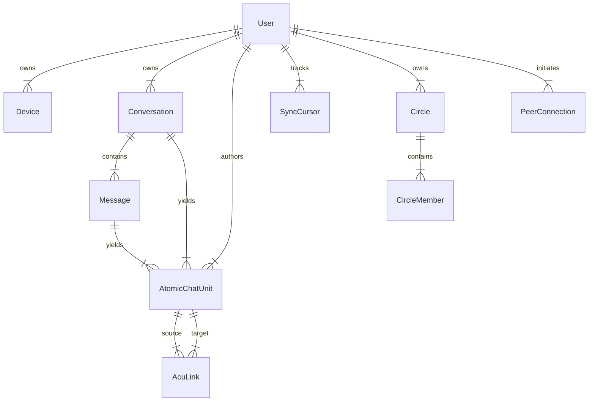

# VIVIM Database Master Specification (v1.0)

**Date:** February 10, 2026  
**Status:** Production Baseline  
**Context:** Local-First P2P Knowledge Network (PostgreSQL Implementation)

---

## 1. Executive Summary (The "Common Sense" View)

The VIVIM database is designed to be more than just a chat log. It is a **structured knowledge graph**. Instead of just storing "what was said," we store "what was learned," broken down into atomic pieces that can be connected, shared, and remixed.

Think of it like this:
*   **Conversations** are the "Source Documents."
*   **ACUs (Atomic Chat Units)** are the "index cards" where you extracted specific facts, quotes, or code snippets from those documents.
*   **The Network** allows you to share a specific index card with a friend without giving them the entire filing cabinet.

The database has three main layers:
1.  **Source Layer:** The raw data as it came from ChatGPT, Claude, etc.
2.  **Knowledge Layer:** The refined, interconnected insights (ACUs).
3.  **Network Layer:** The plumbing that lets you share this with other people (Users, Devices, Sync).

---

## 2. High-Level Architecture (Mermaid)



---

## 3. Detailed Schema Specification

### 3.1 The Source Layer (Raw Data)

This layer preserves the integrity of the original interaction. It is the "Golden Record."

#### `Conversation`
The container for a specific session with an AI.
*   **`id` (UUID):** Unique internal ID.
*   **`sourceUrl` (String):** The share link (e.g., `chatgpt.com/c/...`). This is unique—we never duplicate the same conversation.
*   **`contentHash` (SHA-256):** A fingerprint of the raw content. If this changes, we know the conversation has been updated.
*   **`state` (Enum):** Is this conversation `ACTIVE` or `ARCHIVED`?
*   **`capturedAt` (Date):** When we grabbed it (not necessarily when it was created).

#### `Message`
A single turn in the dialogue.
*   **`role` (String):** Who spoke? (`user`, `assistant`, `system`).
*   **`parts` (JSON):** The actual content. We store this as a flexible JSON array to handle text, images, and code blocks gracefully.
*   **`contentHash` (SHA-256):** Integrity check for this specific message.

---

### 3.2 The Knowledge Layer (The "Brain")

This is where the magic happens. We break conversations down into useful pieces.

#### `AtomicChatUnit` (ACU)
A single, standalone unit of information.
*   **`id` (SHA-3 Hash):** The ID is mathematically derived from the content. If two people extract the exact same fact, it gets the *same ID*. This enables global deduplication.
*   **`content` (Text):** The raw information (e.g., a specific Python function).
*   **`type` (String):** What is this? A `question`, a `code_snippet`, a `definition`?
*   **`qualityOverall` (0-100):** Algorithmically determined value. High quality = rich formatting, code, good length.
*   **`state` (Enum):** `ACTIVE`, `DORMANT` (raw/unprocessed), `ARCHIVED`.
*   **`securityLevel` (0-5):** 0 = Public info, 5 = PII (Personal Identifiable Information like API keys).

#### `AcuLink`
The connective tissue.
*   **`sourceId` -> `targetId`:** Connects two ACUs.
*   **`relation` (String):** How are they related? (e.g., `EXPLAINS`, `CONTRADICTS`, `NEXT_STEP`).
*   **`createdByDid` (String):** Who noticed this connection? Important for P2P credit.

---

### 3.3 The Network Layer (P2P Plumbing)

This infrastructure allows the database to sync across devices without a central master server.

#### `User` & `Device`
*   **`did` (DID):** Decentralized Identifier (e.g., `did:key:z6Mk...`). This is your global ID, not tied to any specific server.
*   **`publicKey`:** Used to verify that data really came from you.
*   **`SyncCursor`:** Tracks how much data we have synced from every other device. "I have everything from Alice up to Tuesday at 5 PM."

#### `SyncOperation`
The "Flight Recorder" of the database.
*   **`operation`:** `INSERT`, `UPDATE`, `DELETE`.
*   **`hlcTimestamp`:** Hybrid Logical Clock. A special timestamp that guarantees order across different devices even if their clocks are slightly off.
*   **`payload`:** The actual data that changed.

#### `PeerConnection`
Represents a handshake between two users.
*   **`trustLevel`:** `acquaintance` (see public shares) vs `trusted` (see friend-only shares).

---

## 4. Full Technical Schema (Prisma)

```prisma
// ============================================================================
// IDENTITY & DEVICES
// ============================================================================

model User {
  id          String   @id @default(uuid())
  did         String   @unique // The Global ID
  
  // Keys & Security
  publicKey   String   @db.Text 
  encryptedPrivateKey String? @db.Text 
  
  // Sync State
  syncCursors     SyncCursor[]
  
  // Ownership
  conversations   Conversation[]
  acus            AtomicChatUnit[]
  devices         Device[]
  
  // Social
  circlesOwned    Circle[] @relation("CircleOwner")
  circleMemberships CircleMember[]
  
  @@map("users")
}

// ============================================================================
// CORE CONTENT (Source)
// ============================================================================

model Conversation {
  id          String   @id @default(uuid())
  sourceUrl   String   @unique
  contentHash String?  // SHA-256 integrity
  state       String   @default("ACTIVE")
  
  // Metadata
  title       String   @db.Text
  provider    String   // "chatgpt", "claude"
  
  // Content
  messages    Message[]
  acus        AtomicChatUnit[]
  
  // Stats
  messageCount Int     @default(0)
  capturedAt   DateTime @default(now()) @db.Timestamptz
  
  @@map("conversations")
}

model Message {
  id              String   @id @default(uuid())
  conversationId  String
  role            String   // user/assistant
  parts           Json     // Rich content blocks
  contentHash     String?  // Integrity check
  
  @@map("messages")
}

// ============================================================================
// KNOWLEDGE GRAPH (ACU)
// ============================================================================

model AtomicChatUnit {
  id          String   @id // SHA-3 Content Hash
  content     String   @db.Text
  
  // Classification
  type        String   // code_snippet, statement, etc.
  category    String   // technical, personal, etc.
  
  // Quality & Security
  qualityOverall Float?
  securityLevel  Int      @default(0)
  isPersonal     Boolean  @default(false)
  
  // Connections
  linksFrom     AcuLink[] @relation("SourceAcu")
  linksTo       AcuLink[] @relation("TargetAcu")
  
  @@map("atomic_chat_units")
}

model AcuLink {
  id           String   @id @default(uuid())
  sourceId     String
  targetId     String
  relation     String   // "explains", "refers_to"
  createdByDid String?  // Attribution
  
  @@map("acu_links")
}

// ============================================================================
// SYNC ENGINE (P2P)
// ============================================================================

model SyncOperation {
  id           String   @id @default(uuid())
  hlcTimestamp String   // Hybrid Logical Clock
  operation    String   // INSERT/UPDATE/DELETE
  tableName    String
  payload      Json     // The data delta
  
  @@index([hlcTimestamp])
  @@map("sync_operations")
}
```

## 5. Why This Design?

1.  **Sovereignty:** You own your keys (`User`). You own your data (`Conversation`).
2.  **Resilience:** The `contentHash` and `SyncOperation` log ensure that even if a server crashes or a peer goes offline, the data integrity is preserved and can be reconstructed.
3.  **Future-Proof:** The `AtomicChatUnit` design decouples *knowledge* from *chats*. In the future, you could feed these ACUs into a personal AI agent to write a blog post, and it would know exactly where every fact came from.
