# VIVIM Digital Twin Cost Database
## Entity Relationship Diagram

```mermaid
erDiagram
    %% PEOPLE MODULE
    LOCATIONS ||--o{ SALARY_BENCHMARKS : has
    LOCATIONS ||--o{ LOCATION_TAX_INCENTIVES : offers
    LOCATIONS ||--o{ EMPLOYMENT_COST_FACTORS : defines
    LOCATIONS ||--o{ TEAM_MEMBERS : based_in
    LOCATIONS ||--o{ MILESTONE_TEAM_ALLOCATIONS : located_at
    
    ROLE_CATEGORIES ||--o{ ROLES : contains
    ROLES ||--o{ ROLE_SKILL_REQUIREMENTS : requires
    ROLES ||--o{ SALARY_BENCHMARKS : benchmarked_as
    ROLES ||--o{ TEAM_MEMBERS : assigned_as
    ROLES ||--o{ MILESTONE_TEAM_ALLOCATIONS : needed_as
    
    SKILLS ||--o{ ROLE_SKILL_REQUIREMENTS : required_for
    
    TEAMS ||--o{ TEAM_MEMBERS : has
    TEAMS ||--o{ MILESTONE_TEAM_ALLOCATIONS : allocated_to
    TEAMS ||--|| TEAMS : parent_team
    
    %% TOOLS MODULE
    CLOUD_PROVIDERS ||--o{ SERVICES : offers
    CLOUD_PROVIDERS ||--o{ ML_COMPUTE_INSTANCES : provides
    
    SERVICE_CATEGORIES ||--o{ SERVICES : categorizes
    
    SERVICES ||--o{ SERVICE_PRICING_TIERS : priced_as
    SERVICES ||--o{ SERVICE_ALLOCATIONS : allocated_in
    
    INFRASTRUCTURE_COST_MODELS ||--o{ USER_SCALE_THRESHOLDS : scales_to
    
    USER_SCALE_THRESHOLDS ||--o{ COST_PER_USER_TRAJECTORIES : has_costs
    
    ML_COMPUTE_INSTANCES ||--o{ ML_TRAINING_COST_ESTIMATES : used_for
    
    INFRASTRUCTURE_BUDGETS ||--o{ SERVICE_ALLOCATIONS : allocates
    
    %% USERS MODULE
    USER_GROWTH_MODELS ||--o{ USER_BASE_PROJECTIONS : projects
    USER_GROWTH_MODELS ||--o{ MILESTONES : targets
    
    USER_ACTIVITY_PROFILES ||--o{ USER_SEGMENT_COSTS : defines
    
    REVENUE_STREAMS ||--o{ REVENUE_PROJECTIONS : generates
    
    DIVIDEND_POLICIES ||--o{ DIVIDEND_CALCULATIONS : governs
    DIVIDEND_CALCULATIONS ||--o{ CONTRIBUTOR_DIVIDENDS : distributes
    
    MILESTONES ||--o{ MILESTONE_COSTS : has_costs
    MILESTONES ||--o{ USER_BASE_PROJECTIONS : targets
    MILESTONES ||--o{ MILESTONE_TEAM_ALLOCATIONS : allocates_team
    MILESTONES ||--o{ LEGAL_PROJECTS : scheduled_in
    MILESTONES ||--o{ COMPLIANCE_MILESTONES : achieves
    
    %% GOVERNANCE MODULE
    COMPLIANCE_FRAMEWORKS ||--o{ COMPLIANCE_MILESTONES : requires
    COMPLIANCE_FRAMEWORKS ||--o{ DATA_GOVERNANCE_POLICIES : governs
    COMPLIANCE_FRAMEWORKS ||--o{ CONSENT_MANAGEMENT : applies_to
    
    LEGAL_SERVICE_CATEGORIES ||--o{ LEGAL_COUNSEL_RATES : categorized_as
    LEGAL_SERVICE_CATEGORIES ||--o{ LEGAL_PROJECTS : classified_as
    
    LEGAL_PROJECTS ||--o{ LEGAL_COST_TRACKING : tracks
    
    CONTRACT_TEMPLATES ||--o{ CONTRACT_VERSIONS : versions
    
    RISK_CATEGORIES ||--o{ RISK_REGISTER : categorizes
    
    LEGAL_BUDGETS ||--o{ LEGAL_COST_TRACKING : tracks
    
    %% CROSS-MODULE CONNECTIONS
    MILESTONES ||--o{ COST_PER_USER_ANALYSIS : analyzed_at
    MILESTONES ||--o{ REVENUE_PROJECTIONS : targets
    
    SALARY_BENCHMARKS ||--o{ LABOR_BUDGETS : informs
    INFRASTRUCTURE_COST_MODELS ||--o{ INFRASTRUCTURE_BUDGETS : informs
    
    LABOR_BUDGETS ||--o{ LABOR_COST_FORECASTS : forecasts
```



## Core Entity Definitions

### PEOPLE Module Entities

| Entity | Description | Key Relationships |
|--------|-------------|-------------------|
| **locations** | Geographic locations with cost/regulatory data | Parent to: salary_benchmarks, employment_cost_factors, team_members |
| **roles** | Job roles with skill requirements | Links to: role_categories, salary_benchmarks, team_members |
| **skills** | Technical and soft skills matrix | Referenced by: role_skill_requirements |
| **teams** | Organizational teams | Contains: team_members, allocated in: milestone_team_allocations |
| **salary_benchmarks** | Market salary data by role/location | Informs: labor_budgets |

### TOOLS Module Entities

| Entity | Description | Key Relationships |
|--------|-------------|-------------------|
| **cloud_providers** | Infrastructure providers (Hetzner, AWS, etc.) | Offers: services, ml_compute_instances |
| **services** | Cloud services (compute, storage, database) | Has: service_pricing_tiers, allocated in: service_allocations |
| **infrastructure_cost_models** | Complete cost models at different scales | Scales to: user_scale_thresholds |
| **ml_compute_instances** | GPU/ML training hardware | Used for: ml_training_cost_estimates |
| **llm_api_costs** | LLM provider pricing (OpenAI, Anthropic, etc.) | Referenced in: cost calculations |

### USERS Module Entities

| Entity | Description | Key Relationships |
|--------|-------------|-------------------|
| **user_growth_models** | User acquisition projections | Projects: user_base_projections, targets: milestones |
| **revenue_streams** | Revenue sources (API, enterprise, etc.) | Generates: revenue_projections |
| **dividend_policies** | Revenue sharing configuration | Governs: dividend_calculations |
| **dividend_calculations** | Periodic dividend pool calculations | Distributes: contributor_dividends |
| **milestones** | The 10 VIVIM development milestones | Central hub connecting all modules |

### GOVERNANCE Module Entities

| Entity | Description | Key Relationships |
|--------|-------------|-------------------|
| **compliance_frameworks** | Regulations (GDPR, SOC2, etc.) | Requires: compliance_milestones |
| **legal_projects** | Specific legal engagements | Tracks costs in: legal_cost_tracking |
| **risk_register** | Risk tracking with mitigation | Categorized by: risk_categories |
| **contract_templates** | Standard legal documents | Versioned in: contract_versions |
| **legal_budgets** | Legal spend tracking | Tracks: legal_cost_tracking |

## Key Relationships Summary

### Hierarchical Relationships
- **teams** → **team_members** (1:N)
- **roles** → **role_skill_requirements** → **skills** (M:N via junction)
- **cloud_providers** → **services** (1:N)
- **milestones** → All cost/team/revenue tables (central planning hub)

### Cost Flow Relationships
1. **salary_benchmarks** inform **labor_budgets** → **milestone_team_allocations**
2. **infrastructure_cost_models** inform **infrastructure_budgets** → **service_allocations**
3. **legal_counsel_rates** inform **legal_budgets** → **legal_projects**

### User Journey Relationships
1. **user_growth_models** → **user_base_projections** → **milestones**
2. **revenue_streams** → **revenue_projections** → **dividend_calculations** → **contributor_dividends**
3. **cost_per_user_analysis** tracks unit economics across **milestones**

## Knowledge Graph Nodes

### Primary Nodes (Entities)
- People: Employee, Contractor, Role, Skill
- Tools: CloudProvider, Service, Infrastructure
- Users: Contributor, Customer, Segment
- Governance: ComplianceFramework, Risk, Contract

### Relationship Types
- **COSTS**: Links entities to financial data
- **REQUIRES**: Dependencies between milestones
- **LOCATED_AT**: Geographic relationships
- **GOVERNS**: Compliance/legal relationships
- **GENERATES**: Revenue/dividend flows
- **CONTRIBUTES_TO**: User contribution tracking

## Schema Module Dependencies

```
01_people_labor_schema.sql
    └── Depends on: milestones (circular - use deferred constraints)
    
02_tools_infrastructure_schema.sql
    └── Depends on: cloud_providers (self-contained)
    
03_users_operations_schema.sql
    └── Depends on: milestones, dividend_policies
    
04_governance_legal_schema.sql
    └── Depends on: milestones, compliance_frameworks
```

## Deployment Order

1. **Base tables** (no foreign keys): locations, role_categories, skills, cloud_providers, service_categories, compliance_frameworks
2. **Dependent tables**: roles, services, legal_service_categories, risk_categories
3. **Junction/reference tables**: role_skill_requirements, salary_benchmarks, service_pricing_tiers
4. **Operational tables**: teams, team_members, user_growth_models, legal_projects
5. **Milestone-linked tables**: milestone_costs, milestone_team_allocations, compliance_milestones
6. **Tracking tables**: All cost_tracking, projections, calculations tables
7. **Views**: All reporting views (created last)
