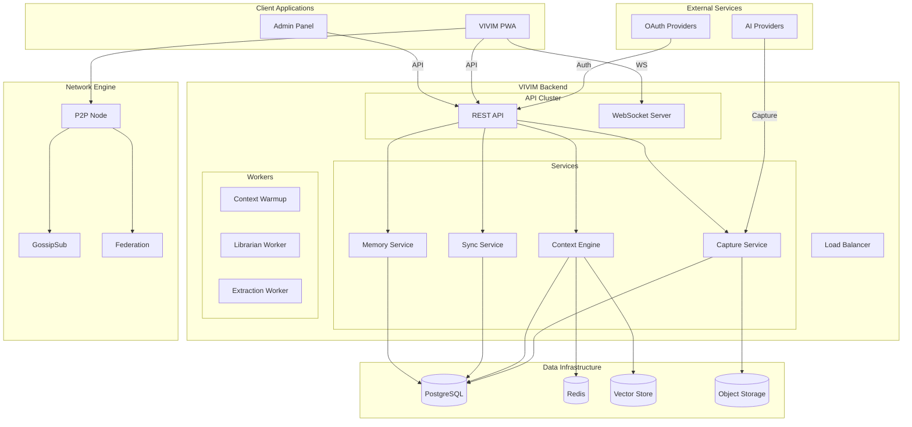
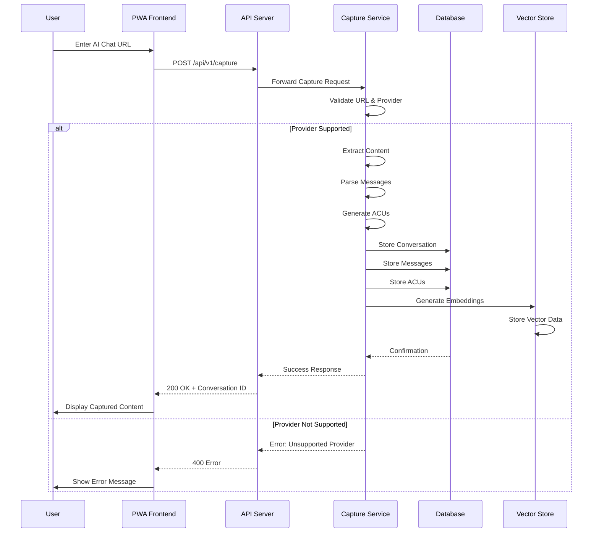
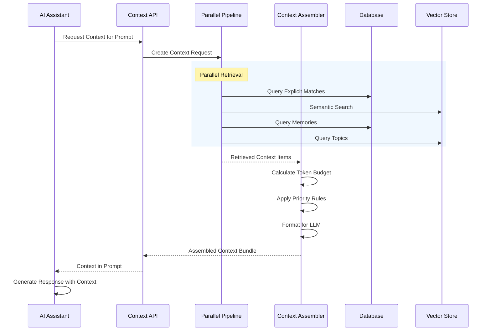
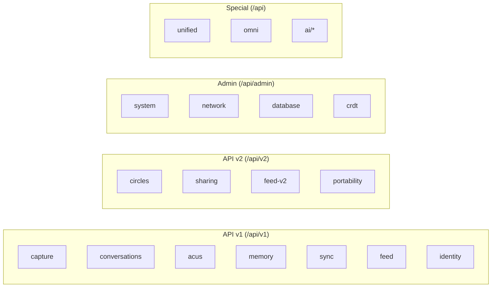
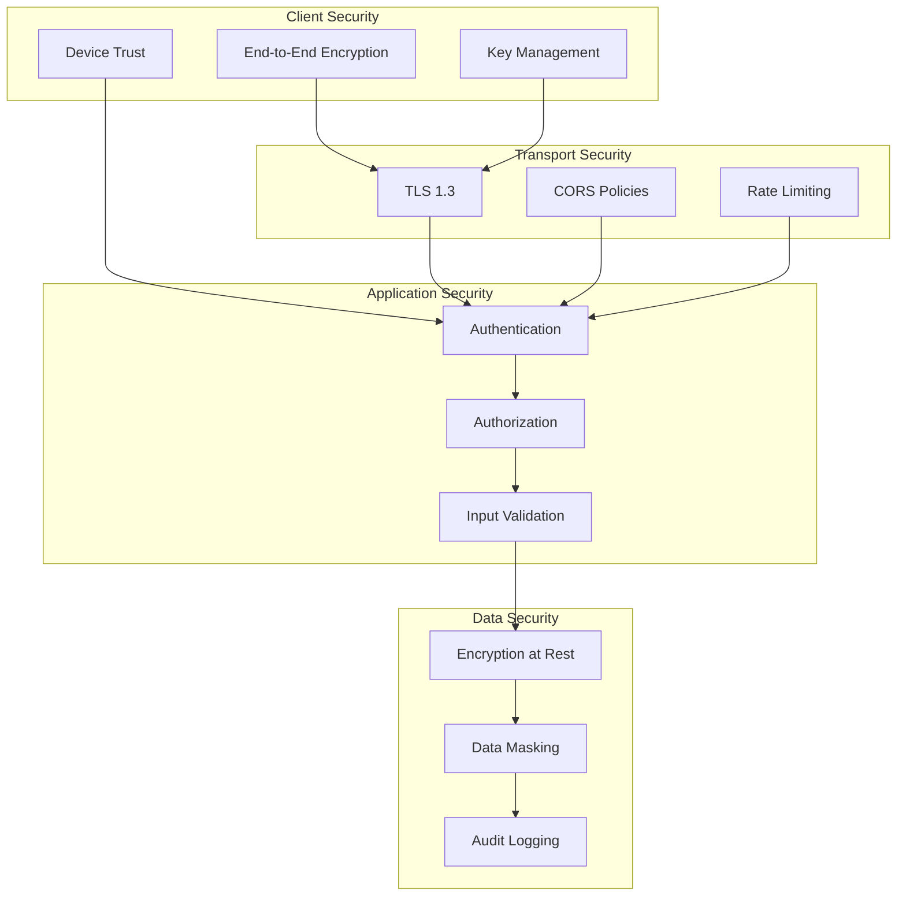

# Architecture Overview

This document provides a comprehensive overview of the VIVIM system architecture, including the major components, data flows, and design decisions.

## High-Level Architecture

---

## Component Responsibilities

### API Server (`/server`)

The API server is the central hub for all client communications, handling:

- **Authentication**: OAuth 2.0 (Google), session-based auth, API keys
- **REST Endpoints**: CRUD operations for conversations, users, ACUs
- **WebSocket**: Real-time updates, sync notifications
- **Context Assembly**: Dynamic context generation for AI prompts

### PWA Frontend (`/pwa`)

The Progressive Web App provides:

- **Conversation Capture**: URL-based extraction from AI providers
- **Content Rendering**: Rich content display (code, images, tables, mermaid)
- **Offline Support**: Service workers for offline functionality
- **Real-time Sync**: WebSocket connection for live updates

### Network Engine (`/network`)

Decentralized P2P layer enabling:

- **Peer Discovery**: DHT-based peer finding
- **Data Sync**: CRDT-based conflict-free replication
- **Federation**: Cross-instance communication
- **E2E Encryption**: Secure peer-to-peer messaging

---

## Data Flow: Conversation Capture

---

## Data Flow: Context Injection

---

## API Route Structure

---

## Security Architecture

---

## Next Steps

- [Server Architecture](/docs/architecture/server) - Detailed API and services
- [Context Engine](/docs/architecture/context) - Dynamic context system
- [Network Layer](/docs/network/overview) - P2P and sync details
- [Database Schema](/docs/database/schema) - Data models
