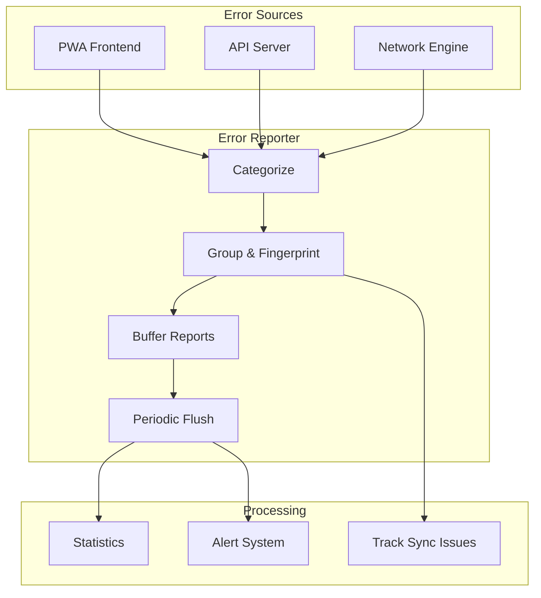
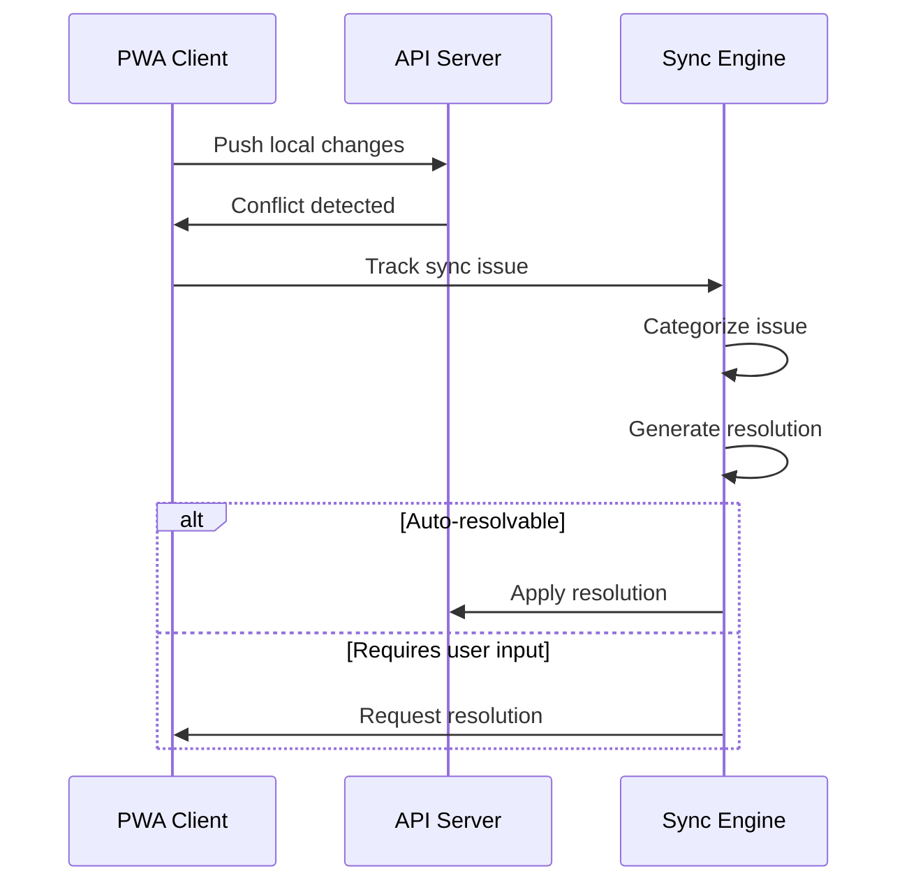

# Common Utilities

The `/common` directory contains shared TypeScript modules used across all VIVIM applications (PWA, Server, Network).

## Error Reporting System

A comprehensive centralized error reporting system with automatic categorization, grouping, and alerting.



### Error Categories

```typescript
type ErrorCategory =
  | 'NETWORK_TIMEOUT'        // Network request timed out
  | 'CONNECTION_LOST'        // Connection dropped
  | 'PROTOCOL_VIOLATION'     // Protocol error
  | 'DATABASE_ERROR'        // Database operation failed
  | 'SCHEMA_VIOLATION'       // Data schema mismatch
  | 'SYNC_CONFLICT'         // CRDT sync conflict
  | 'CRDT_CONFLICT'          // Conflict in replicated data
  | 'CONTRACT_VIOLATION'    // API contract mismatch
  | 'AUTH_EXPIRED'           // Authentication expired
  | 'PERMISSION_DENIED'     // Access denied
  | 'EXTRACTION_FAILED'      // Content extraction failed
  | 'AI_PROVIDER_ERROR'     // AI API error
  | 'VALIDATION_FAILED'      // Input validation failed
```

### Enhanced Error Context

```typescript
interface EnhancedErrorContext {
  // Request context
  requestId?: string;
  flowId?: string;
  correlationId?: string;
  endpoint?: string;
  method?: string;
  statusCode?: number;
  responseTime?: number;
  
  // User context
  userId?: string;
  sessionId?: string;
  deviceId?: string;
  userAction?: string;
  userJourney?: string[];
  
  // Sync context
  sync?: {
    entityType: string;
    entityId: string;
    operation: 'create' | 'update' | 'delete';
    localVersion?: number;
    remoteVersion?: number;
    conflictData?: any;
  };
  
  // Performance metrics
  memoryUsage?: number;
  cpuUsage?: number;
  networkLatency?: number;
}
```

### Usage Examples

```typescript
import { errorReporter, reportError, ErrorCategory, ErrorComponent } from '@vivim/common';

// Singleton usage
const reporter = errorReporter;

// Report error with context
await reporter.report({
  level: 'error',
  component: 'pwa',
  category: ErrorCategory.SYNC_CONFLICT,
  source: 'client',
  message: 'Failed to sync conversation',
  context: {
    sync: {
      entityType: 'conversation',
      entityId: 'conv_123',
      operation: 'update',
      localVersion: 5,
      remoteVersion: 3
    },
    userAction: 'edit conversation'
  },
  severity: 'high'
});

// Quick helper function
await reportError(
  'Database connection failed',
  'server',
  ErrorCategory.DATABASE_ERROR,
  error,
  { endpoint: '/api/v1/conversations' }
);

// Report sync issues
reporter.trackSyncIssue({
  issueType: 'conflict',
  source: 'pwa',
  target: 'server',
  entityType: 'message',
  entityId: 'msg_456',
  details: {
    operation: 'update',
    conflictingFields: ['content', 'editedAt']
  }
});
```

### Service Contract Validation

```typescript
// Register API contract
reporter.registerContract({
  id: 'get_conversations',
  serviceName: 'conversations-api',
  endpoint: '/api/v1/conversations',
  contractVersion: '1.0',
  expectedParams: [
    { name: 'limit', type: 'number', required: false },
    { name: 'offset', type: 'number', required: false }
  ],
  expectedResponse: {
    type: 'object',
    properties: {
      data: { type: 'array' },
      pagination: { type: 'object' }
    }
  },
  timeout: 5000
});

// Validate contract on API call
const violation = reporter.validateContract(
  'get_conversations',
  { limit: 20, offset: 0 },
  response,
  responseTimeMs
);
```

### Error Statistics

```typescript
const stats = reporter.getStats();

console.log(`
Total Errors: ${stats.total}
By Level: ${JSON.stringify(stats.byLevel)}
By Component: ${JSON.stringify(stats.byComponent)}
Recent (1hr): ${stats.recent}
Trending: ${stats.trending.map(t => t.fingerprint).join(', ')}
`);
```

### Alert Configuration

```typescript
const reporter = ErrorReporter.getInstance({
  endpoint: '/api/v1/errors',
  bufferSize: 10,
  flushInterval: 5000,        // Flush every 5 seconds
  maxRetries: 3,
  sampleRate: 100,            // Report 100% of errors
  alertThreshold: 10,         // Alert after 10 similar errors
  environment: 'production',
  version: '1.0.0'
});
```

---

## Sync Issue Tracking

Tracks data synchronization issues between PWA, Server, and Network layers.



### Sync Issue Types

```typescript
type SyncIssueType = 
  | 'conflict'         // Version conflict
  | 'divergence'      // Data diverged
  | 'missing_data'    // Data not found
  | 'order_violation' // Operation order issue
  | 'validation_failed';

type SyncResolutionStrategy = 
  | 'server_wins'     // Server data wins
  | 'client_wins'     // Client data wins
  | 'merge'           // Automatic merge
  | 'manual'          // User resolves
  | 'rejected';       // Rejected
```

---

## Debug Stream

Real-time debugging event stream for monitoring system state:

```typescript
// Subscribe to debug events
const unsubscribe = reporter.addDebugStreamListener((event) => {
  console.log('Debug event:', event.eventType, event.service);
  
  if (event.syncState) {
    console.log('Sync state:', {
      pending: event.syncState.pendingOperations,
      conflicts: event.syncState.conflictCount,
      offline: event.syncState.offlineQueue
    });
  }
});

// Events include:
// - error, warning, info
// - sync_update
// - contract_check
// - performance
```

---

## Error Dashboard Integration

The error reporting system integrates with the PWA's Error Dashboard:

```tsx
// From: pwa/src/pages/ErrorDashboard.tsx
import { errorReporter } from '@vivim/common';

function ErrorDashboard() {
  const [stats, setStats] = useState(null);
  
  useEffect(() => {
    // Get real-time stats
    setStats(errorReporter.getStats());
    
    // Subscribe to debug stream
    const unsub = errorReporter.addDebugStreamListener((event) => {
      setStats(errorReporter.getStats());
    });
    
    return unsub;
  }, []);
  
  return (
    <div>
      <ErrorStatsPanel stats={stats} />
      <ErrorList errors={stats?.topErrors} />
      <SyncIssuesPanel />
    </div>
  );
}
```
