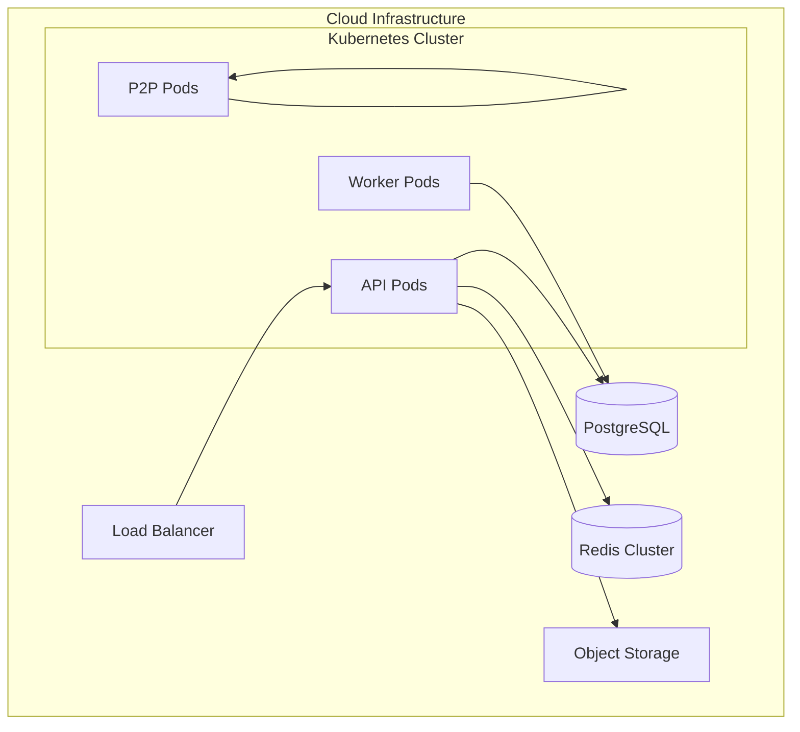

# Deployment Guide

This guide covers deploying VIVIM to production environments.

## Architecture



## Prerequisites

| Component | Specification |
|-----------|---------------|
| Database | PostgreSQL 14+ |
| Cache | Redis 7+ Cluster |
| Storage | S3-compatible |
| Kubernetes | 1.28+ |
| Ingress | TLS termination |

## Configuration

### Environment Variables

```bash
# Required
DATABASE_URL=postgresql://...
REDIS_URL=redis://...
SESSION_SECRET=<64-char-secret>

# Optional
LOG_LEVEL=info
NODE_ENV=production
```

### Docker Images

```dockerfile
# API Server
FROM oven/bun:1-alpine
WORKDIR /app
COPY server/ ./server/
WORKDIR /app/server
EXPOSE 3000
CMD ["bun", "src/server.js"]

# Network Engine
FROM oven/bun:1-alpine
WORKDIR /app
COPY network/ ./network/
WORKDIR /app/network
EXPOSE 1235
CMD ["bun", "src/index.js"]
```

## Kubernetes Deployment

### API Deployment

```yaml
apiVersion: apps/v1
kind: Deployment
metadata:
  name: vivim-api
spec:
  replicas: 3
  selector:
    matchLabels:
      app: vivim-api
  template:
    metadata:
      labels:
        app: vivim-api
    spec:
      containers:
        - name: api
          image: vivim/api:latest
          ports:
            - containerPort: 3000
          env:
            - name: DATABASE_URL
              valueFrom:
                secretKeyRef:
                  name: vivim-secrets
                  key: database-url
          resources:
            requests:
              memory: "512Mi"
              cpu: "250m"
            limits:
              memory: "1Gi"
              cpu: "1000m"
```

### Horizontal Pod Autoscaling

```yaml
apiVersion: autoscaling/v2
kind: HorizontalPodAutoscaler
metadata:
  name: vivim-api-hpa
spec:
  scaleTargetRef:
    apiVersion: apps/v1
    kind: Deployment
    name: vivim-api
  minReplicas: 3
  maxReplicas: 20
  metrics:
    - type: Resource
      resource:
        name: cpu
        target:
          type: Utilization
          averageUtilization: 70
```

## Database Setup

```sql
-- Create database
CREATE DATABASE vivim;

-- Create extensions
CREATE EXTENSION IF NOT EXISTS "uuid-ossp";
CREATE EXTENSION IF NOT EXISTS "pg_trgm";
CREATE EXTENSION IF NOT EXISTS "vector";

-- Run migrations
-- bun run db:migrate
```

## Monitoring

### Prometheus Metrics

```yaml
apiVersion: monitoring.coreos.com/v1
kind: ServiceMonitor
metadata:
  name: vivim-api
spec:
  selector:
    matchLabels:
      app: vivim-api
  endpoints:
    - port: metrics
      path: /metrics
```

### Key Metrics

| Metric | Description | Alert Threshold |
|--------|-------------|------------------|
| `api_requests_total` | Total requests | N/A |
| `api_latency_seconds` | Response latency | > 1s |
| `db_pool_connections` | DB pool usage | > 80% |
| `redis_memory_bytes` | Redis memory | > 80% |

### Logging

```yaml
apiVersion: v1
kind: ConfigMap
metadata:
  name: vivim-logging
data:
  fluent-bit.conf: |
    [INPUT]
        Name tail
        Path /var/log/containers/*.log
        Parser json
    
    [OUTPUT]
        Name cloudwatch
        Region us-east-1
        Log_Group /aws/vivim
        Stream container
```

## Backup & Recovery

### Database Backup

```bash
# Daily backup
pg_dump $DATABASE_URL | gzip > backup_$(date +%Y%m%d).sql.gz

# Point-in-time recovery
pg_restore -P --target-time="2024-01-15 10:00:00" \
  $DATABASE_URL backup_20240115.sql
```

### S3 Backup

```bash
# Enable versioning
aws s3api put-bucket-versioning \
  --bucket vivim-assets \
  -- versioning-configuration Status=Enabled

# Lifecycle policy
aws s3api put-bucket-lifecycle-configuration \
  --bucket vivim-assets \
  -- lifecycle-configuration '{"Rules":[{"ID":"archive","Status":"Enabled","Transitions":[{"Days":30,"StorageClass":"GLACIER"}]}]
```

## Health Checks

### Liveness Probe

```typescript
app.get('/health/live', (req, res) => {
  res.status(200).json({ status: 'ok' });
});
```

### Readiness Probe

```typescript
app.get('/health/ready', async (req, res) => {
  const checks = {
    database: await checkDatabase(),
    redis: await checkRedis()
  };
  
  const allHealthy = Object.values(checks).every(v => v);
  res.status(allHealthy ? 200 : 503).json(checks);
});
```

## SSL/TLS

```nginx
server {
    listen 443 ssl http2;
    server_name api.vivim.app;
    
    ssl_certificate /etc/ssl/certs/vivim.crt;
    ssl_certificate_key /etc/ssl/private/vivim.key;
    ssl_protocols TLSv1.2 TLSv1.3;
    ssl_ciphers HIGH:!aNULL:!MD5;
    
    location / {
        proxy_pass http://vivim-api:3000;
        proxy_http_version 1.1;
        proxy_set_header Upgrade $http_upgrade;
        proxy_set_header Connection 'upgrade';
    }
}
```

## Disaster Recovery

### RTO/RPO Targets

| Metric | Target |
|--------|--------|
| RTO (Recovery Time Objective) | 30 minutes |
| RPO (Recovery Point Objective) | 1 hour |

### Failover Procedure

1. Activate standby database
2. Update DNS to point to new primary
3. Verify all services
4. Notify users

## Scaling Guidelines

| Traffic Level | API Replicas | Worker Replicas | P2P Nodes |
|---------------|-------------|-----------------|-----------|
| < 1K req/min | 2 | 1 | 3 |
| 1K-10K req/min | 5 | 3 | 5 |
| 10K-100K req/min | 15 | 10 | 10 |
| > 100K req/min | 30+ | 20+ | 20+ |
