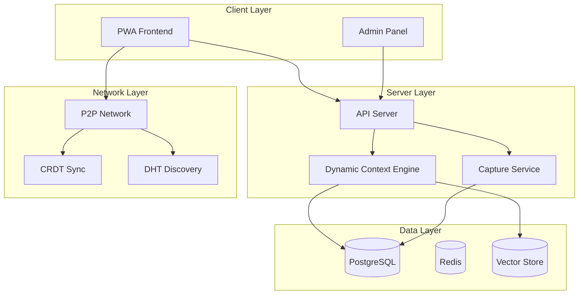

# VIVIM - Own Your AI

VIVIM is a decentralized AI memory and capture platform that allows users to capture, store, and interact with their AI conversations across multiple providers. The platform emphasizes user ownership, privacy, and seamless integration with AI assistants.

## Vision

VIVIM aims to be your "personal digital brain" - a system that captures and understands your interactions with AI assistants, making your knowledge accessible and useful across contexts.

## Core Principles

1. **User Ownership** - Your data belongs to you, not the AI providers
2. **Privacy First** - End-to-end encryption and isolated user contexts
3. **Decentralization** - P2P sync and federated architecture
4. **Universal Capture** - Support for multiple AI providers (ChatGPT, Claude, Gemini, etc.)

---

## Architecture Overview

---

## System Components

| Component | Technology | Purpose |
|-----------|------------|---------|
| **PWA** | React + TypeScript | Frontend application for capturing and viewing conversations |
| **Server** | Express + TypeScript | RESTful API, WebSocket support, context engine |
| **Network** | libp2p + Yjs | P2P networking, CRDT synchronization |
| **Database** | PostgreSQL + Prisma | Primary data store with full-text search |
| **Cache** | Redis | Session management, caching, pub/sub |
| **Admin Panel** | React + Recharts | System monitoring and management dashboard |

---

## Documentation Structure

### Getting Started
- **[Introduction](/docs/getting-started/introduction)** - Welcome & overview
- **[Development Guide](/docs/development/guide)** - Local setup and development

### Architecture
- **[Architecture Overview](/docs/architecture/overview)** - System design and high-level view
- **[Server Architecture](/docs/architecture/server)** - Express.js API server details
- **[Context Engine](/docs/architecture/context)** - Dynamic Context System
- **[Pipeline](/docs/architecture/pipeline)** - Parallel processing
- **[User Context](/docs/architecture/user-context)** - Per-user isolation
- **[Assembler](/docs/architecture/assembler)** - Context assembly
- **[Data Sync & Offline](/docs/architecture/sync)** - Offline-first architecture

### API Reference
- **[API Overview](/docs/api/overview)** - REST API endpoints and patterns

### Frontend
- **[PWA Overview](/docs/pwa/overview)** - React PWA architecture

### Network
- **[Network Layer](/docs/network/overview)** - P2P, CRDT, DHT, Federation

### Database
- **[Database Schema](/docs/database/schema)** - PostgreSQL models and relationships

### Social Features
- **[Social Overview](/docs/social/overview)** - Circles, sharing, feeds

### Admin
- **[Admin Panel](/docs/admin/overview)** - System monitoring

### Security
- **[Security Overview](/docs/security/overview)** - Authentication, encryption

### Common
- **[Common Utilities](/docs/common/overview)** - Shared modules

### Reference
- **[TypeScript Types](/docs/reference/types)** - Core type definitions

### Deployment
- **[Deployment Guide](/docs/deployment/guide)** - Production deployment

---

## Getting Started

Explore the documentation by selecting a topic from the sidebar.
