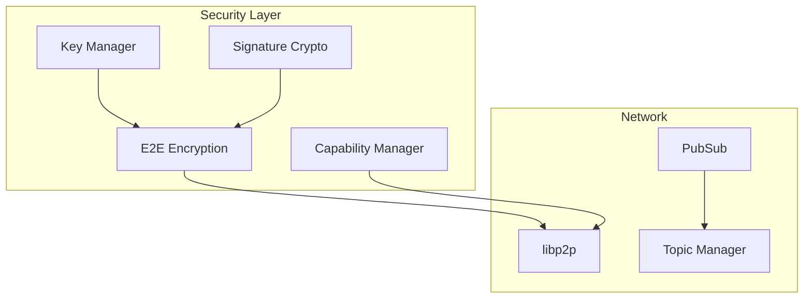
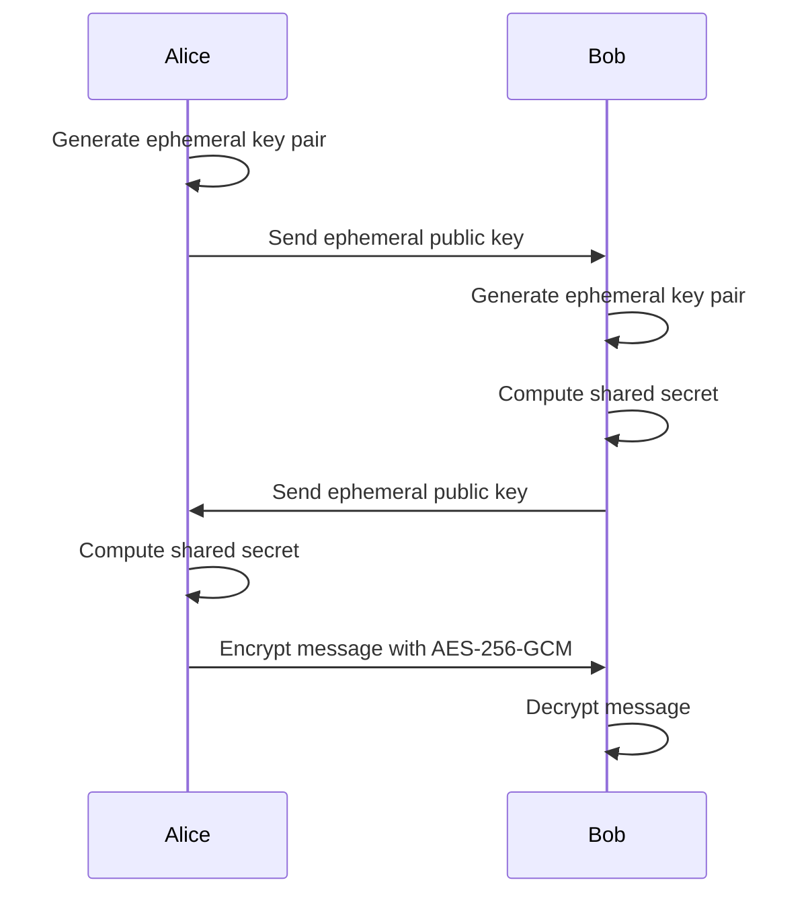
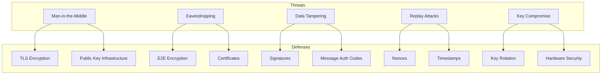

# Network Security Layer

The VIVIM Network Security Layer provides comprehensive security features including **end-to-end encryption**, **key management**, **capability-based access control**, and **secure communication** over P2P networks.

## Architecture Overview



## End-to-End Encryption

### E2EEncryption Class

The `E2EEncryption` class provides X25519 key exchange with AES-256-GCM encryption:

```typescript
import { E2EEncryption } from './security/E2EEncryption';

const e2e = new E2EEncryption({
  algorithm: 'x25519',
  cipher: 'aes-256-gcm'
});

// Generate key pair
const keyPair = e2e.generateKeyPair();

// Or set existing key pair
e2e.setKeyPair(existingKeyPair);
```

### Encryption Flow



### Encrypting Messages

```typescript
const encrypted = await e2e.encryptMessage(
  'Hello, Bob!',
  recipientPublicKey  // Bob's public key
);

// Result contains:
// - ephemeralPublicKey: for key exchange
// - nonce: random initialization vector
// - ciphertext: encrypted message
console.log(encrypted);
// {
//   ephemeralPublicKey: Uint8Array,
//   nonce: Uint8Array, 
//   ciphertext: Uint8Array
// }
```

### Decrypting Messages

```typescript
const plaintext = await e2e.decryptMessage(
  encrypted,
  senderPublicKey  // Alice's public key
);

console.log(plaintext); // "Hello, Bob!"
```

### Key Derivation

```typescript
// The E2EEncryption class derives keys using HMAC-SHA256
private deriveKey(sharedSecret: Buffer, purpose: string): Buffer {
  const info = Buffer.from(`vivim-${purpose}-v1`, 'utf8`);
  const hmac = require('crypto').createHmac('sha256', sharedSecret);
  hmac.update(info);
  return hmac.digest().slice(0, 32);
}
```

## Key Management

### KeyManager

```typescript
import { KeyManager } from './security/KeyManager';

const keyManager = new KeyManager();

// Generate new identity
const identity = await keyManager.generateIdentity();

// Store key pair securely
await keyManager.storeKeyPair(keyPair);

// Load existing key pair
const storedKeyPair = await keyManager.loadKeyPair();

// Export public key for sharing
const publicKey = await keyManager.exportPublicKey();

// Import peer's public key
await keyManager.importPeerKey(peerId, peerPublicKey);
```

### Key Types

| Type | Description | Usage |
|------|-------------|-------|
| `identity` | User's main identity key | Authentication, signing |
| `encryption` | Message encryption key | E2E encryption |
| `session` | Temporary session key | Short-lived operations |
| `recovery` | Backup/recovery key | Account recovery |

### Key Rotation

```typescript
// Rotate encryption keys
await keyManager.rotateKey('encryption');

// Get new public key after rotation
const newPublicKey = await keyManager.exportPublicKey();

// Notify peers of key change
await notifyPeersOfKeyChange(newPublicKey);
```

## Capability Manager

The Capability Manager implements **capability-based access control** for fine-grained permissions:

```typescript
import { CapabilityManager } from './security/CapabilityManager';

const capabilityManager = new CapabilityManager();
```

### Capability Types

```typescript
type Capability = 
  // Read capabilities
  | { type: 'read', resource: string }
  | { type: 'read:conversation', conversationId: string }
  
  // Write capabilities
  | { type: 'write', resource: string }
  | { type: 'write:message', conversationId: string }
  
  // Share capabilities
  | { type: 'share', resource: string }
  | { type: 'share:conversation', conversationId: string }
  
  // Admin capabilities
  | { type: 'admin', resource: string }
  | { type: 'admin:circle', circleId: string };
```

### Granting Capabilities

```typescript
// Grant read access to a conversation
await capabilityManager.grant(
  userDID,
  { type: 'read:conversation', conversationId: 'conv-123' }
);

// Grant write access
await capabilityManager.grant(
  userDID,
  { type: 'write:message', conversationId: 'conv-123' }
);

// Grant admin access to a circle
await capabilityManager.grant(
  userDID,
  { type: 'admin:circle', circleId: 'circle-456' }
);
```

### Verifying Capabilities

```typescript
// Check if user has capability
const canRead = await capabilityManager.check(
  userDID,
  { type: 'read:conversation', conversationId: 'conv-123' }
);

if (canRead) {
  // Allow access
}

// Get all capabilities for a user
const capabilities = await capabilityManager.getCapabilities(userDID);
```

### Revoking Capabilities

```typescript
// Revoke specific capability
await capabilityManager.revoke(
  userDID,
  { type: 'write:message', conversationId: 'conv-123' }
);

// Revoke all capabilities
await capabilityManager.revokeAll(userDID);
```

## Secure Communication

### PubSub Service

```typescript
import { PubSubService } from './pubsub/PubSubService';

const pubsub = new PubSubService(networkNode);

// Subscribe to a topic
await pubsub.subscribe('vivim:conversations', (message) => {
  console.log('Received:', message);
});

// Publish a message
await pubsub.publish('vivim:conversations', {
  type: 'new_message',
  data: { /* message data */ }
});

// Unsubscribe
await pubsub.unsubscribe('vivim:conversations');
```

### Topic Manager

```typescript
import { TopicManager } from './pubsub/TopicManager';

const topicManager = new TopicManager();

// Create secure topic
const topic = await topicManager.createTopic('my-circle', {
  encrypted: true,
  accessControl: 'circle-members-only'
});

// Add members to topic
await topicManager.addMember('my-circle', peerId);

// Remove members
await topicManager.removeMember('my-circle', peerId);

// Get topic info
const info = await topicManager.getTopicInfo('my-circle');
```

## Signature & Verification

### Signing Data

```typescript
import { sign, verify } from './crypto/signature';

const data = {
  type: 'message',
  content: 'Hello!',
  timestamp: Date.now()
};

// Sign with private key
const signature = await sign(data, privateKey);

// Verify with public key
const isValid = await verify(data, signature, publicKey);
```

### Node Signing

```typescript
import { signNode, verifyNode } from './crypto/signature';

const node: MessageNode = {
  id: 'msg-123',
  type: 'message',
  content: 'Hello!',
  // ... other fields
};

// Sign the node
const signedNode = await signNode(node, privateKey);

// Verify the node
const isValid = await verifyNode(signedNode, authorPublicKey);
```

## Security Best Practices

### Key Storage

```typescript
// NEVER store private keys in plain text
// Use secure storage mechanisms:

// 1. Browser Keychain (Web Crypto API)
const key = await crypto.subtle.generateKey(
  { name: 'RSA-OAEP', modulusLength: 2048 },
  true,
  ['encrypt', 'decrypt']
);

// 2. IndexedDB with encryption
const encryptedKey = await encryptKey(privateKey, userPassword);

// 3. Hardware security module (for server-side)
```

### Encryption Guidelines

1. **Use fresh nonces**: Never reuse encryption nonces
2. **Verify signatures**: Always verify message authenticity
3. **Key rotation**: Regularly rotate encryption keys
4. **Perfect forward secrecy**: Use ephemeral keys for each session

### Access Control

```typescript
// Implement defense in depth
const securityLayers = [
  // Layer 1: Network-level
  { type: 'tls', enforce: true },
  
  // Layer 2: Application-level
  { type: 'capability', enforce: true },
  
  // Layer 3: Content-level
  { type: 'signature', enforce: true },
  
  // Layer 4: Encryption
  { type: 'e2e', enforce: true }
];
```

## Threat Model



## Related Documentation

- [Network Overview](/docs/network/overview) - P2P networking
- [Sync Architecture](/docs/architecture/sync) - Secure sync
- [Security Overview](/docs/security/overview) - Authentication
