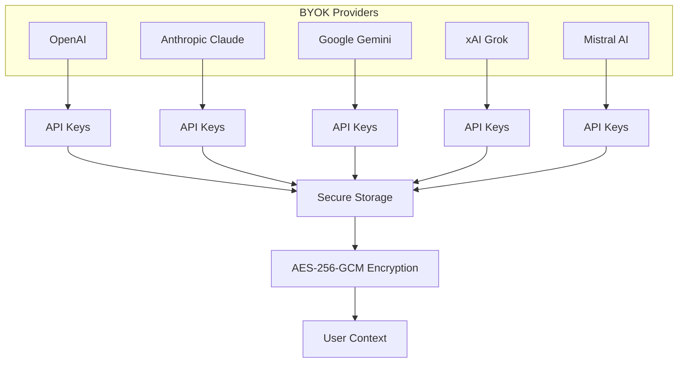
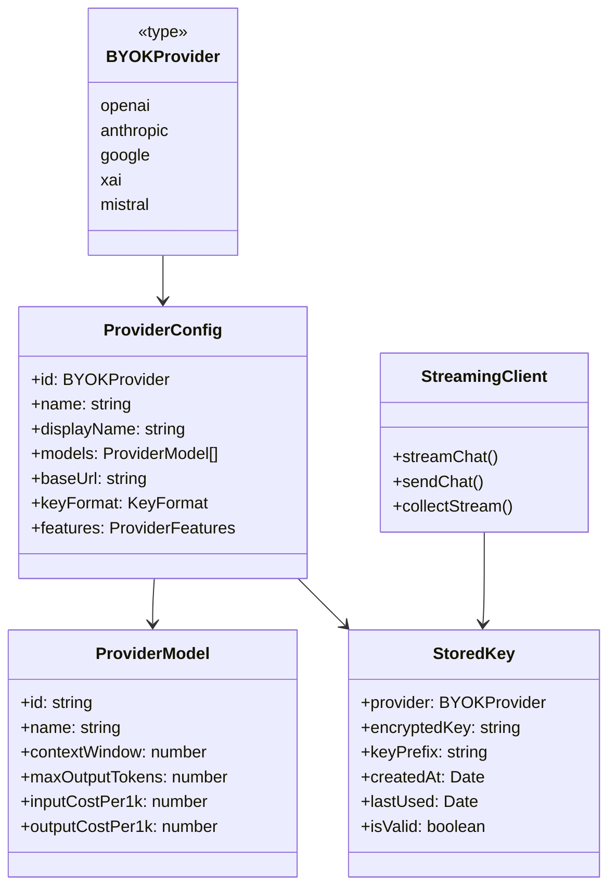

# BYOK - Bring Your Own Key

VIVIM's BYOK (Bring Your Own Key) system allows users to bring their own AI provider API keys, enabling direct access to AI models without requiring VIVIM's infrastructure. This provides maximum flexibility, privacy, and cost control.

## Supported Providers



### Provider Support Matrix

| Provider | Models | Streaming | Function Calling | Vision |
|----------|--------|-----------|------------------|--------|
| **OpenAI** | GPT-4o, GPT-4o Mini, GPT-4 Turbo, GPT-3.5 Turbo | ✅ | ✅ | ✅ |
| **Anthropic** | Claude Sonnet 4, Claude Opus 4, Claude Haiku 3 | ✅ | ✅ | ✅ |
| **Google** | Gemini 1.5 Pro, Gemini 1.5 Flash | ✅ | ✅ | ✅ |
| **xAI** | Grok 2, Grok 2 Vision | ✅ | ❌ | ✅ |
| **Mistral** | Mistral Large, Mistral Small, Mistral 7B | ✅ | ✅ | ✅ |

## Architecture

### Core Components



## API Key Management

### Key Storage Security

API keys are encrypted using **AES-256-GCM** before storage:

```typescript
// Encryption flow
async function encryptValue(value: string): Promise<{ ciphertext: string; iv: string }> {
  const key = await getOrCreateMasterKey();
  const iv = crypto.getRandomValues(new Uint8Array(12));
  
  const encrypted = await crypto.subtle.encrypt(
    { name: 'AES-GCM', iv },
    key,
    encoder.encode(value)
  );

  return {
    ciphertext: btoa(String.fromCharCode(...new Uint8Array(encrypted))),
    iv: btoa(String.fromCharCode(...iv)),
  };
}
```

### Key Derivation

Keys are derived from user identity using **PBKDF2**:

```typescript
async function deriveKeyFromPassword(
  password: string,
  salt: Uint8Array,
  iterations: number = 100000
): Promise<CryptoKey> {
  const passwordKey = await crypto.subtle.importKey(
    'raw',
    encoder.encode(password),
    'PBKDF2',
    false,
    ['deriveBits', 'deriveKey']
  );

  return crypto.subtle.deriveKey(
    {
      name: 'PBKDF2',
      salt,
      iterations,
      hash: 'SHA-256',
    },
    passwordKey,
    { name: 'AES-GCM', length: 256 },
    false,
    ['encrypt', 'decrypt']
  );
}
```

## Usage Examples

### Adding an API Key

```typescript
import { addKey, validateKey } from './byok/api-key-manager';
import type { BYOKProvider } from './byok/types';

// Add a new API key
const result = await addKey('openai', 'sk-proj-abc123...');

if (result.valid) {
  console.log('API key added successfully');
} else {
  console.error('Failed:', result.error);
}

// Validate key with provider
const validation = await validateKey('anthropic', 'sk-ant-api03-...');
if (validation.valid) {
  console.log('Key is valid for:', validation.models);
}
```

### Streaming Chat

```typescript
import { streamChat, collectStream } from './byok/streaming-client';

const request = {
  provider: 'openai',
  model: 'gpt-4o',
  messages: [
    { role: 'user', content: 'Hello, how are you?' }
  ],
  settings: {
    temperature: 0.7,
    maxTokens: 1000
  }
};

// Stream response
for await (const chunk of streamChat(request)) {
  if (chunk.type === 'content') {
    process.stdout.write(chunk.delta);
  }
}

// Or collect complete response
const result = await collectStream(request, (chunk) => {
  // Progress callback
});

console.log('Usage:', result.usage);
```

### Cost Calculation

```typescript
import { getProviderModels, calculateCost, formatCost } from './byok/provider-config';

// Get models for a provider
const models = getProviderModels('openai');
console.log('Available models:', models.map(m => m.name));

// Calculate cost
const cost = calculateCost('openai', 'gpt-4o', 1000, 500);
console.log('Cost:', formatCost(cost)); // "$0.0075"
```

## Pricing Models

### Token Pricing (USD per 1K tokens)

| Model | Input | Output | Context |
|-------|-------|--------|---------|
| **GPT-4o** | $0.0025 | $0.01 | 128K |
| **GPT-4o Mini** | $0.00015 | $0.0006 | 128K |
| **Claude Sonnet 4** | $0.003 | $0.015 | 200K |
| **Claude Haiku 3** | $0.00025 | $0.00125 | 200K |
| **Gemini 1.5 Pro** | $0.00125 | $0.00375 | 2M |
| **Gemini 1.5 Flash** | $0.000075 | $0.0003 | 1M |
| **Grok 2** | $0.002 | $0.01 | 131K |
| **Mistral Large** | $0.002 | $0.006 | 128K |

## Error Handling

```typescript
import { BYOKError, BYOK_ERROR_CODES } from './byok/types';

try {
  const result = await sendChat(request);
} catch (error) {
  if (error instanceof BYOKError) {
    switch (error.code) {
      case BYOK_ERROR_CODES.INVALID_API_KEY:
        // Prompt user to re-enter key
        break;
      case BYOK_ERROR_CODES.RATE_LIMITED:
        // Show rate limit message
        break;
      case BYOK_ERROR_CODES.INSUFFICIENT_QUOTA:
        // Show quota exceeded message
        break;
    }
  }
}
```

### Error Codes

| Code | Description |
|------|-------------|
| `INVALID_API_KEY` | The API key is invalid or malformed |
| `RATE_LIMITED` | Too many requests, try again later |
| `MODEL_NOT_FOUND` | The requested model doesn't exist |
| `INSUFFICIENT_QUOTA` | API key has no remaining quota |
| `STREAM_ABORTED` | Streaming was cancelled |
| `ENCRYPTION_FAILED` | Failed to encrypt the API key |
| `DECRYPTION_FAILED` | Failed to decrypt the API key |
| `KEY_NOT_FOUND` | No API key found for provider |

## Best Practices

1. **Key Format Validation**: Always validate key format before storage
2. **Secure Display**: Never show full API keys (only prefix + suffix)
3. **Usage Tracking**: Monitor API key usage to avoid unexpected costs
4. **Key Rotation**: Regularly update and validate API keys
5. **Encryption**: Always encrypt keys at rest using AES-256-GCM

```typescript
// Secure key display
import { formatKeyDisplay } from './byok/provider-config';

const displayKey = formatKeyDisplay('sk-proj-abc123def456');
console.log(displayKey); // "sk-pr••••••••f456"
```

## Related Documentation

- [Security Overview](/docs/security/overview) - Authentication and encryption
- [PWA Architecture](/docs/pwa/overview) - Frontend architecture
- [API Overview](/docs/api/overview) - REST API endpoints
