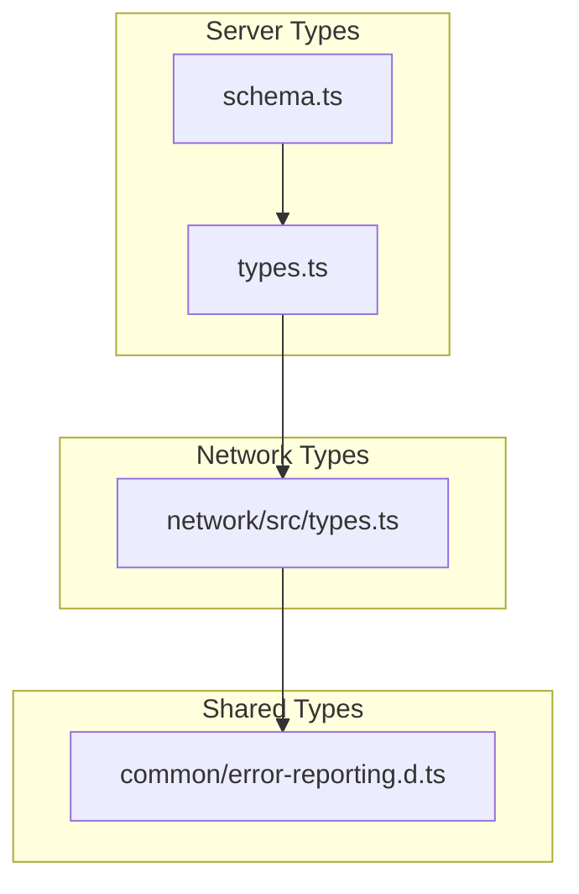

# TypeScript Type Definitions

VIVIM uses comprehensive TypeScript types across all modules for type safety and API contracts.

## Core Types Overview



---

## Content Types

### ContentPart Union

Represents different content types within messages:

```typescript
// From: server/src/types/schema.ts

type ContentPartType = 
  | 'text'
  | 'code'
  | 'image'
  | 'latex'
  | 'table'
  | 'mermaid'
  | 'tool_call'
  | 'tool_result';

interface BaseContentPart {
  type: ContentPartType;
  metadata?: Record<string, any>;
}

interface TextPart extends BaseContentPart {
  type: 'text';
  content: string;
  metadata?: {
    format?: 'markdown' | 'plain';
  };
}

interface CodePart extends BaseContentPart {
  type: 'code';
  content: string;
  metadata?: {
    language?: string;
    filename?: string;
    highlighted?: boolean;
  };
}

interface ImagePart extends BaseContentPart {
  type: 'image';
  content: string; // URL or base64
  metadata?: {
    alt?: string;
    width?: number;
    height?: number;
    mimeType?: string;
    source?: 'generated' | 'uploaded' | 'url';
  };
}

interface TablePart extends BaseContentPart {
  type: 'table';
  content: {
    headers: string[];
    rows: string[][];
  };
  metadata?: {
    format?: 'markdown' | 'html';
  };
}

interface MermaidPart extends BaseContentPart {
  type: 'mermaid';
  content: string;
  metadata?: {
    diagramType?: 'flowchart' | 'sequence' | 'gantt' | 'class' | 'state' | 'er' | 'pie';
  };
}

type ContentPart = TextPart | CodePart | ImagePart | LatexPart | TablePart | MermaidPart | ToolCallPart | ToolResultPart;
```

### Message Types

```typescript
type MessageRole = 'user' | 'assistant' | 'system' | 'tool';
type MessageStatus = 'completed' | 'error' | 'cancelled';
type FinishReason = 'stop' | 'length' | 'tool_calls' | 'content_filter' | 'error';

interface Message {
  id: string;
  conversationId: string;
  role: MessageRole;
  author?: string | null;
  parts: ContentPart[];
  createdAt: Date;
  messageIndex: number;
  status: MessageStatus;
  finishReason?: FinishReason | null;
  tokenCount?: number | null;
  metadata: Record<string, any>;
}
```

### Conversation Types

```typescript
type Provider = 'gemini' | 'chatgpt' | 'claude' | 'other';

interface Conversation {
  id: string;
  provider: Provider | string;
  sourceUrl: string;
  title: string;
  model?: string | null;
  createdAt: Date;
  updatedAt: Date;
  capturedAt: Date;

  // Statistics
  messageCount: number;
  userMessageCount: number;
  aiMessageCount: number;
  totalWords: number;
  totalCharacters: number;
  totalTokens?: number | null;

  // Rich content counts
  totalCodeBlocks: number;
  totalImages: number;
  totalTables: number;
  totalLatexBlocks: number;
  totalMermaidDiagrams: number;
  totalToolCalls: number;

  metadata: Record<string, any>;
}
```

---

## Context Types

### Token Budget

```typescript
interface TokenBudget {
  total: number;
  allocation: {
    system: number;      // System prompt
    memories: number;    // User memories
    entities: number;    // Entity context
    topics: number;     // Topic context
    history: number;     // Recent messages
    padding: number;     // Response buffer
  };
}

interface ContextRequest {
  userId: string;
  query: string;
  options?: {
    includeMemories?: boolean;
    includeEntities?: boolean;
    includeTopics?: boolean;
    maxTokens?: number;
  };
}

interface ContextBundle {
  id: string;
  userId: string;
  createdAt: Date;
  items: ContextItem[];
  tokenCount: number;
  quality: ContextQuality;
}

interface ContextItem {
  type: 'memory' | 'entity' | 'topic' | 'acu';
  id: string;
  content: string;
  relevance: number;
  source: string;
}
```

---

## Network Types

### Peer & Connection

```typescript
// From: network/src/types.ts

interface PeerInfo {
  peerId: string;
  multiaddrs: string[];
  protocols: string[];
  connections: number;
  latency?: number;
  bandwidth?: {
    upload: number;
    download: number;
  };
}

type ConnectionState = 
  | 'disconnected'
  | 'connecting'
  | 'connected'
  | 'disconnecting';

interface NetworkMessage {
  id: string;
  type: string;
  sender: string;
  recipient?: string;
  payload: Uint8Array;
  timestamp: number;
  ttl?: number;
}

interface Protocol {
  name: string;
  version: string;
  handlers: {
    onConnect?: (peer: PeerInfo) => void;
    onDisconnect?: (peer: PeerInfo) => void;
    onMessage?: (message: NetworkMessage) => void;
  };
}
```

### Sync State

```typescript
interface SyncState {
  docId: string;
  version: number;
  vectorClock: Record<string, number>;
  status: 'offline' | 'connecting' | 'syncing' | 'synced' | 'error';
  peers: string[];
  pending: number;
  conflicts: Conflict[];
}

interface Conflict {
  id: string;
  key: string;
  localValue: any;
  remoteValue: any;
  timestamp: number;
  resolution?: ConflictResolution;
}

type ConflictResolution = {
  strategy: 'local' | 'remote' | 'merge' | 'manual';
  value?: any;
  resolvedAt: Date;
};
```

---

## Context Settings Types

```typescript
// From: server/src/context/settings-types.ts

interface UserContextSettings {
  userId: string;
  
  // AI Configuration
  ai: {
    model: string;
    temperature: number;
    maxTokens: number;
  };
  
  // Context preferences
  context: {
    maxMemories: number;
    maxEntities: number;
    maxTopics: number;
    includeRecentMessages: number;
    tokenBudget: number;
  };
  
  // Retrieval preferences
  retrieval: {
    semanticWeight: number;    // 0-1
    explicitWeight: number;   // 0-1
    recencyWeight: number;    // 0-1
    qualityThreshold: number; // 0-1
  };
  
  // Privacy settings
  privacy: {
    shareWithCircles: boolean;
    allowPublicSearch: boolean;
    dataRetentionDays: number;
  };
}
```

---

## API Request/Response Types

### Standard Response

```typescript
interface ApiResponse<T> {
  success: boolean;
  data?: T;
  error?: ApiError;
  meta: {
    requestId: string;
    timestamp: string;
    pagination?: Pagination;
  };
}

interface ApiError {
  code: string;
  message: string;
  details?: Record<string, any>;
}

interface Pagination {
  page: number;
  limit: number;
  total: number;
  hasMore: boolean;
}
```

### Capture Types

```typescript
interface CaptureRequest {
  sourceUrl: string;
  provider?: Provider;
  options?: {
    extractCode?: boolean;
    extractImages?: boolean;
    generateSummary?: boolean;
    extractEntities?: boolean;
  };
}

interface CaptureResponse {
  success: boolean;
  conversation?: Conversation;
  error?: {
    code: string;
    message: string;
  };
}
```

---

## Social Types

### Circle Types

```typescript
interface Circle {
  id: string;
  ownerId: string;
  name: string;
  description?: string;
  isPublic: boolean;
  icon?: string;
  color?: string;
  memberCount: number;
  createdAt: Date;
  updatedAt: Date;
}

interface CircleMember {
  id: string;
  circleId: string;
  userId: string;
  role: 'owner' | 'admin' | 'member';
  joinedAt: Date;
}
```

### Feed Types

```typescript
interface FeedItem {
  id: string;
  type: 'acu_created' | 'memory_added' | 'circle_share' | 'comment';
  actor: {
    id: string;
    displayName: string;
    avatarUrl?: string;
  };
  target: {
    type: string;
    id: string;
    preview: string;
  };
  timestamp: Date;
  engagement: {
    views: number;
    likes: number;
    comments: number;
  };
}

interface FeedRequest {
  type: 'personal' | 'circle' | 'following' | 'global';
  circleId?: string;
  page?: number;
  limit?: number;
}
```

---

## Utility Functions

```typescript
// Helper functions from schema.ts

function countPartsByType(parts: ContentPart[]): Record<ContentPartType, number> {
  const counts: Record<string, number> = {};
  for (const part of parts) {
    counts[part.type] = (counts[part.type] || 0) + 1;
  }
  return counts as Record<ContentPartType, number>;
}

function computeConversationStats(messages: Message[]): ConversationStats {
  const stats: ConversationStats = {
    messageCount: messages.length,
    userMessageCount: 0,
    aiMessageCount: 0,
    totalWords: 0,
    totalCharacters: 0,
    totalTokens: 0,
    // ... more fields
  };
  
  for (const message of messages) {
    if (message.role === 'user') stats.userMessageCount++;
    if (message.role === 'assistant') stats.aiMessageCount++;
    // ... counting logic
  }
  
  return stats;
}

// Type guards
function isTextPart(part: ContentPart): part is TextPart {
  return part.type === 'text';
}

function isCodePart(part: ContentPart): part is CodePart {
  return part.type === 'code';
}

function isImagePart(part: ContentPart): part is ImagePart {
  return part.type === 'image';
}
```
