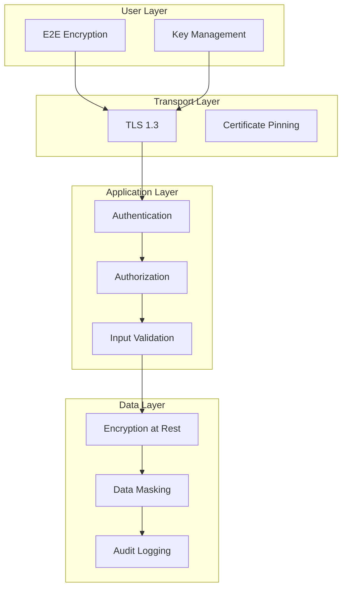

# Security Architecture

VIVIM implements defense-in-depth security across all layers of the system.

## Security Layers



## Authentication

### Methods

| Method | Use Case | Security Level |
|--------|----------|----------------|
| Google OAuth | Primary login | High |
| API Keys | Programmatic access | Medium-High |
| Session | Web sessions | Medium |
| Device Keys | Mobile devices | High |

### OAuth Flow

```typescript
// OAuth configuration
const oauthConfig = {
  google: {
    clientId: process.env.GOOGLE_CLIENT_ID,
    callback: '/api/v1/auth/google/callback',
    scope: ['email', 'profile'],
    prompt: 'consent'
  }
};
```

## Authorization

### Permission Model

```typescript
type Permission = 
  | 'conversation:read'
  | 'conversation:write'
  | 'conversation:delete'
  | 'acu:read'
  | 'acu:write'
  | 'acu:share'
  | 'circle:manage'
  | 'admin:*';

type Role = {
  name: string;
  permissions: Permission[];
};
```

### Roles

| Role | Permissions |
|------|-------------|
| User | Own data, basic ACU operations |
| Circle Admin | Manage circles, members |
| Moderator | Content moderation |
| Admin | System administration |

## Encryption

### End-to-End Encryption

```typescript
// Key generation
const keyPair = await generateKeyPair('ed25519');

// Encrypt for recipient
const encrypted = await encrypt(
  message,
  senderPrivateKey,
  recipientPublicKey
);

// Decrypt
const decrypted = await decrypt(
  encrypted,
  recipientPrivateKey,
  senderPublicKey
);
```

### Data at Rest

```prisma
// Encrypted fields in database
model SecureData {
  id        String @id
  userId    String
  
  // Encrypted with user's key
  encryptedContent Bytes
  
  // Hashed for verification
  contentHash String
}
```

## Input Validation

### Validation Pipeline

```typescript
const validationPipeline = [
  // 1. Type validation (Zod)
  validateSchema,
  
  // 2. Sanitization
  sanitizeInput,
  
  // 3. Rate limiting
  checkRateLimit,
  
  // 4. CSRF protection
  verifyCSRFToken,
  
  // 5. Final validation
  finalCheck
];
```

### Allowed Patterns

| Field | Pattern | Example |
|-------|---------|---------|
| Email | RFC 5322 | `user@example.com` |
| URL | HTTPS only | `https://chat.openai.com/...` |
| DID | `did:vivim:` prefix | `did:vivim:abc123` |

## Security Headers

```typescript
// Helmet configuration
app.use(helmet({
  contentSecurityPolicy: {
    directives: {
      defaultSrc: ["'self'"],
      scriptSrc: ["'self'"],
      imgSrc: ["'self'", "data:", "https:"],
      connectSrc: ["'self'", "wss:", "https:"]
    }
  },
  hsts: {
    maxAge: 31536000,
    includeSubDomains: true,
    preload: true
  }
}));
```

## Audit Logging

### Events Logged

```typescript
const auditEvents = [
  'user.login',
  'user.logout',
  'user.create',
  'conversation.capture',
  'acu.create',
  'acu.share',
  'circle.create',
  'circle.member.add',
  'admin.action'
];
```

### Log Format

```json
{
  "event": "user.login",
  "timestamp": "2024-01-15T10:30:00Z",
  "userId": "user_abc123",
  "ip": "192.168.1.1",
  "userAgent": "Mozilla/5.0...",
  "success": true,
  "metadata": {
    "method": "google_oauth"
  }
}
```
