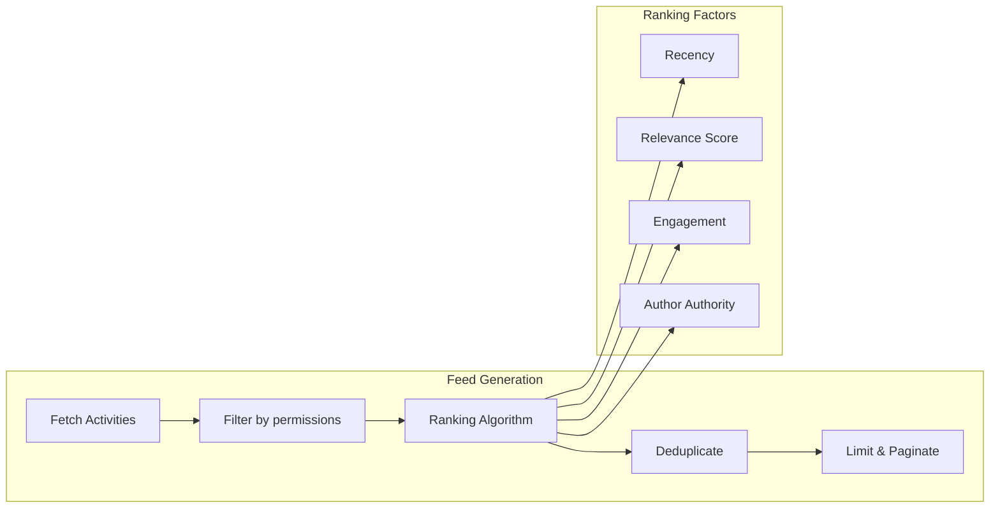

# Social Features

VIVIM includes a comprehensive social layer enabling users to share context, collaborate in circles, and build a knowledge network.

## Core Concepts

### Circles

Private groups for sharing ACUs and memories:

```mermaid
graph TD
    subgraph "Circle Structure"
        OWNER[Owner]
        ADMIN[Administrators]
        MEMBERS[Members]
    end
    
    subgraph "Shared Content"
        ACUS[Shared ACUs]
        MEMORIES[Shared Memories]
        NOTES[Notes & Links]
    end
    
    OWNER -->|manage| ADMIN
    ADMIN -->|manage| MEMBERS
    OWNER -->|share| ACUS
    ADMIN -->|share| ACUS
    MEMBERS -->|view| ACUS
end
```

### Privacy Levels

| Level | Description | Visibility |
|-------|-------------|------------|
| Self | Private to owner | Only owner |
| Circle | Shared with circle | Circle members |
| Public | Anyone can view | All users |

## Circle Management

### Create Circle

```bash
POST /api/v2/circles
Content-Type: application/json

{
  "name": "Project Alpha Team",
  "description": "Shared knowledge for Project Alpha",
  "isPublic": false,
  "icon": "🚀",
  "color": "#6366f1"
}
```

### Add Members

```bash
POST /api/v2/circles/:circleId/members
Content-Type: application/json

{
  "userDid": "did:vivim:user123",
  "role": "member"
}
```

### Share ACU with Circle

```bash
PUT /api/v1/acus/:acuId
Content-Type: application/json

{
  "sharingPolicy": "circle",
  "sharingCircles": ["circle_abc123"]
}
```

## Activity Feed

### Feed Types

| Feed | Description | Endpoint |
|------|-------------|----------|
| Personal | Own ACUs and activities | `/api/v2/feed` |
| Circle | Circle member activities | `/api/v2/feed/circle/:id` |
| Global | Public activities | `/api/v2/feed/global` |

### Feed Algorithm



## Following System

### Follow/Unfollow

```bash
# Follow user
POST /api/v2/follow
{ "targetDid": "did:vivim:user456" }

# Unfollow
DELETE /api/v2/follow/:targetDid
```

### Follow Feed

```bash
GET /api/v2/feed/following?page=1&limit=20
```

---

## Sharing Policies

### Policy Types

```typescript
type SharingPolicy = 
  | 'self'        // Private
  | 'circle'      // Circle members only
  | 'public';     // Anyone
```

### Content Stakeholders

```prisma
model ContentStakeholder {
  id          String   @id @default(uuid())
  contentId   String
  contentType String   // 'acu', 'memory', 'notebook'
  userId      String
  role        String   // 'owner', 'editor', 'viewer'
  permissions Json     // Granular permissions
  
  @@unique([contentId, contentType, userId])
}
```

---

## Reputation & Trust

### Trust Score

```typescript
interface TrustScore {
  overall: number;        // 0-100
  quality: number;        // Based on ACU quality
  activity: number;      // Based on engagement
  consistency: number;   // Based on activity patterns
}
```

### Verification Levels

| Level | Requirements | Badge |
|-------|--------------|-------|
| 0 | None | None |
| 1 | Email verified | ✓ |
| 2 | Phone verified | ✓✓ |
| 3 | Identity verified | ✓✓✓ |
