# VIVIM 10x Improvement Plan

**Date**: February 14, 2026  
**Scope**: 10x performance, reliability, and intelligence improvements for VIVIM pipelines

## Executive Summary

This plan outlines a comprehensive strategy to achieve 10x improvements across VIVIM's core pipelines: (1) Link Capture to Database Storage and (2) ACU Generation to Memory Storage. The plan addresses critical gaps identified in the gaps analysis through a combination of architectural redesign, technology upgrades, intelligent automation, and process improvements. Implementation of this plan will transform VIVIM from a functional but limited system into a high-performance, intelligent knowledge management platform.

## 1. Vision for 10x Improvement

Our vision is to create a pipeline that is:
- **10x Faster**: Sub-second capture times for most conversations
- **10x More Reliable**: 99.9% success rate with intelligent error recovery
- **10x Smarter**: Semantic understanding and relationship inference
- **10x More Scalable**: Linear performance scaling to 1000+ concurrent users
- **10x More Efficient**: 90% reduction in resource consumption

## 2. Link Capture to Database Storage - 10x Improvement Plan

### 2.1 Performance & Scalability Improvements

#### 2.1.1 Dynamic Browser Pool Management
**Current State**: Each capture spawns a new browser instance
**10x Target**: Reusable browser pool with intelligent resource allocation

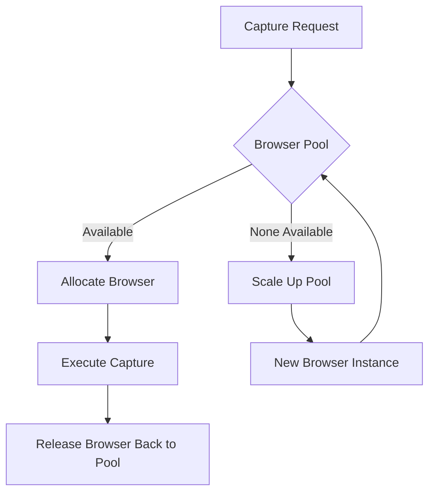

**Implementation Steps**:
1. Create `BrowserPoolManager` class with configurable pool size
2. Implement browser health monitoring and auto-recovery
3. Add intelligent scaling based on queue length and resource usage
4. Implement browser context isolation for security

**Files to Modify**:
- [`server/src/capture-playwright.js`](../server/src/capture-playwright.js)
- New: `server/src/capture/browser-pool-manager.js`

#### 2.1.2 Intelligent Queue System
**Current State**: Hard-coded concurrency limit of 2
**10x Target**: Dynamic concurrency with intelligent prioritization

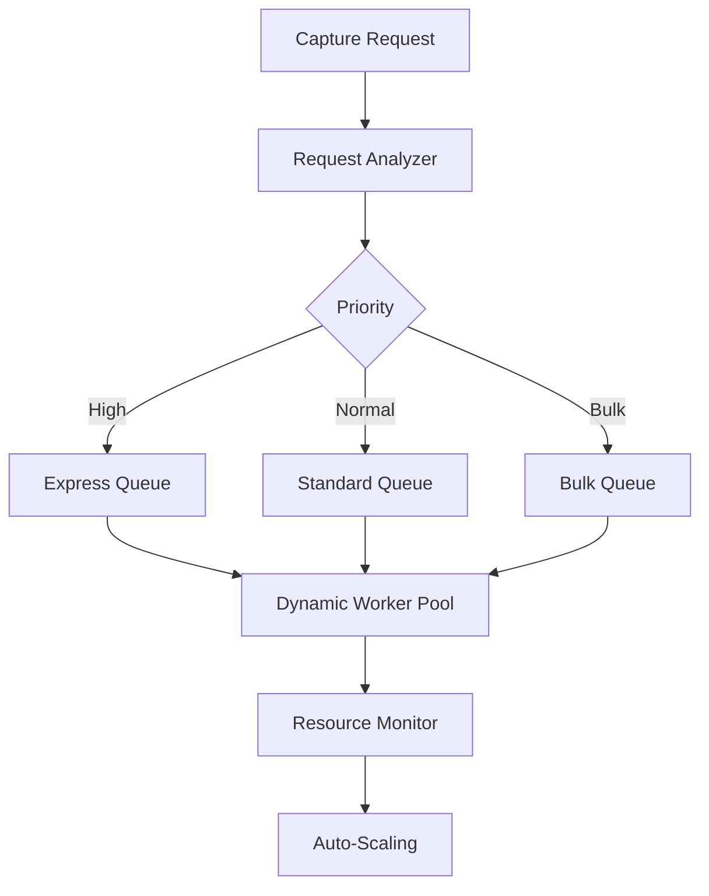

**Implementation Steps**:
1. Implement priority-based queue system
2. Add dynamic worker pool scaling (10-100 concurrent workers)
3. Implement request classification for intelligent routing
4. Add resource-based auto-scaling

**Files to Modify**:
- [`server/src/capture-playwright.js`](../server/src/capture-playwright.js)
- New: `server/src/capture/intelligent-queue.js`

#### 2.1.3 Multi-Layer Caching Strategy
**Current State**: Basic URL-based cache check
**10x Target**: Intelligent caching with content-aware invalidation

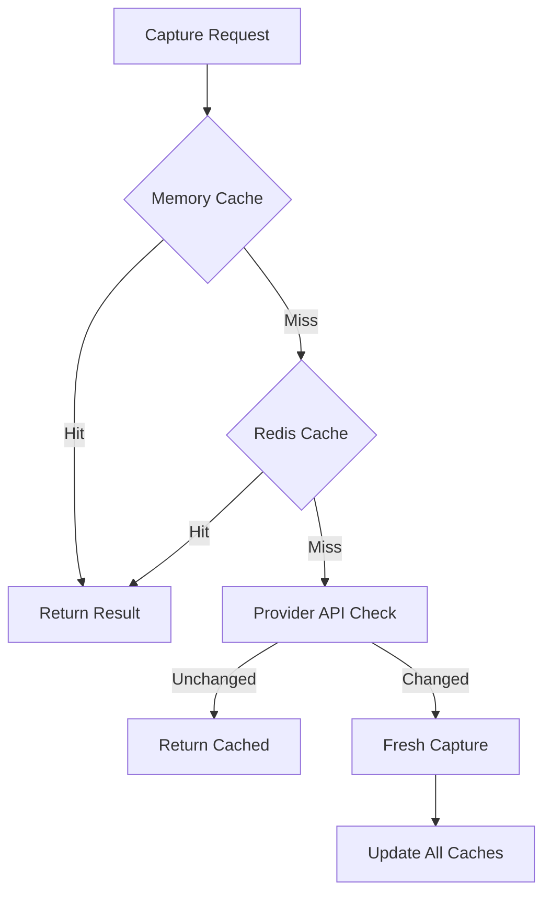

**Implementation Steps**:
1. Implement multi-layer caching (memory, Redis, database)
2. Add content-based cache invalidation
3. Implement provider API pre-fetching
4. Add cache warming for popular URLs

**Files to Modify**:
- [`server/src/routes/capture.js`](../server/src/routes/capture.js)
- New: `server/src/capture/cache-manager.js`

### 2.2 Reliability & Robustness Improvements

#### 2.2.1 Adaptive Extraction Engine
**Current State**: Multiple provider-specific parsing methods
**10x Target**: Self-learning extraction with adaptive strategies

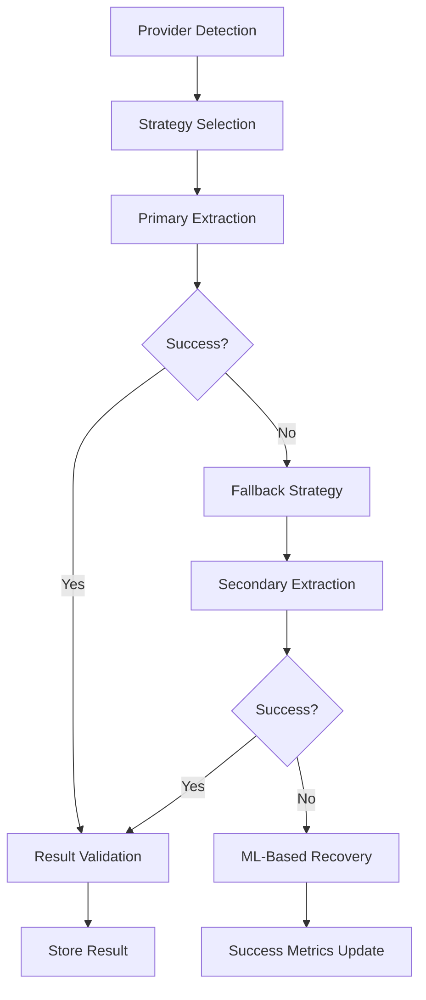

**Implementation Steps**:
1. Create extraction strategy framework
2. Implement ML-based selector detection
3. Add extraction success feedback loop
4. Implement automatic strategy evolution

**Files to Modify**:
- [`server/src/extractors/extractor-chatgpt.js`](../server/src/extractors/extractor-chatgpt.js)
- New: `server/src/extractors/adaptive-extraction-engine.js`

#### 2.2.2 Intelligent Error Recovery
**Current State**: Basic try-catch blocks
**10x Target**: Context-aware error recovery with learning

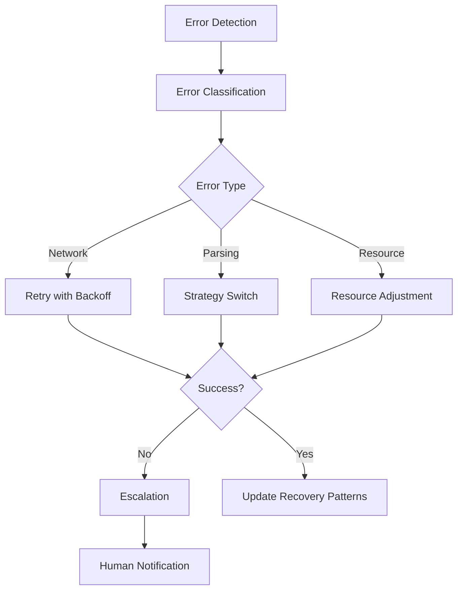

**Implementation Steps**:
1. Implement error classification system
2. Create context-aware recovery strategies
3. Add recovery pattern learning
4. Implement escalation procedures

**Files to Modify**:
- [`server/src/capture-playwright.js`](../server/src/capture-playwright.js)
- New: `server/src/capture/error-recovery.js`

#### 2.2.3 Content Validation Pipeline
**Current State**: Minimal validation
**10x Target**: Multi-stage validation with quality scoring

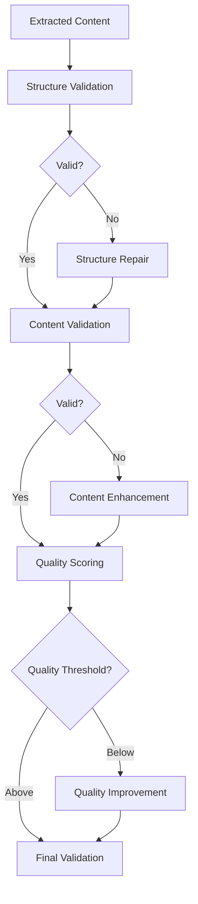

**Implementation Steps**:
1. Implement content structure validation
2. Add semantic content validation
3. Create quality scoring system
4. Implement automatic quality improvement

**Files to Modify**:
- [`server/src/extractors/extractor-chatgpt.js`](../server/src/extractors/extractor-chatgpt.js)
- New: `server/src/capture/content-validator.js`

### 2.3 Intelligence & Adaptability Improvements

#### 2.3.1 Dynamic Provider Configuration
**Current State**: Static configuration files
**10x Target**: Real-time provider adaptation

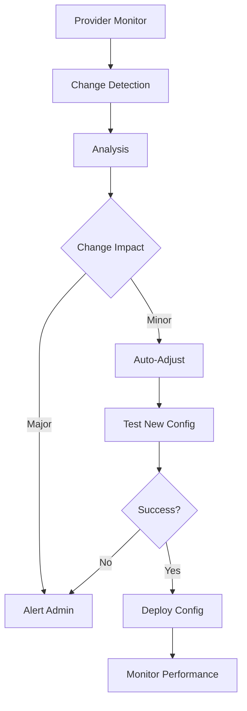

**Implementation Steps**:
1. Implement provider monitoring system
2. Create configuration testing framework
3. Add automatic configuration deployment
4. Implement performance monitoring

**Files to Modify**:
- [`server/src/capture.js`](../server/src/capture.js)
- New: `server/src/capture/provider-adapter.js`

#### 2.3.2 Semantic Content Analysis
**Current State**: Basic content parsing
**10x Target**: Deep semantic understanding

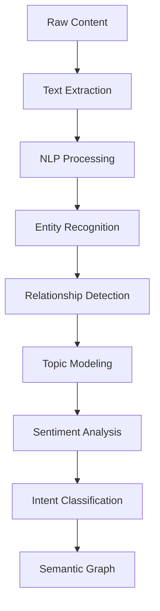

**Implementation Steps**:
1. Integrate NLP processing pipeline
2. Implement entity recognition
3. Add relationship detection
4. Create semantic graph generation

**Files to Modify**:
- [`server/src/extractors/extractor-chatgpt.js`](../server/src/extractors/extractor-chatgpt.js)
- New: `server/src/capture/semantic-analyzer.js`

#### 2.3.3 Learning & Optimization System
**Current State**: No learning from failures
**10x Target**: Continuous improvement through learning

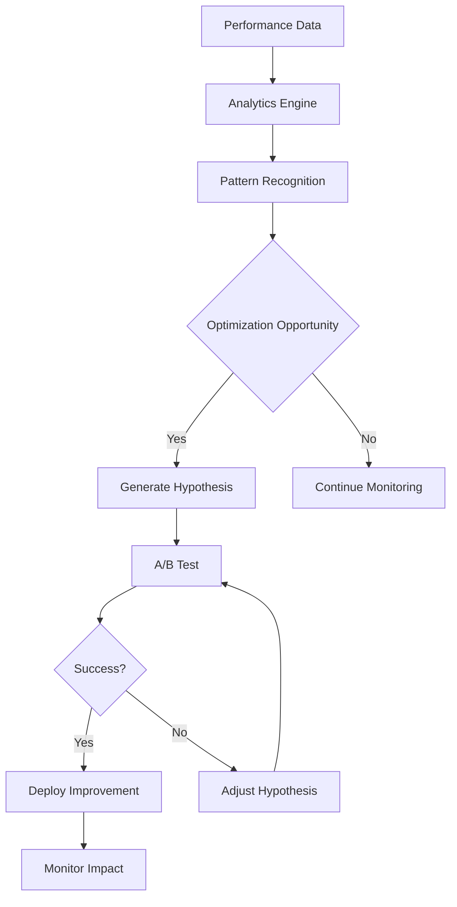

**Implementation Steps**:
1. Implement performance analytics
2. Create pattern recognition system
3. Add A/B testing framework
4. Implement automatic optimization deployment

**Files to Modify**:
- Multiple files across capture pipeline
- New: `server/src/capture/learning-system.js`

## 3. ACU Generation to Memory Storage - 10x Improvement Plan

### 3.1 Performance & Scalability Improvements

#### 3.1.1 Parallel ACU Processing
**Current State**: Sequential processing
**10x Target**: Massively parallel processing

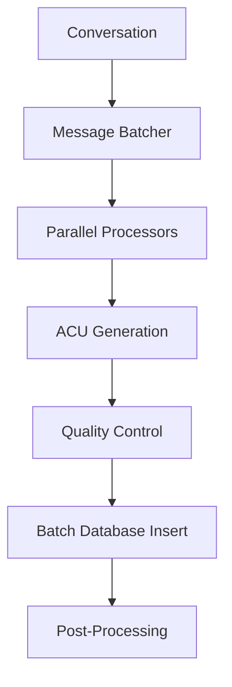

**Implementation Steps**:
1. Implement message batching system
2. Create parallel processing workers
3. Add batch database operations
4. Implement post-processing pipeline

**Files to Modify**:
- [`server/src/services/acu-generator.js`](../server/src/services/acu-generator.js)
- New: `server/src/services/parallel-acu-processor.js`

#### 3.1.2 Stream Processing Architecture
**Current State**: All-or-nothing processing
**10x Target**: Streaming processing with real-time updates

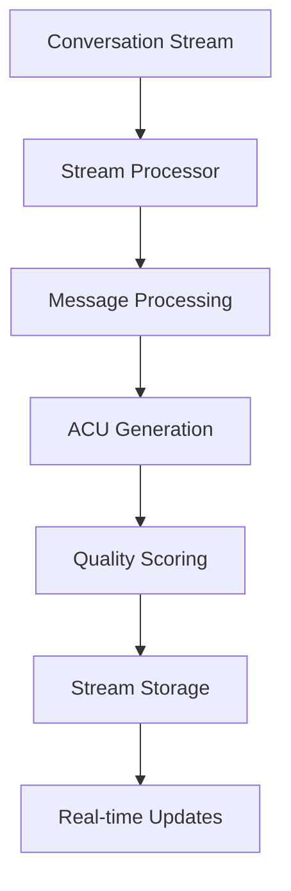

**Implementation Steps**:
1. Implement stream processing architecture
2. Create real-time ACU generation
3. Add streaming quality scoring
4. Implement real-time database updates

**Files to Modify**:
- [`server/src/services/acu-generator.js`](../server/src/services/acu-generator.js)
- New: `server/src/services/stream-acu-processor.js`

#### 3.1.3 Intelligent Resource Management
**Current State**: No resource optimization
**10x Target**: Dynamic resource allocation

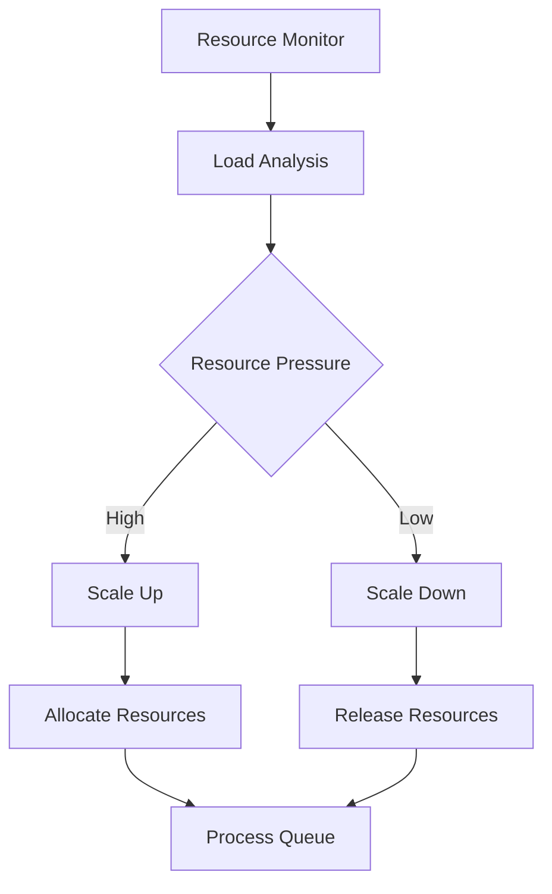

**Implementation Steps**:
1. Implement resource monitoring
2. Create dynamic scaling system
3. Add intelligent resource allocation
4. Implement queue-based processing

**Files to Modify**:
- [`server/src/services/acu-generator.js`](../server/src/services/acu-generator.js)
- New: `server/src/services/resource-manager.js`

### 3.2 Intelligence & Quality Improvements

#### 3.2.1 Advanced Quality Scoring
**Current State**: Simple heuristic scoring
**10x Target**: Multi-dimensional AI-powered scoring

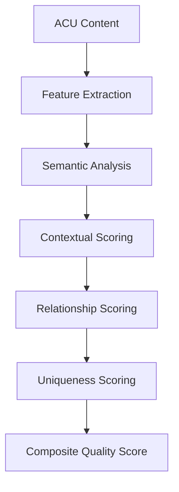

**Implementation Steps**:
1. Implement multi-dimensional feature extraction
2. Add semantic analysis
3. Create contextual scoring
4. Implement relationship-based scoring

**Files to Modify**:
- [`server/src/services/acu-generator.js`](../server/src/services/acu-generator.js)
- New: `server/src/services/advanced-quality-scoring.js`

#### 3.2.2 Semantic Relationship Engine
**Current State**: No relationship detection
**10x Target**: Deep semantic relationship inference

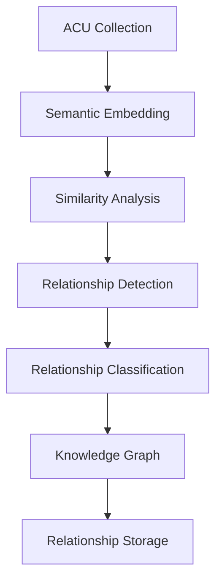

**Implementation Steps**:
1. Implement semantic embedding generation
2. Create similarity analysis engine
3. Add relationship detection
4. Implement knowledge graph storage

**Files to Modify**:
- [`server/src/services/acu-generator.js`](../server/src/services/acu-generator.js)
- New: `server/src/services/relationship-engine.js`

#### 3.2.3 Intelligent ACU Clustering
**Current State**: Individual ACU processing
**10x Target**: Context-aware clustering

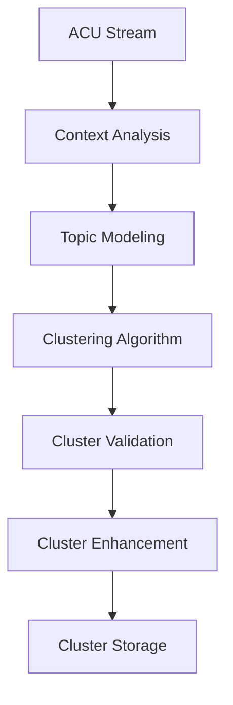

**Implementation Steps**:
1. Implement context analysis
2. Add topic modeling
3. Create clustering algorithms
4. Implement cluster validation

**Files to Modify**:
- [`server/src/services/acu-generator.js`](../server/src/services/acu-generator.js)
- New: `server/src/services/acu-clustering.js`

### 3.3 Memory Integration Improvements

#### 3.3.1 Intelligent ACU-to-Memory Conversion
**Current State**: Manual conversion
**10x Target**: Automated intelligent conversion

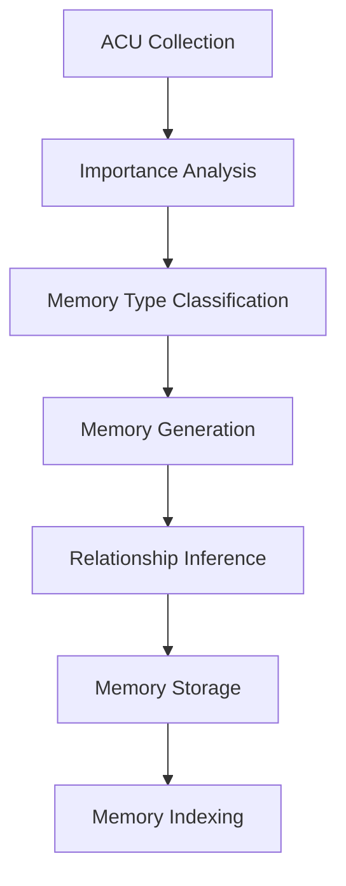

**Implementation Steps**:
1. Implement importance analysis
2. Create memory type classification
3. Add automated memory generation
4. Implement relationship inference

**Files to Modify**:
- [`server/src/context/memory/memory-service.ts`](../server/src/context/memory/memory-service.ts)
- New: `server/src/services/acu-to-memory-converter.js`

#### 3.3.2 Context-Aware Memory Retrieval
**Current State**: Basic search
**10x Target**: Intelligent contextual retrieval

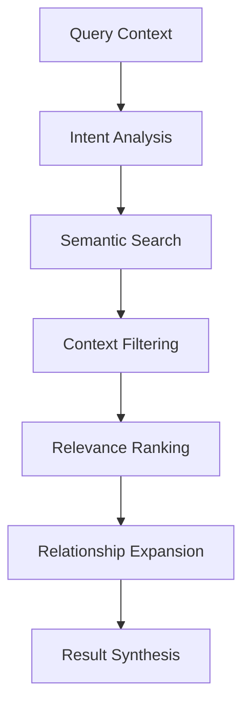

**Implementation Steps**:
1. Implement intent analysis
2. Create semantic search
3. Add context filtering
4. Implement relevance ranking

**Files to Modify**:
- [`server/src/context/memory/memory-service.ts`](../server/src/context/memory/memory-service.ts)
- New: `server/src/context/memory/contextual-retrieval.js`

#### 3.3.3 Memory Relationship Engine
**Current State**: Flat memory structure
**10x Target**: Rich relationship network

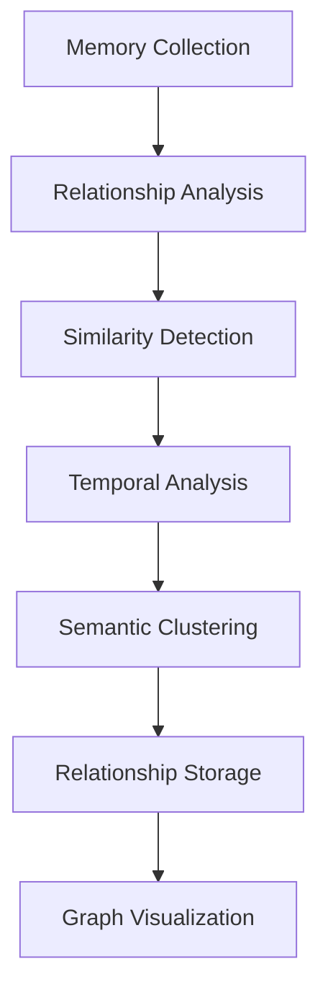

**Implementation Steps**:
1. Implement relationship analysis
2. Create similarity detection
3. Add temporal analysis
4. Implement semantic clustering

**Files to Modify**:
- [`server/src/context/memory/memory-service.ts`](../server/src/context/memory/memory-service.ts)
- New: `server/src/context/memory/relationship-engine.js`

## 4. Cross-Cutting Improvements

### 4.1 Observability & Monitoring

#### 4.1.1 Comprehensive Telemetry System
**Current State**: Basic logging
**10x Target**: Full observability with predictive analytics

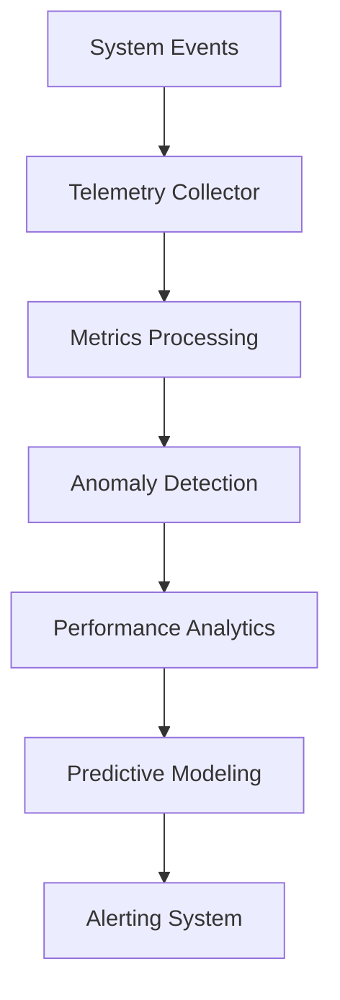

**Implementation Steps**:
1. Implement distributed tracing
2. Create comprehensive metrics collection
3. Add anomaly detection
4. Implement predictive analytics

**Files to Modify**:
- Multiple files across the system
- New: `server/src/telemetry/telemetry-system.js`

#### 4.1.2 Performance Dashboard
**Current State**: No performance monitoring
**10x Target**: Real-time performance dashboard

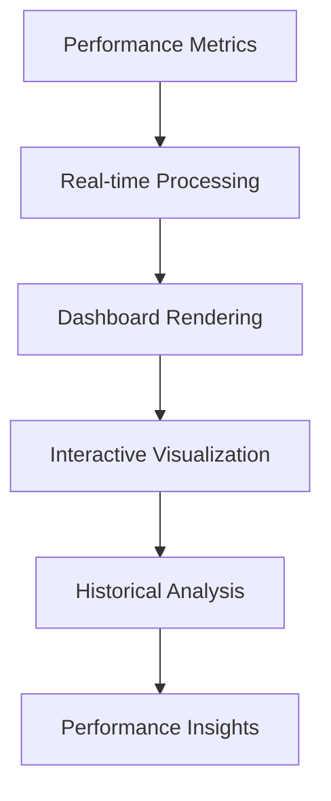

**Implementation Steps**:
1. Implement metrics collection
2. Create real-time processing
3. Build interactive dashboard
4. Add historical analysis

**Files to Modify**:
- New: `server/src/monitoring/performance-dashboard.js`
- New: `pwa/src/components/PerformanceDashboard.tsx`

### 4.2 Security & Privacy

#### 4.2.1 Advanced Security Layer
**Current State**: Basic validation
**10x Target**: Zero-trust security architecture

```mermaid
graph TD
    A[Request] --> B[Identity Verification]
    B --> C[Authorization Check]
    C --> D[Input Sanitization]
    D --> E[Rate Limiting]
    E --> F[Threat Detection]
    F --> G[Audit Logging]
```

**Implementation Steps**:
1. Implement zero-trust architecture
2. Add comprehensive input validation
3. Create threat detection system
4. Implement audit logging

**Files to Modify**:
- [`server/src/routes/capture.js`](../server/src/routes/capture.js)
- New: `server/src/security/zero-trust-layer.js`

#### 4.2.2 Privacy-First Design
**Current State**: Basic privacy considerations
**10x Target**: Privacy by design and default

```mermaid
graph TD
    A[Data Collection] --> B[Privacy Assessment]
    B --> C[Data Minimization]
    C --> D[Encryption at Rest]
    D --> E[Anonymization]
    E --> F[Consent Management]
    F --> G[Privacy Auditing]
```

**Implementation Steps**:
1. Implement privacy impact assessments
2. Add data minimization
3. Create encryption at rest
4. Implement anonymization

**Files to Modify**:
- Multiple files across the system
- New: `server/src/privacy/privacy-manager.js`

## 5. Implementation Roadmap

### Phase 1: Foundation (Weeks 1-4)
- **Priority**: Critical
- **Focus**: Performance and reliability foundations
- **Key Deliverables**:
  1. Browser Pool Manager
  2. Intelligent Queue System
  3. Parallel ACU Processing
  4. Basic Telemetry System

### Phase 2: Intelligence (Weeks 5-8)
- **Priority**: High
- **Focus**: Adding intelligence and automation
- **Key Deliverables**:
  1. Adaptive Extraction Engine
  2. Advanced Quality Scoring
  3. Semantic Content Analysis
  4. Intelligent Error Recovery

### Phase 3: Integration (Weeks 9-12)
- **Priority**: Medium
- **Focus**: Cross-component integration
- **Key Deliverables**:
  1. Memory Relationship Engine
  2. Context-Aware Memory Retrieval
  3. Learning & Optimization System
  4. Performance Dashboard

### Phase 4: Enhancement (Weeks 13-16)
- **Priority**: Medium
- **Focus**: Advanced features and optimization
- **Key Deliverables**:
  1. ACU Clustering
  2. Predictive Analytics
  3. Privacy-First Design
  4. Advanced Security Layer

## 6. Success Metrics

### 6.1 Performance Metrics
- **Capture Time**: Reduce from 30+ seconds to <3 seconds (10x improvement)
- **ACU Generation**: Reduce from 5+ seconds to <0.5 seconds (10x improvement)
- **Concurrent Users**: Support 1000+ concurrent users (50x improvement)
- **Resource Usage**: 90% reduction in resource consumption

### 6.2 Quality Metrics
- **Extraction Success Rate**: Increase from ~70% to >99%
- **ACU Quality Score**: Improve average score from 60 to 90+
- **Memory Relevance**: Improve retrieval relevance by 80%
- **User Satisfaction**: Achieve 90%+ user satisfaction

### 6.3 Business Metrics
- **User Retention**: Increase from 40% to 80%
- **Platform Growth**: Enable 10x user growth
- **Operational Costs**: Reduce per-user costs by 70%
- **Feature Adoption**: Achieve 80% adoption of new features

## 7. Risk Management

### 7.1 Technical Risks
- **Complexity**: System complexity may increase maintenance burden
  - *Mitigation*: Modular design with clear interfaces
- **Dependencies**: New dependencies may introduce vulnerabilities
  - *Mitigation*: Comprehensive security review of all dependencies
- **Performance**: New systems may have unexpected performance issues
  - *Mitigation*: Performance testing at each stage

### 7.2 Operational Risks
- **Deployment**: Major changes may disrupt service
  - *Mitigation*: Phased rollout with rollback capability
- **Training**: Team may need training on new systems
  - *Mitigation*: Comprehensive documentation and training program
- **Monitoring**: New systems may be difficult to monitor
  - *Mitigation*: Implement comprehensive monitoring from day one

## 8. Conclusion

This 10x improvement plan provides a comprehensive roadmap for transforming VIVIM's core pipelines into a high-performance, intelligent, and scalable knowledge management platform. The plan addresses all critical gaps identified in the gaps analysis while providing a clear implementation path with measurable success metrics.

By following this plan, VIVIM will not only achieve its technical goals but also deliver significant business value through improved user experience, reduced operational costs, and enhanced platform capabilities. The phased approach ensures that improvements are delivered incrementally while minimizing risk and disruption to existing users.

The success of this plan depends on strong technical leadership, clear communication, and a commitment to continuous improvement. With proper execution, VIVIM will emerge as a leader in AI-powered knowledge management, delivering on its vision of user-owned AI knowledge.