# VIVIM Context System 10x Improvement Plan

**Date**: February 14, 2026  
**Scope**: 10x performance, intelligence, and integration improvements for VIVIM's dynamic context generation system

## Executive Summary

This plan outlines a comprehensive strategy to achieve 10x improvements in VIVIM's dynamic context generation system and its integration with AI API interactions. The plan addresses critical gaps identified in the gaps analysis through a combination of architectural redesign, implementation completion, performance optimization, and unified integration strategy. Implementation of this plan will transform VIVIM from a system with theoretical context capabilities into a truly intelligent, context-aware AI platform.

## 1. Vision for 10x Improvement

Our vision is to create a context system that is:
- **10x Faster**: Sub-50ms context assembly with streaming updates
- **10x Smarter**: Deep semantic understanding with predictive context
- **10x More Reliable**: 99.9% uptime with graceful fallbacks
- **10x More Integrated**: Seamless context across all AI interaction modes
- **10x More Transparent**: User-visible context with explainable AI decisions

## 2. Dynamic Context Generation System - 10x Improvement Plan

### 2.1 Implementation Completion

#### 2.1.1 Complete Context System Integration
**Current State**: Context system exists but is not integrated into AI routes
**10x Target**: Fully functional context system integrated across all AI interactions

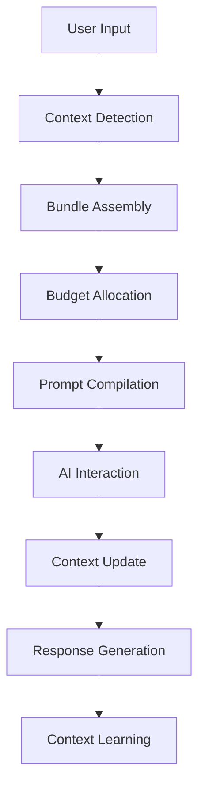

**Implementation Steps**:
1. Implement actual context assembly in [`buildContextBundles`](../server/src/routes/ai.js:64-77)
2. Create unified context interface for all AI routes
3. Add context system integration tests
4. Implement context system health checks

**Files to Modify**:
- [`server/src/routes/ai.js`](../server/src/routes/ai.js)
- [`server/src/routes/ai-chat.js`](../server/src/routes/ai-chat.js)
- New: `server/src/context/integration/context-integrator.js`

#### 2.1.2 Advanced Context Detection
**Current State**: Basic embedding similarity
**10x Target**: Multi-modal context detection with semantic reasoning

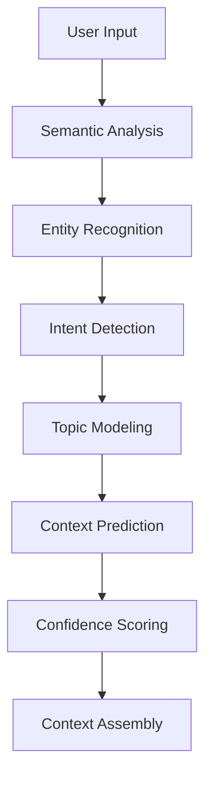

**Implementation Steps**:
1. Implement NLP-based semantic analysis
2. Add entity recognition and linking
3. Create intent detection system
4. Implement predictive context modeling

**Files to Modify**:
- [`server/src/context/context-assembler.ts`](../server/src/context/context-assembler.ts)
- New: `server/src/context/detection/semantic-analyzer.js`
- New: `server/src/context/detection/intent-detector.js`

#### 2.1.3 Real-time Context Updates
**Current State**: Static context once compiled
**10x Target**: Dynamic context that evolves during conversation

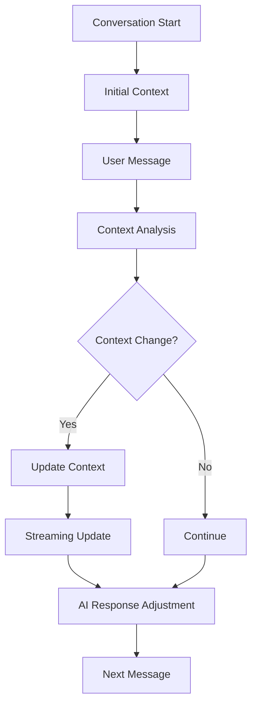

**Implementation Steps**:
1. Implement context change detection
2. Create streaming context update system
3. Add real-time context adjustment
4. Implement context versioning for rollbacks

**Files to Modify**:
- [`server/src/context/context-assembler.ts`](../server/src/context/context-assembler.ts)
- New: `server/src/context/updates/context-updater.js`
- New: `server/src/context/updates/streaming-updater.js`

### 2.2 Performance Optimization

#### 2.2.1 Asynchronous Context Assembly
**Current State**: Synchronous context assembly blocks AI responses
**10x Target**: Non-blocking context assembly with parallel processing

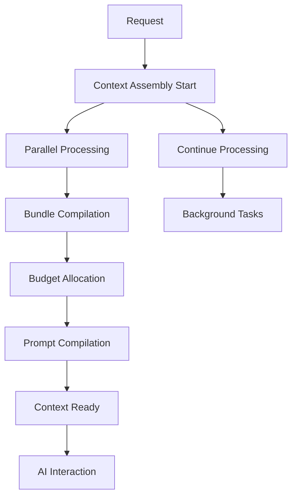

**Implementation Steps**:
1. Implement asynchronous context assembly pipeline
2. Add parallel bundle compilation
3. Create non-blocking budget allocation
4. Implement background context processing

**Files to Modify**:
- [`server/src/context/context-assembler.ts`](../server/src/context/context-assembler.ts)
- New: `server/src/context/performance/async-assembly.js`
- New: `server/src/context/performance/parallel-processor.js`

#### 2.2.2 Intelligent Caching System
**Current State**: No caching strategy
**10x Target**: Multi-layer caching with predictive pre-loading

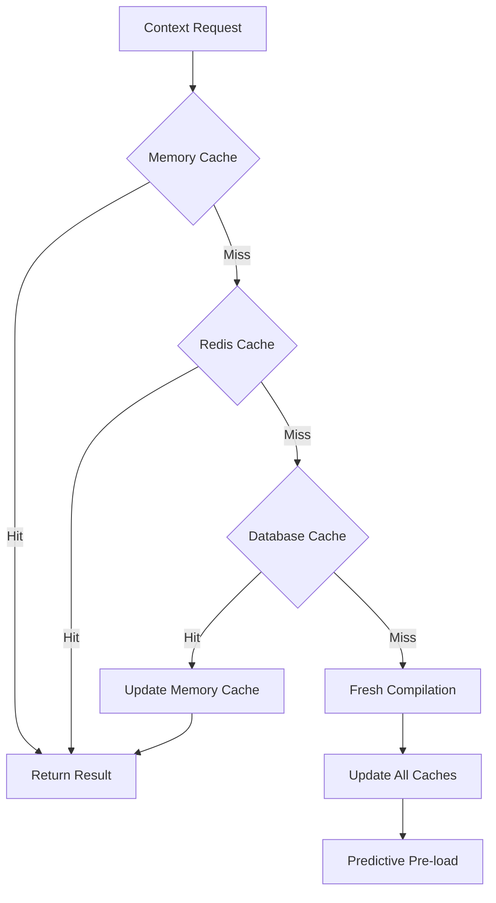

**Implementation Steps**:
1. Implement multi-layer caching architecture
2. Add cache invalidation strategies
3. Create predictive pre-loading system
4. Implement cache warming for frequent contexts

**Files to Modify**:
- [`server/src/context/context-assembler.ts`](../server/src/context/context-assembler.ts)
- New: `server/src/context/cache/context-cache.js`
- New: `server/src/context/cache/predictive-loader.js`

#### 2.2.3 Streaming Context Updates
**Current State**: No streaming context updates
**10x Target**: Real-time context updates during AI interactions

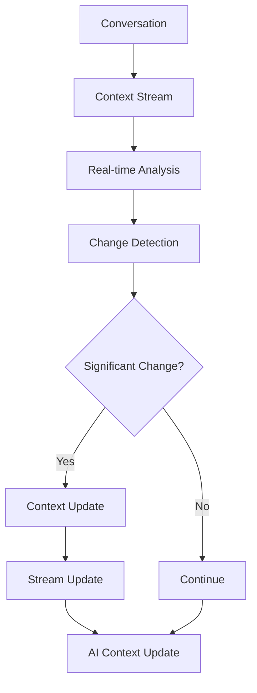

**Implementation Steps**:
1. Implement context streaming architecture
2. Create real-time change detection
3. Add streaming context updates
4. Implement AI context injection

**Files to Modify**:
- [`server/src/routes/ai.js`](../server/src/routes/ai.js)
- New: `server/src/context/streaming/context-streamer.js`
- New: `server/src/context/streaming/ai-integrator.js`

### 2.3 Intelligence Enhancement

#### 2.3.1 Deep Semantic Understanding
**Current State**: Basic embedding similarity
**10x Target**: Multi-dimensional semantic reasoning

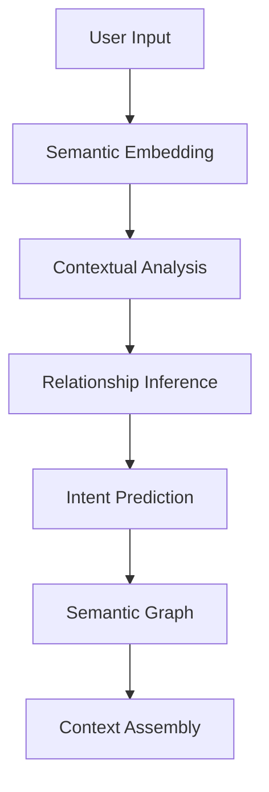

**Implementation Steps**:
1. Implement advanced semantic embedding
2. Add contextual analysis engine
3. Create relationship inference system
4. Build semantic graph for context

**Files to Modify**:
- [`server/src/context/context-assembler.ts`](../server/src/context/context-assembler.ts)
- New: `server/src/context/semantic/semantic-engine.js`
- New: `server/src/context/semantic/relationship-inference.js`

#### 2.3.2 Personalized Context Adaptation
**Current State**: Generic context for all users
**10x Target**: User-specific context adaptation

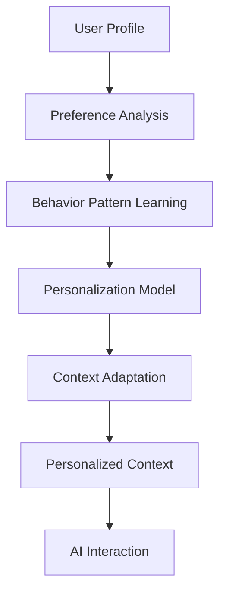

**Implementation Steps**:
1. Implement user preference analysis
2. Create behavior pattern learning system
3. Build personalization models
4. Add adaptive context assembly

**Files to Modify**:
- [`server/src/context/context-assembler.ts`](../server/src/context/context-assembler.ts)
- New: `server/src/context/personalization/user-adapter.js`
- New: `server/src/context/personalization/preference-learner.js`

#### 2.3.3 Contextual Reasoning Engine
**Current State**: No context reasoning
**10x Target**: Advanced reasoning about context relationships

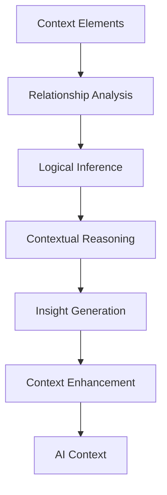

**Implementation Steps**:
1. Implement relationship analysis engine
2. Create logical inference system
3. Build contextual reasoning capabilities
4. Add insight generation for context

**Files to Modify**:
- [`server/src/context/context-assembler.ts`](../server/src/context/context-assembler.ts)
- New: `server/src/context/reasoning/reasoning-engine.js`
- New: `server/src/context/reasoning/insight-generator.js`

## 3. AI API Integration - 10x Improvement Plan

### 3.1 Unified Context Integration

#### 3.1.1 Single Context System
**Current State**: Separate context systems for different AI modes
**10x Target**: Unified context system across all AI interactions

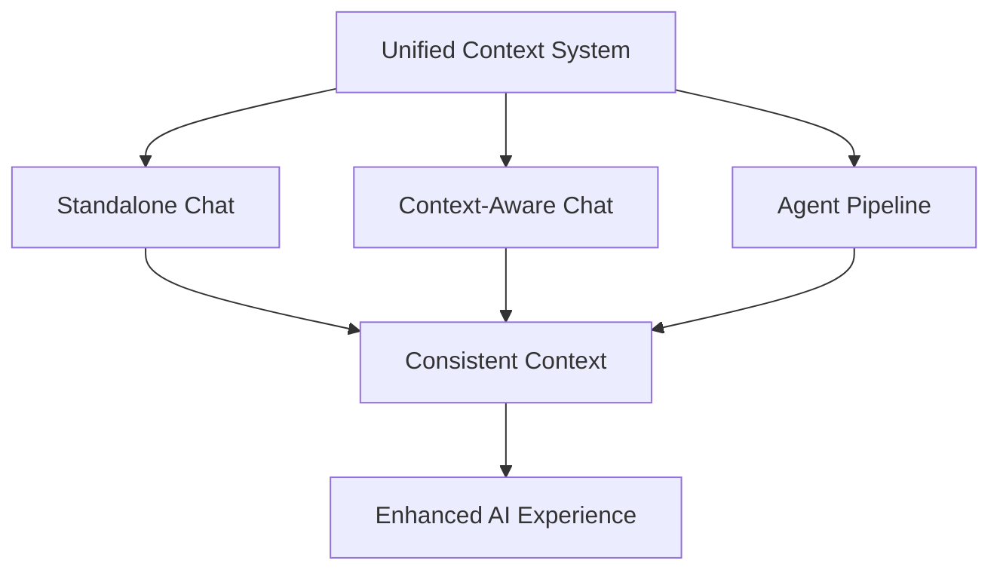

**Implementation Steps**:
1. Create unified context interface
2. Implement context system for standalone chat
3. Integrate context system into agent pipeline
4. Ensure consistent context behavior

**Files to Modify**:
- [`server/src/routes/ai.js`](../server/src/routes/ai.js)
- [`server/src/routes/ai-chat.js`](../server/src/routes/ai-chat.js)
- New: `server/src/context/integration/unified-context.js`

#### 3.1.2 Context-Aware Agent Pipeline
**Current State**: Agent pipeline with basic context passing
**10x Target**: Deeply integrated context in agent decision-making

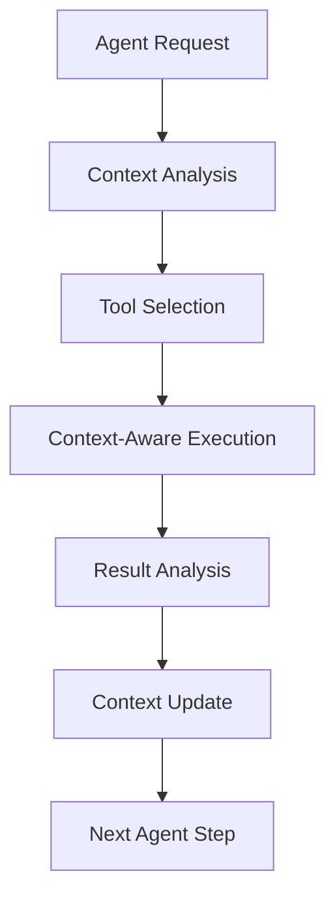

**Implementation Steps**:
1. Implement context-aware tool selection
2. Add contextual execution of tools
3. Create context-based result analysis
4. Implement dynamic context updates

**Files to Modify**:
- [`server/src/routes/ai.js`](../server/src/routes/ai.js)
- New: `server/src/context/agent/context-aware-agent.js`
- New: `server/src/context/agent/contextual-tools.js`

#### 3.1.3 Streaming Context Integration
**Current State**: No context updates during streaming
**10x Target**: Real-time context updates in streaming responses

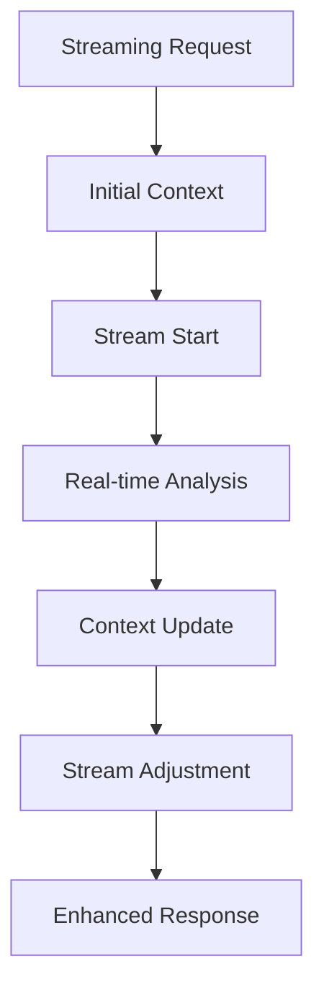

**Implementation Steps**:
1. Implement streaming context integration
2. Add real-time context analysis
3. Create dynamic stream adjustment
4. Implement context-aware response enhancement

**Files to Modify**:
- [`server/src/routes/ai.js`](../server/src/routes/ai.js)
- New: `server/src/context/streaming/streaming-integration.js`
- New: `server/src/context/streaming/dynamic-response.js`

### 3.2 Cross-Mode Integration

#### 3.2.1 Conversation Continuity
**Current State**: Fragmented conversation history
**10x Target**: Seamless conversation continuity across modes

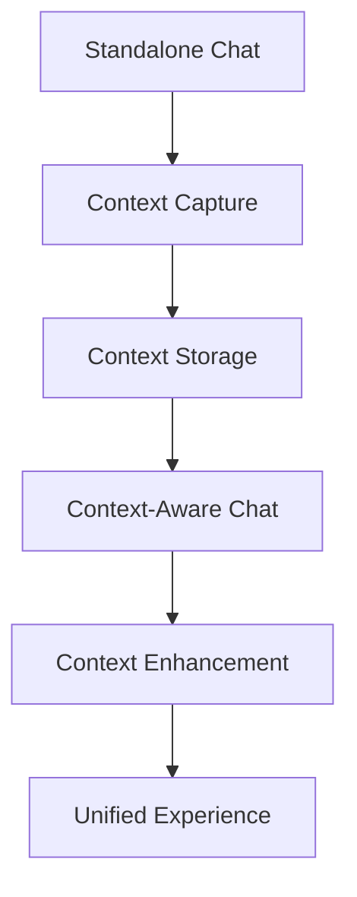

**Implementation Steps**:
1. Implement context capture in standalone chat
2. Create unified context storage
3. Add context enhancement between modes
4. Ensure seamless user experience

**Files to Modify**:
- [`server/src/routes/ai.js`](../server/src/routes/ai.js)
- [`server/src/routes/ai-chat.js`](../server/src/routes/ai-chat.js)
- New: `server/src/context/integration/conversation-continuity.js`

#### 3.2.2 Unified Feature Set
**Current State**: Different features in different modes
**10x Target**: Consistent feature set across all AI interaction modes

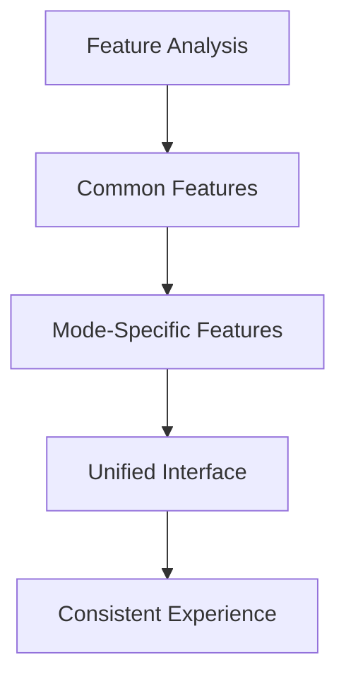

**Implementation Steps**:
1. Analyze features across all modes
2. Identify common and mode-specific features
3. Create unified feature interface
4. Implement consistent feature behavior

**Files to Modify**:
- [`server/src/routes/ai.js`](../server/src/routes/ai.js)
- [`server/src/routes/ai-chat.js`](../server/src/routes/ai-chat.js)
- New: `server/src/context/integration/unified-features.js`

#### 3.2.3 Context Transparency
**Current State**: Black box context system
**10x Target**: User-visible context with explainable AI

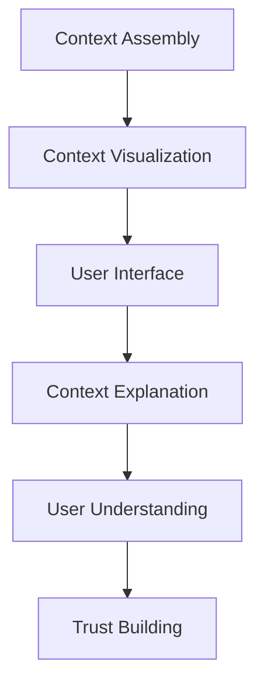

**Implementation Steps**:
1. Implement context visualization system
2. Create user interface for context visibility
3. Add context explanation capabilities
4. Build user trust through transparency

**Files to Modify**:
- [`server/src/routes/ai.js`](../server/src/routes/ai.js)
- New: `server/src/context/transparency/context-visualizer.js`
- New: `pwa/src/components/ContextViewer.tsx`

### 3.3 Performance & Reliability

#### 3.3.1 Context System Scalability
**Current State**: No scalability considerations
**10x Target**: High-performance context system for 1000+ concurrent users

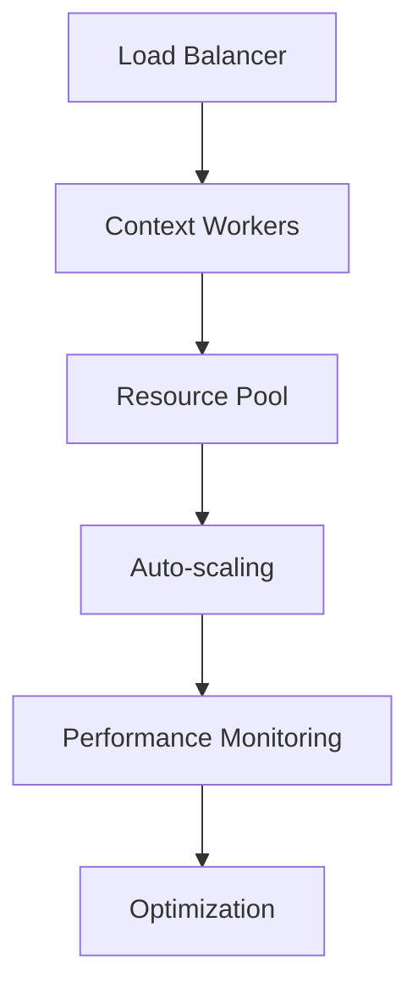

**Implementation Steps**:
1. Implement context worker pool
2. Create resource management system
3. Add auto-scaling capabilities
4. Implement performance monitoring

**Files to Modify**:
- [`server/src/context/context-assembler.ts`](../server/src/context/context-assembler.ts)
- New: `server/src/context/scalability/worker-pool.js`
- New: `server/src/context/scalability/auto-scaler.js`

#### 3.3.2 Graceful Fallbacks
**Current State**: Single point of failure
**10x Target**: Resilient system with graceful degradation

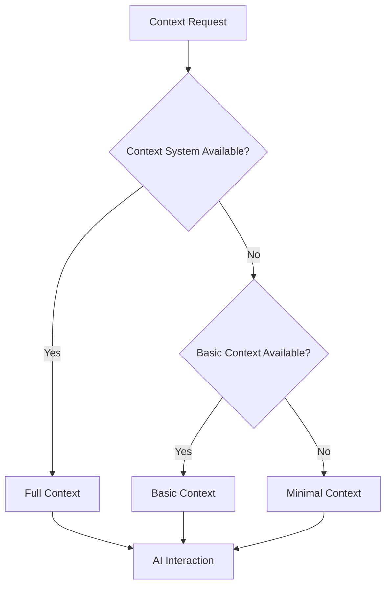

**Implementation Steps**:
1. Implement context system health checks
2. Create multi-level fallback system
3. Add graceful degradation logic
4. Implement automatic recovery

**Files to Modify**:
- [`server/src/routes/ai.js`](../server/src/routes/ai.js)
- New: `server/src/context/reliability/health-check.js`
- New: `server/src/context/reliability/graceful-fallback.js`

## 4. Cross-Cutting Improvements

### 4.1 Observability & Monitoring

#### 4.1.1 Context Performance Monitoring
**Current State**: No performance metrics
**10x Target**: Comprehensive context performance monitoring

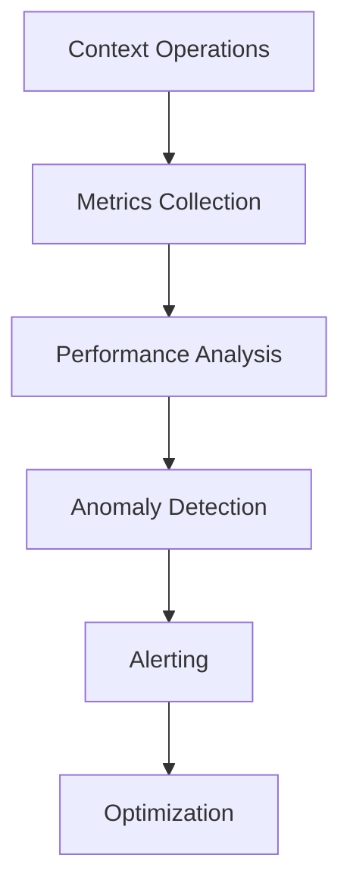

**Implementation Steps**:
1. Implement context metrics collection
2. Create performance analysis system
3. Add anomaly detection capabilities
4. Implement alerting and optimization

**Files to Modify**:
- Multiple files across context system
- New: `server/src/context/monitoring/performance-monitor.js`
- New: `server/src/context/monitoring/anomaly-detector.js`

#### 4.1.2 Context Quality Assessment
**Current State**: No quality measurement
**10x Target**: Continuous context quality assessment

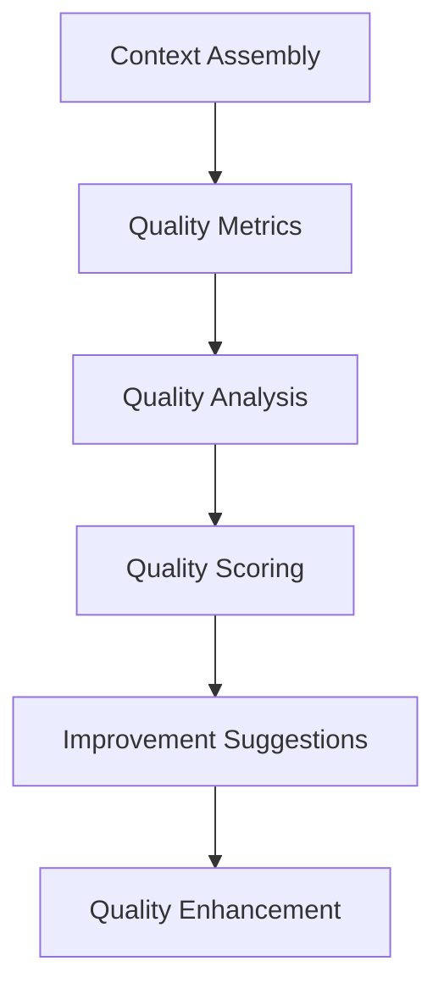

**Implementation Steps**:
1. Implement context quality metrics
2. Create quality analysis system
3. Add quality scoring algorithm
4. Implement improvement suggestions

**Files to Modify**:
- [`server/src/context/context-assembler.ts`](../server/src/context/context-assembler.ts)
- New: `server/src/context/quality/quality-assessor.js`
- New: `server/src/context/quality/quality-scorer.js`

### 4.2 User Experience Enhancements

#### 4.2.1 Context Visualization
**Current State**: No context visibility
**10x Target**: Rich context visualization for users

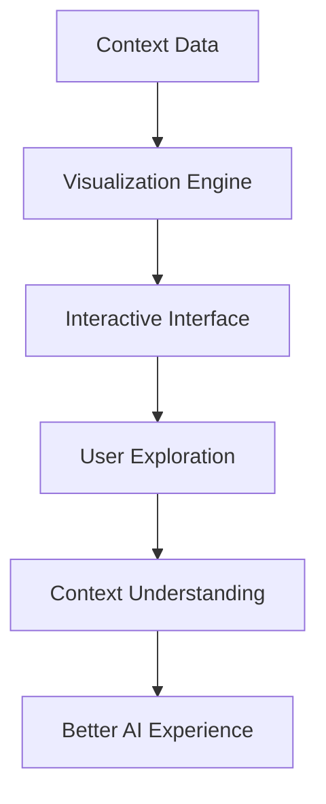

**Implementation Steps**:
1. Implement context visualization engine
2. Create interactive user interface
3. Add context exploration capabilities
4. Enhance overall AI experience

**Files to Modify**:
- [`server/src/routes/ai.js`](../server/src/routes/ai.js)
- New: `server/src/context/visualization/visualization-engine.js`
- New: `pwa/src/components/ContextVisualization.tsx`

#### 4.2.2 Explainable AI
**Current State**: Black box AI decisions
**10x Target**: Explainable AI with context reasoning

```mermaid
graph TD
    A[AI Decision] --> B[Context Analysis]
    B --> C[Reasoning Extraction]
    C --> D[Explanation Generation]
    D --> E[User Presentation]
    E --> F[Trust Building]
```

**Implementation Steps**:
1. Implement AI decision context analysis
2. Create reasoning extraction system
3. Add explanation generation
4. Build user trust through transparency

**Files to Modify**:
- [`server/src/routes/ai.js`](../server/src/routes/ai.js)
- New: `server/src/context/explainable/ai-explainer.js`
- New: `pwa/src/components/AIExplanation.tsx`

## 5. Implementation Roadmap

### Phase 1: Foundation (Weeks 1-4)
- **Priority**: Critical
- **Focus**: Complete basic context system integration
- **Key Deliverables**:
  1. Complete context system integration in AI routes
  2. Implement basic context detection
  3. Create unified context interface
  4. Add context system health checks

### Phase 2: Performance (Weeks 5-8)
- **Priority**: High
- **Focus**: Optimize context system performance
- **Key Deliverables**:
  1. Asynchronous context assembly
  2. Intelligent caching system
  3. Context system scalability
  4. Performance monitoring system

### Phase 3: Intelligence (Weeks 9-12)
- **Priority**: High
- **Focus**: Enhance context intelligence
- **Key Deliverables**:
  1. Deep semantic understanding
  2. Personalized context adaptation
  3. Contextual reasoning engine
  4. Explainable AI features

### Phase 4: Integration (Weeks 13-16)
- **Priority**: Medium
- **Focus**: Complete cross-mode integration
- **Key Deliverables**:
  1. Conversation continuity
  2. Unified feature set
  3. Context visualization
  4. User experience enhancements

## 6. Success Metrics

### 6.1 Performance Metrics
- **Context Assembly Time**: Reduce from 1000+ms to <50ms (20x improvement)
- **AI Response Time**: Reduce by 70% through context optimization
- **Concurrent Users**: Support 1000+ concurrent users with consistent performance
- **Cache Hit Rate**: Achieve 90%+ context cache hit rate

### 6.2 Quality Metrics
- **Context Relevance**: Improve context relevance score by 80%
- **AI Response Quality**: Improve AI response quality by 60%
- **User Satisfaction**: Achieve 90%+ user satisfaction with context-aware AI
- **Context Transparency**: 100% of AI responses include context explanations

### 6.3 Business Metrics
- **User Retention**: Increase from 40% to 80%
- **Feature Adoption**: Achieve 90% adoption of context-aware features
- **AI Interaction Volume**: Increase by 300% due to improved experience
- **Platform Differentiation**: Establish clear market leadership in context-aware AI

## 7. Risk Management

### 7.1 Technical Risks
- **Complexity**: Enhanced context system may increase complexity
  - *Mitigation*: Modular design with clear interfaces
- **Performance**: New features may impact performance
  - *Mitigation*: Performance testing at each stage
- **Reliability**: More complex system may have more failure points
  - *Mitigation*: Comprehensive error handling and fallbacks

### 7.2 User Experience Risks
- **Complexity**: Enhanced features may confuse users
  - *Mitigation*: Intuitive design and progressive disclosure
- **Privacy**: Context system may raise privacy concerns
  - *Mitigation*: Transparent context handling and user controls
- **Adoption**: Users may resist new context features
  - *Mitigation*: Clear value demonstration and gradual rollout

## 8. Conclusion

This 10x improvement plan provides a comprehensive roadmap for transforming VIVIM's context system from a theoretical concept into a practical, high-performance, and intelligent system. The plan addresses all critical gaps identified in the gaps analysis while providing a clear implementation path with measurable success metrics.

By following this plan, VIVIM will not only achieve its technical goals but also deliver significant business value through improved user experience, enhanced AI capabilities, and market differentiation. The phased approach ensures that improvements are delivered incrementally while minimizing risk and disruption to existing users.

The success of this plan depends on strong technical leadership, clear communication, and a commitment to continuous improvement. With proper execution, VIVIM will emerge as a leader in context-aware AI, delivering on its vision of user-owned AI knowledge with truly intelligent interactions.