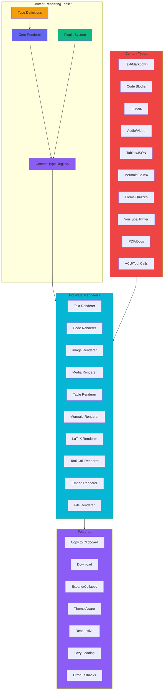

# Global Content Rendering Toolkit Specification

## Overview

A centralized, extensible content rendering system that handles all types of content from the database and AI chat interactions across the entire application.

---

## Architecture



---

## Type System

### Core Content Types

```typescript
/**
 * All supported content types in the rendering toolkit
 */
export type ContentType =
  // Basic content
  | 'text'           // Plain text or markdown
  | 'code'           // Code blocks with syntax highlighting
  | 'image'          // Static images
  | 'link'           // URLs and links

  // Rich media
  | 'audio'          // Audio files
  | 'video'          // Video files
  | 'gif'            // Animated GIFs

  // Data & structured
  | 'table'          // Data tables
  | 'json'           // JSON data display
  | 'yaml'           // YAML data display
  | 'xml'            // XML data display

  // Visual & diagrams
  | 'mermaid'        // Mermaid diagrams
  | 'latex'          // LaTeX math
  | 'svg'            // SVG graphics
  | 'chart'          // Charts and graphs

  // Interactive
  | 'form'           // Interactive forms
  | 'quiz'           // Quiz questions
  | 'poll'           // Polls and surveys

  // Embeds
  | 'youtube'        // YouTube embeds
  | 'twitter'        // Twitter embeds
  | 'vimeo'          // Vimeo embeds
  | 'codepen'        // CodePen embeds
  | 'iframe'         // Generic iframe embeds

  // Files & documents
  | 'file'           // File attachments
  | 'pdf'            // PDF documents
  | 'doc'            // Word documents
  | 'spreadsheet'     // Excel/spreadsheet files

  // AI & structured
  | 'tool_call'      // AI tool/function calls
  | 'tool_result'    // AI tool results
  | 'thought'        // AI chain of thought
  | 'reasoning'      // AI reasoning steps
  | 'acu_statement'  // ACU statement blocks
  | 'acu_question'   // ACU question blocks
  | 'acu_answer'     // ACU answer blocks
  | 'acu_code'       // ACU code blocks
  | 'acu_formula'    // ACU formula blocks
  | 'acu_table'      // ACU table blocks
  | 'acu_image'      // ACU image blocks
  | 'acu_tool'       // ACU tool blocks

  // Special
  | 'html'           // Raw HTML
  | 'quote'          // Blockquotes
  | 'divider'        // Horizontal dividers
  | 'spacer'         // Vertical spacers
  | 'callout'        // Callout/alert boxes
  | 'accordion'      // Collapsible sections
  | 'tabs'           // Tabbed content
  | 'timeline'       // Timeline events
  | 'tree'           // Tree structures
  | 'mindmap'        // Mind maps
  | 'kanban'         // Kanban boards
  | 'calendar'       // Calendar events
  | 'location'       // Location/maps
  | 'weather'        // Weather widgets

  // Fallback
  | 'unknown'        // Unknown content types
  | 'error'          // Error states
  | 'loading';       // Loading states
```

### Content Block Interface

```typescript
/**
 * A single content block with metadata
 */
export interface ContentBlock {
  // Identification
  id: string;
  type: ContentType;

  // Content data
  content: string | object | ContentBlock[];

  // Metadata
  metadata?: ContentMetadata;

  // Display options
  display?: 'inline' | 'block' | 'full-width';
  size?: 'sm' | 'md' | 'lg' | 'xl';
  align?: 'left' | 'center' | 'right';

  // Interaction options
  interactive?: boolean;
  copyable?: boolean;
  downloadable?: boolean;
  expandable?: boolean;
  collapsible?: boolean;

  // Styling
  className?: string;
  style?: React.CSSProperties;

  // Custom data
  [key: string]: any;
}

/**
 * Content metadata
 */
export interface ContentMetadata {
  // Source information
  source?: string;
  provider?: string;
  author?: string;
  timestamp?: string;

  // Content info
  title?: string;
  description?: string;
  language?: string;
  filename?: string;
  mimetype?: string;
  size?: number;
  duration?: number;

  // Visual
  alt?: string;
  caption?: string;
  thumbnail?: string;

  // Technical
  format?: string;
  encoding?: string;
  checksum?: string;

  // ACU specific
  acuType?: ACUType;
  acuId?: string;
  acuParentId?: string;
  confidence?: number;

  // Custom
  [key: string]: any;
}

/**
 * ACU (Atomic Content Unit) types
 */
export type ACUType =
  | 'statement'
  | 'question'
  | 'answer'
  | 'code'
  | 'formula'
  | 'table'
  | 'image'
  | 'tool';

/**
 * Content collection (array of blocks)
 */
export interface ContentCollection {
  id: string;
  title?: string;
  blocks: ContentBlock[];
  metadata?: ContentMetadata;
}

/**
 * Content renderer props
 */
export interface ContentRendererProps {
  // Content to render
  content: string | ContentBlock | ContentBlock[] | ContentCollection;

  // Display options
  className?: string;
  maxImageWidth?: number;
  maxContentHeight?: number;

  // Features
  enableCopy?: boolean;
  enableDownload?: boolean;
  enableExpand?: boolean;
  enableSyntaxHighlighting?: boolean;

  // Theme
  theme?: 'light' | 'dark' | 'auto';

  // Performance
  lazyLoad?: boolean;
  virtualScroll?: boolean;

  // Events
  onBlockClick?: (block: ContentBlock, index: number) => void;
  onBlockRender?: (block: ContentBlock, index: number) => void;
  onError?: (error: Error, block: ContentBlock) => void;

  // Custom renderers
  customRenderers?: Record<string, React.ComponentType<any>>;
}

/**
 * Content renderer configuration
 */
export interface ContentRendererConfig {
  // Default options
  defaultMaxImageWidth?: number;
  defaultTheme?: 'light' | 'dark' | 'auto';
  defaultLanguage?: string;

  // Feature flags
  enableMermaid?: boolean;
  enableKaTeX?: boolean;
  enableSyntaxHighlighting?: boolean;
  enableCopyToClipboard?: boolean;
  enableLazyLoading?: boolean;

  // Performance
  virtualScrollThreshold?: number;
  debounceRenderMs?: number;

  // Custom renderers
  customRenderers?: Record<string, React.ComponentType<any>>;

  // Error handling
  showErrors?: boolean;
  errorComponent?: React.ComponentType<{ error: Error; block: ContentBlock }>;

  // Fallbacks
  fallbackComponent?: React.ComponentType<{ type: ContentType; block: ContentBlock }>;
}
```

---

## Content Type Registry

### Registry Interface

```typescript
/**
 * Content type registry for managing renderers
 */
export class ContentTypeRegistry {
  // Register a new content type renderer
  register(
    type: ContentType,
    renderer: React.ComponentType<ContentBlockRendererProps>,
    priority?: number
  ): void;

  // Unregister a content type
  unregister(type: ContentType): void;

  // Get renderer for a content type
  getRenderer(type: ContentType): React.ComponentType<ContentBlockRendererProps> | null;

  // Check if a type is registered
  hasRenderer(type: ContentType): boolean;

  // Get all registered types
  getRegisteredTypes(): ContentType[];

  // Set fallback renderer
  setFallbackRenderer(renderer: React.ComponentType<ContentBlockRendererProps>): void;

  // Get fallback renderer
  getFallbackRenderer(): React.ComponentType<ContentBlockRendererProps>;

  // Clear all renderers
  clear(): void;
}

/**
 * Content block renderer props
 */
export interface ContentBlockRendererProps {
  block: ContentBlock;
  index: number;
  config: ContentRendererConfig;
  theme: 'light' | 'dark';
  onCopy?: (content: string) => void;
  onDownload?: (content: any, filename?: string) => void;
  onExpand?: () => void;
  onError?: (error: Error) => void;
}
```

### Registry Usage

```typescript
// Create registry instance
const registry = new ContentTypeRegistry();

// Register built-in renderers
registry.register('text', TextRenderer, 100);
registry.register('code', CodeRenderer, 100);
registry.register('image', ImageRenderer, 100);
registry.register('mermaid', MermaidRenderer, 90);
registry.register('latex', LatexRenderer, 90);

// Register custom renderer
registry.register('custom-chart', CustomChartRenderer, 80);

// Set fallback
registry.setFallbackRenderer(UnknownContentRenderer);

// Use in app
<ContentRenderer
  content={content}
  registry={registry}
  config={config}
/>
```

---

## Renderer Specifications

### 1. Text Renderer

**Content Types:** `text`, `html`, `quote`

**Features:**
- Markdown rendering (react-markdown)
- HTML sanitization (DOMPurify)
- Syntax highlighting for inline code
- Copy to clipboard
- Expand/collapse for long text
- Link preview for URLs

**Props:**
```typescript
interface TextRendererProps extends ContentBlockRendererProps {
  format?: 'markdown' | 'html' | 'plain';
  maxLength?: number;
  showTruncation?: boolean;
  enableLinkPreview?: boolean;
}
```

**Visual:**
```
┌─────────────────────────────────────────────┐
│  This is **bold** and *italic* text.    │
│                                             │
│  `inline code` and [links](url).          │
│                                             │
│  > This is a blockquote                    │
└─────────────────────────────────────────────┘
        [Copy] [Expand ↓]
```

---

### 2. Code Renderer

**Content Types:** `code`, `json`, `yaml`, `xml`, `acu_code`

**Features:**
- Syntax highlighting (Prism.js or Shiki)
- Language detection
- Line numbers
- Copy to clipboard
- Download as file
- Expand/collapse long code
- Fold/unfold code blocks
- Word wrap toggle

**Props:**
```typescript
interface CodeRendererProps extends ContentBlockRendererProps {
  language?: string;
  filename?: string;
  showLineNumbers?: boolean;
  showLanguage?: boolean;
  showCopyButton?: boolean;
  showDownloadButton?: boolean;
  wordWrap?: boolean;
  maxHeight?: number;
}
```

**Visual:**
```
┌─────────────────────────────────────────────┐
│  [📄] example.tsx      [Copy] [↓]    │ ← Header
├─────────────────────────────────────────────┤
│  1 │ const greeting = "Hello, World!";   │
│  2 │                                     │
│  3 │ function greet(name: string) {        │
│  4 │   return `${greeting}, ${name}!`;   │
│  5 │ }                                    │
│  6 │                                     │
│  7 │ console.log(greet("User"));          │
└─────────────────────────────────────────────┘
```

---

### 3. Image Renderer

**Content Types:** `image`, `svg`, `gif`

**Features:**
- Lazy loading
- Responsive images (srcset)
- Lightbox/fullscreen view
- Zoom in/out
- Pan around image
- Download image
- Copy image to clipboard
- Alt text display
- Caption support
- EXIF metadata display
- Image filters (brightness, contrast)

**Props:**
```typescript
interface ImageRendererProps extends ContentBlockRendererProps {
  src: string;
  alt?: string;
  caption?: string;
  maxWidth?: number;
  maxHeight?: number;
  fit?: 'contain' | 'cover' | 'fill';
  enableLightbox?: boolean;
  enableZoom?: boolean;
  enableDownload?: boolean;
}
```

**Visual:**
```
┌─────────────────────────────────────────────┐
│                                             │
│                                             │
│           [Image Content]                    │
│                                             │
│                                             │
│         Caption text here                     │
│      [Download] [Fullscreen]                │
└─────────────────────────────────────────────┘
```

---

### 4. Media Renderer (Audio/Video)

**Content Types:** `audio`, `video`

**Features:**
- Custom media controls
- Playback speed control
- Volume control
- Timeline scrubbing
- Keyboard shortcuts
- Picture-in-picture
- Download media
- Subtitle support
- Chapter markers

**Props:**
```typescript
interface MediaRendererProps extends ContentBlockRendererProps {
  src: string;
  type: 'audio' | 'video';
  poster?: string;
  duration?: number;
  autoplay?: boolean;
  controls?: boolean;
  loop?: boolean;
  muted?: boolean;
  enableDownload?: boolean;
}
```

---

### 5. Table Renderer

**Content Types:** `table`, `acu_table`

**Features:**
- Responsive tables (horizontal scroll)
- Sortable columns
- Filterable rows
- Export to CSV/Excel
- Pagination
- Row selection
- Cell highlighting
- Sticky headers

**Props:**
```typescript
interface TableRendererProps extends ContentBlockRendererProps {
  headers: string[];
  rows: (string | number)[][];
  sortable?: boolean;
  filterable?: boolean;
  exportable?: boolean;
  paginated?: boolean;
  pageSize?: number;
}
```

---

### 6. Mermaid Renderer

**Content Types:** `mermaid`

**Features:**
- Multiple diagram types (flowchart, sequence, gantt, etc.)
- Zoom in/out
- Pan around diagram
- Download as SVG/PNG
- Dark/light theme
- Error handling with fallback

**Props:**
```typescript
interface MermaidRendererProps extends ContentBlockRendererProps {
  diagram: string;
  type?: 'flowchart' | 'sequence' | 'gantt' | 'class' | 'state' | 'er';
  theme?: 'light' | 'dark' | 'neutral';
  enableZoom?: boolean;
  enableDownload?: boolean;
}
```

---

### 7. LaTeX Renderer

**Content Types:** `latex`, `acu_formula`

**Features:**
- Inline and block display
- KaTeX rendering
- Copy LaTeX source
- Export as image
- Error fallback

**Props:**
```typescript
interface LatexRendererProps extends ContentBlockRendererProps {
  formula: string;
  display?: 'inline' | 'block';
  enableCopy?: boolean;
  enableExport?: boolean;
}
```

---

### 8. Tool Call Renderer

**Content Types:** `tool_call`, `tool_result`, `acu_tool`

**Features:**
- Collapsible tool details
- Syntax highlighted parameters
- Execution status indicator
- Duration display
- Error display
- Retry button

**Props:**
```typescript
interface ToolRendererProps extends ContentBlockRendererProps {
  toolName: string;
  parameters: Record<string, any>;
  result?: any;
  status?: 'pending' | 'running' | 'success' | 'error';
  duration?: number;
  errorMessage?: string;
}
```

**Visual:**
```
┌─────────────────────────────────────────────┐
│  [🔧] search_web                        │
│  ├─ Parameters:                          │
│  │  {                                   │
│  │    "query": "PWA development"         │
│  │  }                                   │
│  ├─ Status: ✓ Success (1.2s)            │
│  └─ Result: [Show/Hide]                 │
└─────────────────────────────────────────────┘
```

---

### 9. ACU Renderer

**Content Types:** `acu_statement`, `acu_question`, `acu_answer`, `acu_code`, `acu_formula`, `acu_table`, `acu_image`, `acu_tool`

**Features:**
- Color-coded ACU types
- ACU graph visualization
- Expand/collapse
- Link to related ACUs
- Confidence score display
- Edit mode (if allowed)

**Props:**
```typescript
interface ACURendererProps extends ContentBlockRendererProps {
  acuType: ACUType;
  acuId: string;
  confidence?: number;
  relatedAcus?: string[];
  enableGraph?: boolean;
  enableEdit?: boolean;
}
```

**Visual:**
```
┌─────────────────────────────────────────────┐
│  [●] STATEMENT  #acu-123    [★ 0.95] │ ← ACU type badge
│                                             │
│  This is a statement about PWAs...        │
│                                             │
│  ┌─────────────────────────────────────┐   │
│  │  Related: [Question #124]         │   │ ← Related ACUs
│  └─────────────────────────────────────┘   │
└─────────────────────────────────────────────┘
```

---

### 10. Embed Renderer

**Content Types:** `youtube`, `twitter`, `vimeo`, `codepen`, `iframe`

**Features:**
- Responsive embeds
- Lazy loading
- Privacy-enhanced embeds
- Fallback content
- Custom aspect ratios

**Props:**
```typescript
interface EmbedRendererProps extends ContentBlockRendererProps {
  embedType: 'youtube' | 'twitter' | 'vimeo' | 'codepen' | 'iframe';
  url: string;
  embedId?: string;
  aspectRatio?: string;
  privacyEnhanced?: boolean;
}
```

---

### 11. File Renderer

**Content Types:** `file`, `pdf`, `doc`, `spreadsheet`

**Features:**
- File icon based on type
- File size display
- Download button
- Preview for supported types
- File metadata

**Props:**
```typescript
interface FileRendererProps extends ContentBlockRendererProps {
  filename: string;
  size: number;
  mimetype: string;
  url?: string;
  enablePreview?: boolean;
  enableDownload?: boolean;
}
```

**Visual:**
```
┌─────────────────────────────────────────────┐
│  ┌───┐  document.pdf                    │
│  │ 📄│  2.3 MB                          │
│  └───┘  [Preview] [Download]            │
└─────────────────────────────────────────────┘
```

---

### 12. Interactive Renderer

**Content Types:** `form`, `quiz`, `poll`, `accordion`, `tabs`

**Features:**
- Form validation
- Quiz scoring
- Poll results
- Accordion animation
- Tab switching
- State persistence

**Props:**
```typescript
interface InteractiveRendererProps extends ContentBlockRendererProps {
  interactiveType: 'form' | 'quiz' | 'poll' | 'accordion' | 'tabs';
  data: any;
  onSubmit?: (data: any) => void;
  onChange?: (data: any) => void;
}
```

---

### 13. Callout Renderer

**Content Types:** `callout`

**Features:**
- Multiple callout types (info, warning, error, success, tip)
- Icons
- Dismissible
- Custom colors

**Props:**
```typescript
interface CalloutRendererProps extends ContentBlockRendererProps {
  calloutType: 'info' | 'warning' | 'error' | 'success' | 'tip';
  title?: string;
  content: string;
  dismissible?: boolean;
}
```

**Visual:**
```
┌─────────────────────────────────────────────┐
│  [ℹ️]  Important Note            [✕]    │
│                                             │
│  This is important information that...     │
└─────────────────────────────────────────────┘
```

---

### 14. Timeline Renderer

**Content Types:** `timeline`

**Features:**
- Vertical/horizontal timeline
- Events with dates
- Connectors
- Expandable events
- Custom markers

**Props:**
```typescript
interface TimelineRendererProps extends ContentBlockRendererProps {
  events: TimelineEvent[];
  orientation?: 'vertical' | 'horizontal';
  showDates?: boolean;
}
```

---

### 15. Unknown/Error Renderer

**Content Types:** `unknown`, `error`, `loading`

**Features:**
- Friendly error messages
- Retry button
- Raw content display
- Report issue

**Props:**
```typescript
interface UnknownRendererProps extends ContentBlockRendererProps {
  error?: Error;
  rawContent?: any;
  onRetry?: () => void;
}
```

---

## Plugin System

### Plugin Interface

```typescript
/**
 * Content renderer plugin
 */
export interface ContentRendererPlugin {
  // Plugin name
  name: string;

  // Plugin version
  version: string;

  // Content types this plugin handles
  contentTypes: ContentType[];

  // Renderer component
  renderer: React.ComponentType<ContentBlockRendererProps>;

  // Plugin initialization
  init?(config: ContentRendererConfig): void;

  // Plugin cleanup
  destroy?(): void;

  // Transform content before rendering
  transform?(block: ContentBlock): ContentBlock;

  // Validate content
  validate?(block: ContentBlock): boolean;
}
```

### Plugin Registration

```typescript
// Create plugin
const chartPlugin: ContentRendererPlugin = {
  name: 'chart-renderer',
  version: '1.0.0',
  contentTypes: ['chart'],
  renderer: ChartRenderer,
  init(config) {
    console.log('Chart plugin initialized');
  },
  transform(block) {
    // Transform content before rendering
    return block;
  },
  validate(block) {
    // Validate content structure
    return true;
  },
};

// Register plugin
registry.registerPlugin(chartPlugin);
```

---

## Configuration System

### Global Configuration

```typescript
// Create global config
const contentRendererConfig: ContentRendererConfig = {
  defaultMaxImageWidth: 800,
  defaultTheme: 'auto',
  defaultLanguage: 'en',

  enableMermaid: true,
  enableKaTeX: true,
  enableSyntaxHighlighting: true,
  enableCopyToClipboard: true,
  enableLazyLoading: true,

  virtualScrollThreshold: 100,
  debounceRenderMs: 100,

  showErrors: true,
  errorComponent: ErrorBlock,
  fallbackComponent: UnknownContentBlock,

  customRenderers: {
    'my-custom-type': MyCustomRenderer,
  },
};

// Apply globally
setContentRendererConfig(contentRendererConfig);
```

### Per-Instance Configuration

```typescript
<ContentRenderer
  content={content}
  config={{
    enableCopy: false,
    enableDownload: true,
    maxImageWidth: 1200,
    theme: 'dark',
  }}
/>
```

---

## Performance Optimizations

### 1. Virtual Scrolling

```typescript
<ContentRenderer
  content={largeContent}
  virtualScroll={true}
  virtualScrollConfig={{
    itemHeight: 100,
    overscan: 5,
  }}
/>
```

### 2. Lazy Loading

```typescript
<ContentRenderer
  content={content}
  lazyLoad={true}
  lazyLoadConfig={{
    rootMargin: '100px',
    threshold: 0.1,
  }}
/>
```

### 3. Code Splitting

```typescript
// Lazy load heavy renderers
const MermaidRenderer = lazy(() => import('./renderers/MermaidRenderer'));
const LatexRenderer = lazy(() => import('./renderers/LatexRenderer'));
```

### 4. Memoization

```typescript
// All renderers are memoized by default
export const TextRenderer = memo(TextRendererImpl);
export const CodeRenderer = memo(CodeRendererImpl);
```

### 5. Debounced Rendering

```typescript
// Debounce rapid content updates
const debouncedContent = useDebounce(content, 100);
<ContentRenderer content={debouncedContent} />
```

---

## Error Handling

### Error Boundary

```typescript
<ErrorBoundary
  fallback={<ErrorFallback />}
  onError={(error, errorInfo) => {
    console.error('Content renderer error:', error, errorInfo);
    trackError(error);
  }}
>
  <ContentRenderer content={content} />
</ErrorBoundary>
```

### Error Fallback

```typescript
const ErrorFallback: React.FC<{ error: Error }> = ({ error }) => (
  <div className="content-error">
    <AlertCircle className="w-6 h-6 text-error-500" />
    <p>Failed to render content</p>
    <button onClick={() => window.location.reload()}>Retry</button>
  </div>
);
```

---

## Accessibility

### ARIA Attributes

```typescript
<div
  role="region"
  aria-label={`${block.type} content`}
  aria-describedby={block.id}
>
  {/* Content */}
</div>
```

### Keyboard Navigation

```typescript
// Tab order
<div tabIndex={0} role="button">
  {/* Interactive content */}
</div>

// Keyboard shortcuts
useEffect(() => {
  const handleKeyDown = (e: KeyboardEvent) => {
    if (e.ctrlKey && e.key === 'c') {
      copyContent();
    }
  };
  document.addEventListener('keydown', handleKeyDown);
  return () => document.removeEventListener('keydown', handleKeyDown);
}, []);
```

### Screen Reader Support

```typescript
// Live regions for dynamic content
<div aria-live="polite" aria-atomic="true">
  {/* Dynamic content */}
</div>
```

---

## File Structure

```
pwa/src/lib/content-renderer/
├── index.ts                          # Main export
├── ContentRenderer.tsx                # Main renderer component
├── ContentRenderer.types.ts            # Type definitions
├── ContentRenderer.config.ts           # Configuration
├── ContentRenderer.registry.ts         # Content type registry
├── ContentRenderer.plugins.ts         # Plugin system
├── renderers/                        # Individual renderers
│   ├── index.ts
│   ├── TextRenderer.tsx
│   ├── TextRenderer.css
│   ├── CodeRenderer.tsx
│   ├── CodeRenderer.css
│   ├── ImageRenderer.tsx
│   ├── ImageRenderer.css
│   ├── MediaRenderer.tsx
│   ├── MediaRenderer.css
│   ├── TableRenderer.tsx
│   ├── TableRenderer.css
│   ├── MermaidRenderer.tsx
│   ├── MermaidRenderer.css
│   ├── LatexRenderer.tsx
│   ├── LatexRenderer.css
│   ├── ToolRenderer.tsx
│   ├── ToolRenderer.css
│   ├── ACURenderer.tsx
│   ├── ACURenderer.css
│   ├── EmbedRenderer.tsx
│   ├── EmbedRenderer.css
│   ├── FileRenderer.tsx
│   ├── FileRenderer.css
│   ├── InteractiveRenderer.tsx
│   ├── InteractiveRenderer.css
│   ├── CalloutRenderer.tsx
│   ├── CalloutRenderer.css
│   ├── TimelineRenderer.tsx
│   ├── TimelineRenderer.css
│   └── UnknownRenderer.tsx
│       └── UnknownRenderer.css
├── plugins/                          # Built-in plugins
│   ├── index.ts
│   ├── ChartPlugin.tsx
│   ├── MindMapPlugin.tsx
│   └── KanbanPlugin.tsx
├── utils/
│   ├── index.ts
│   ├── content-parser.ts              # Parse content into blocks
│   ├── content-validator.ts            # Validate content blocks
│   ├── content-transformer.ts          # Transform content
│   ├── content-sanitizer.ts           # Sanitize HTML
│   ├── copy-to-clipboard.ts          # Copy utility
│   ├── download-file.ts              # Download utility
│   └── lazy-load.ts                 # Lazy loading utility
├── hooks/
│   ├── index.ts
│   ├── useContentRenderer.ts          # Main hook
│   ├── useContentRegistry.ts         # Registry hook
│   ├── useContentConfig.ts           # Config hook
│   └── useContentTheme.ts            # Theme hook
└── styles/
    ├── content-renderer.css           # Base styles
    ├── content-renderer-dark.css      # Dark mode
    └── content-renderer-print.css     # Print styles
```

---

## Usage Examples

### Basic Usage

```typescript
import { ContentRenderer } from '@/lib/content-renderer';

function ConversationView() {
  const content = [
    { id: '1', type: 'text', content: 'Hello **World**!' },
    { id: '2', type: 'code', content: 'console.log("Hello");', language: 'javascript' },
    { id: '3', type: 'image', content: 'https://example.com/image.png' },
  ];

  return <ContentRenderer content={content} />;
}
```

### With Configuration

```typescript
<ContentRenderer
  content={content}
  config={{
    enableCopy: true,
    enableDownload: true,
    maxImageWidth: 1200,
    theme: 'dark',
  }}
/>
```

### Custom Renderer

```typescript
const MyCustomRenderer: React.FC<ContentBlockRendererProps> = ({ block }) => (
  <div className="custom-renderer">
    {/* Custom rendering logic */}
  </div>
);

// Register
registry.register('my-custom-type', MyCustomRenderer);

// Use
<ContentRenderer
  content={[{ id: '1', type: 'my-custom-type', content: {...} }]}
/>
```

### With Plugin

```typescript
import { ContentRenderer, registerPlugin } from '@/lib/content-renderer';

const myPlugin: ContentRendererPlugin = {
  name: 'my-plugin',
  version: '1.0.0',
  contentTypes: ['my-type'],
  renderer: MyRenderer,
};

registerPlugin(myPlugin);

<ContentRenderer content={content} />
```

---

## Migration Path

### From Existing ContentRenderer

1. **Phase 1: Parallel Implementation**
   - Keep existing ContentRenderer
   - Implement new toolkit alongside
   - Test with new content types

2. **Phase 2: Gradual Migration**
   - Migrate one page at a time
   - Start with AI Chat page
   - Then ConversationView
   - Then other pages

3. **Phase 3: Cleanup**
   - Remove old ContentRenderer
   - Update all imports
   - Remove deprecated code

---

## Testing Strategy

### Unit Tests

```typescript
describe('ContentRenderer', () => {
  it('renders text content', () => {
    const { getByText } = render(
      <ContentRenderer content={{ type: 'text', content: 'Hello' }} />
    );
    expect(getByText('Hello')).toBeInTheDocument();
  });

  it('handles unknown content types', () => {
    const { getByText } = render(
      <ContentRenderer content={{ type: 'unknown', content: {} }} />
    );
    expect(getByText(/unknown/i)).toBeInTheDocument();
  });
});
```

### Integration Tests

```typescript
describe('ContentRenderer Integration', () => {
  it('renders complex content with multiple types', () => {
    const content = [
      { type: 'text', content: 'Hello' },
      { type: 'code', content: 'console.log("test")' },
      { type: 'image', content: 'test.png' },
    ];
    const { container } = render(<ContentRenderer content={content} />);
    expect(container).toMatchSnapshot();
  });
});
```

### E2E Tests

```typescript
test('user can copy code from content', async ({ page }) => {
  await page.goto('/conversation/123');
  await page.click('[data-testid="copy-code-button"]');
  await expect(page.locator('[data-testid="copy-success-toast"]')).toBeVisible();
});
```

---

## Future Enhancements

### Planned Features

1. **AI-Powered Content Enhancement**
   - Auto-summarization
   - Content translation
   - Content explanation

2. **Collaboration Features**
   - Real-time co-editing
   - Comments on content blocks
   - Suggestions/edits

3. **Advanced Visualizations**
   - 3D models (Three.js)
   - Interactive maps (Leaflet/Mapbox)
   - Data dashboards (D3.js)

4. **Content Export**
   - Export to PDF
   - Export to Word
   - Export to Markdown
   - Export to HTML

5. **Content Analytics**
   - View counts
   - Engagement metrics
   - Popular content

6. **Content Versioning**
   - Track content changes
   - Compare versions
   - Rollback to previous versions

---

## References

- [react-markdown](https://github.com/remarkjs/react-markdown)
- [Prism.js](https://prismjs.com/)
- [KaTeX](https://katex.org/)
- [Mermaid.js](https://mermaid.js.org/)
- [DOMPurify](https://github.com/cure53/DOMPurify)
- [react-virtualized](https://github.com/bvaughn/react-virtualized)
