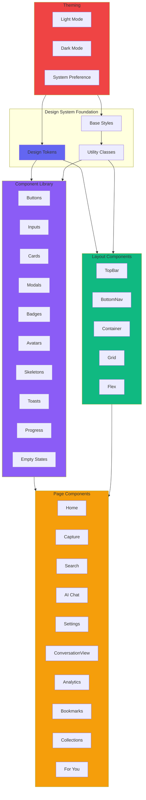
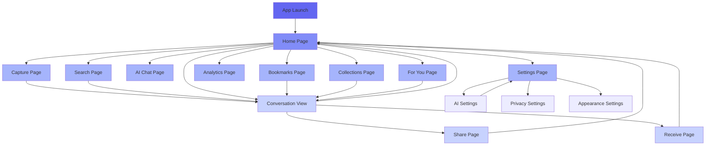
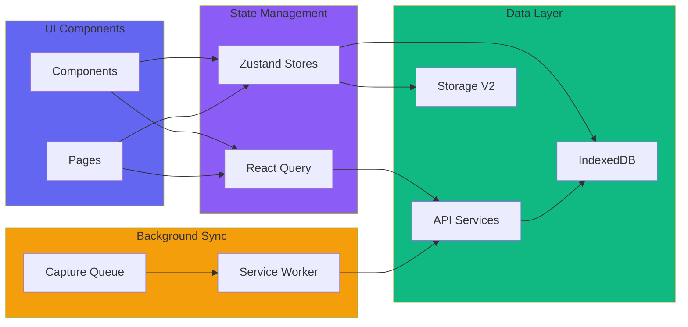
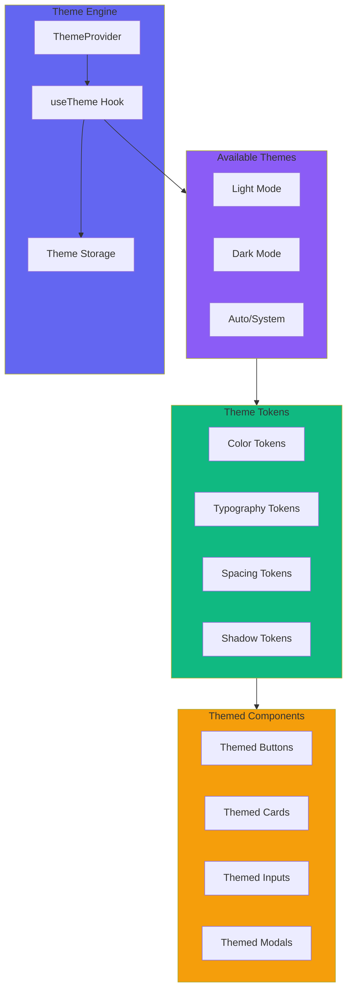
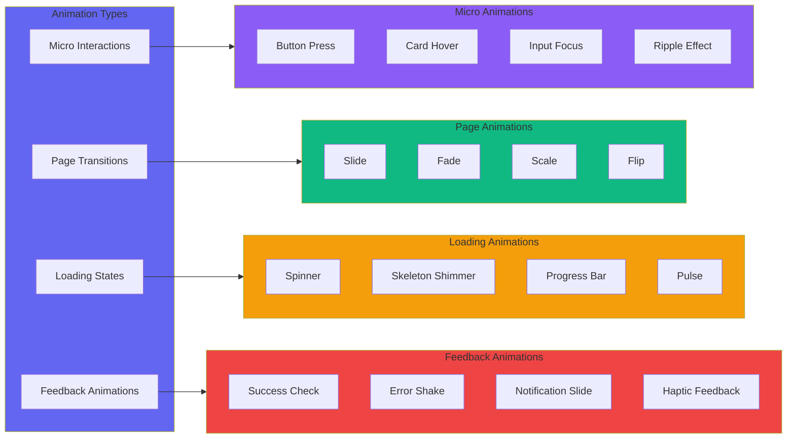
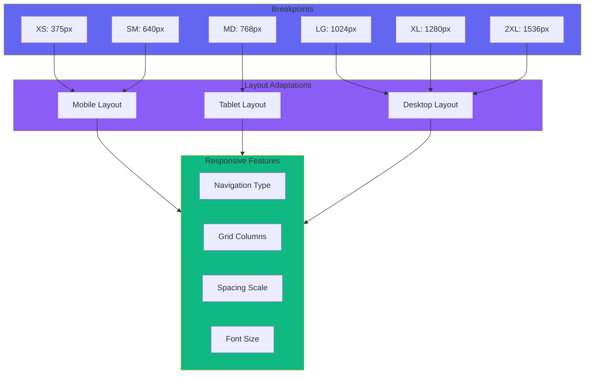
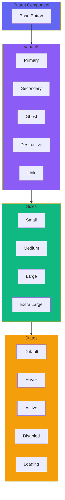
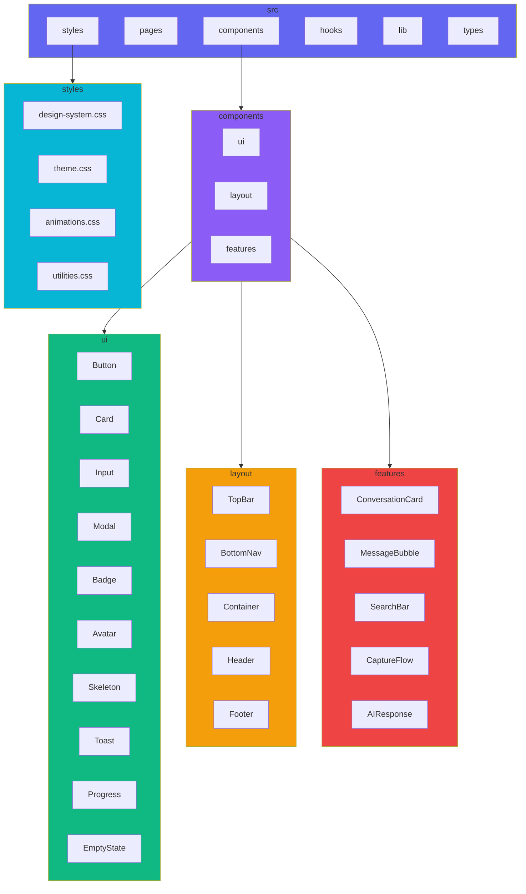

# PWA Redesign - Architecture Overview

## Design System Architecture

## Component Hierarchy

```mermaid
graph LR
    subgraph Foundation
        T[Design Tokens]
        B[Base Styles]
    end

    subgraph Primitives
        Btn[Button]
        Inp[Input]
        Txt[Typography]
        Icn[Icon]
    end

    subgraph Composites
        Card[Card]
        Modal[Modal]
        Toast[Toast]
        Badge[Badge]
    end

    subgraph Features
        SearchBar[SearchBar]
        MessageBubble[MessageBubble]
        ConversationCard[ConversationCard]
        StatCard[StatCard]
    end

    subgraph Layouts
        TopB[TopBar]
        BottomN[BottomNav]
        Page[PageLayout]
    end

    subgraph Pages
        P1[Home]
        P2[Capture]
        P3[Search]
        P4[AIChat]
    end

    T --> B
    B --> Primitives
    Primitives --> Composites
    Composites --> Features
    Features --> Layouts
    Layouts --> Pages

    style T fill:#eef2ff
    style B fill:#e0e7ff
    style Primitives fill:#c7d2fe
    style Composites fill:#a5b4fc
    style Features fill:#818cf8
    style Layouts fill:#6366f1
    style Pages fill:#4f46e5
```

## Page Flow & Navigation

## State Management Flow

## Theme System

## Animation System

## Responsive Breakpoints

## Component Variant System

## File Structure

