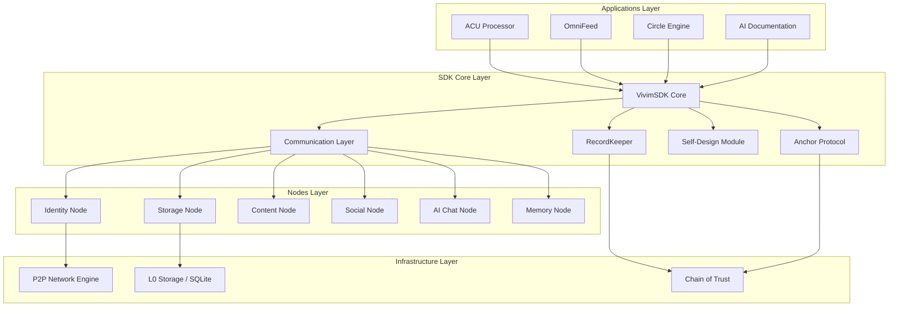
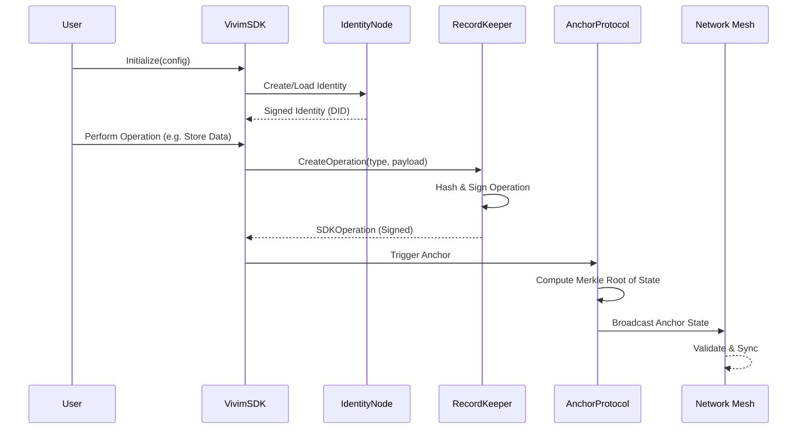
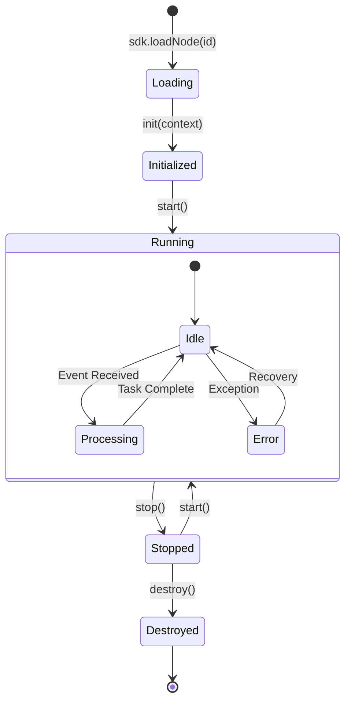
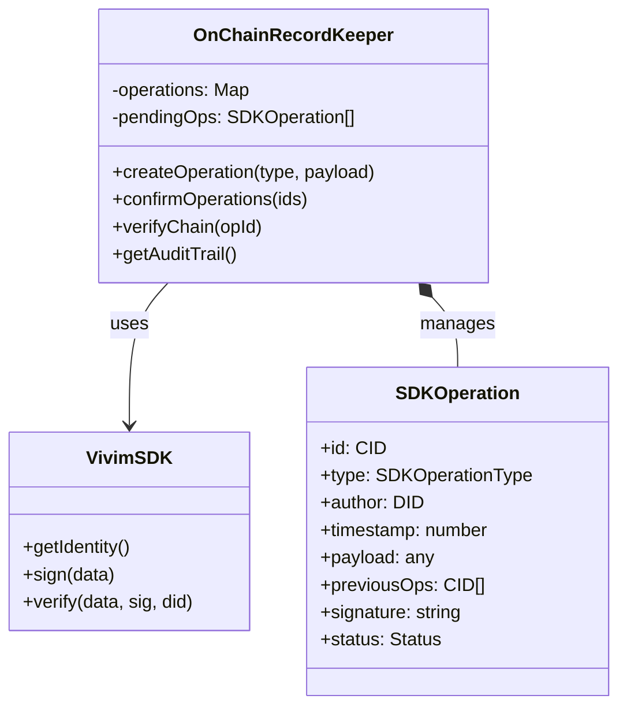
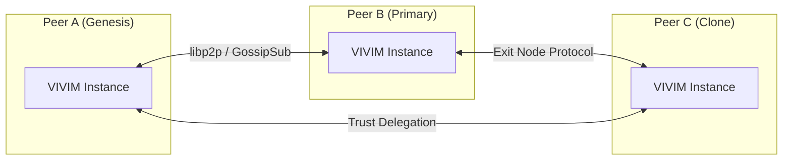
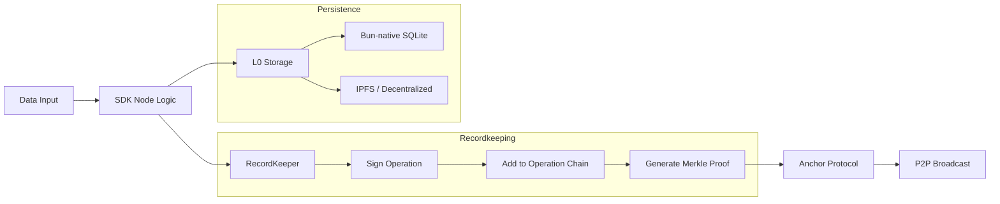

# VIVIM SDK Architecture Visualization

This document provides high-level visualizations of the VIVIM SDK architecture using Mermaid diagrams.

## 1. System Overview

The VIVIM SDK is a multi-layered toolkit that enables decentralized, local-first applications.

## 2. Chain of Trust Flow

The Chain of Trust ensures that every operation and node identity is cryptographically verified.

## 3. Node Lifecycle

How nodes are loaded, registered, and managed within the SDK.

## 4. RecordKeeper Detail

The internal structure of the On-Chain Recordkeeping system.

## 5. Deployment Topology

How VIVIM instances interact across the network.

## 6. Data Flow & Recordkeeping

Detailed view of how data is processed and recorded.

---

*These diagrams can be rendered using Mermaid.js compatible viewers (e.g., GitHub, VS Code Mermaid extension).*
