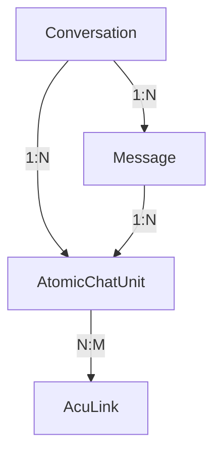
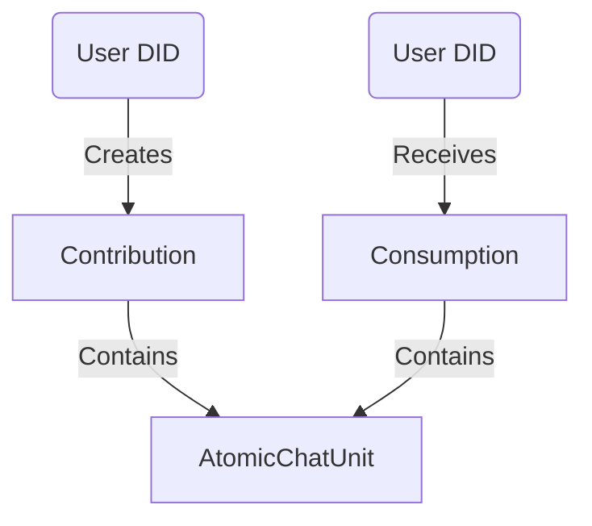

# VIVIM Database: Relationships (ERD)

How the various entities in the VIVIM ecosystem connect.

## 1. Hierarchy: Conversation to ACU



- **Conversation** is the parent. If deleted, all **Messages** and **ACUs** are typically deleted (Cascade).
- **AtomicChatUnit** has two parents: the specific **Message** it was parsed from, and the **Conversation** it belongs to.
- **AcuLink** creates a many-to-many graph between ACUs.

## 2. Hierarchy: User to Device

```mermaid
graph TD
    User -- 1:N --> Device
    User -- 1:N --> Conversation (Owner)
    User -- 1:N --> AtomicChatUnit (Author)
    User -- 1:N --> Circle (Owner)
    User -- N:M --> Circle (Member)
```

- **Identity** is central. A User owns their data (Conversations, ACUs) and their access points (Devices).
- **Circles** act as namespaces for sharing, with a many-to-many relationship via `CircleMember`.

## 3. Network: Contribution & Consumption



- These models use **DIDs** instead of UUIDs to allow for cross-node tracking in a future P2P environment where UUIDs might collide or be hidden.
