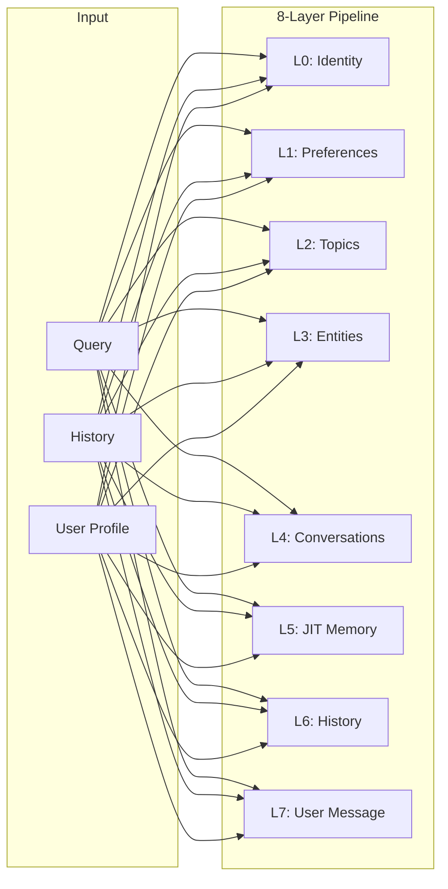
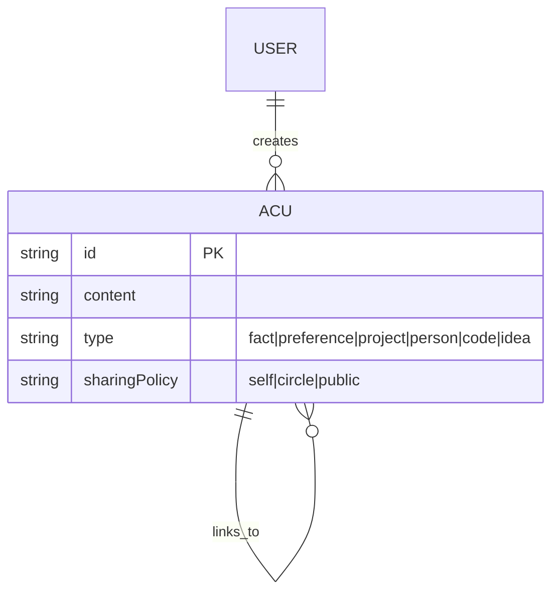
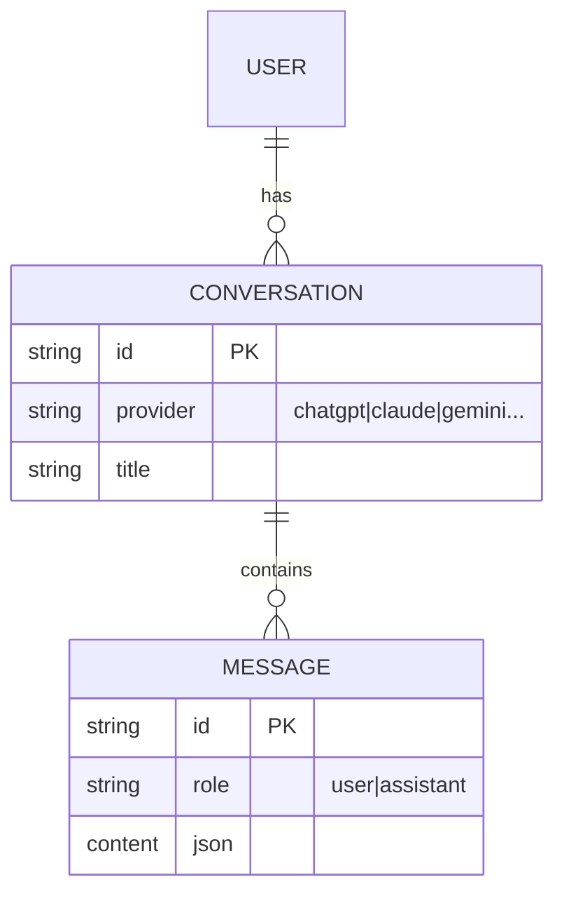

# 🏗️ Architecture Overview

> The complete picture of how VIVIM works - from capture to context

---

## Quick Visual Map

```mermaid
flowchart TB
    subgraph "📱 Client"
        PWA[PWA App]
    end
    
    subgraph "☁️ VIVIM Cloud"
        API[REST API]
        WS[WebSocket]
    end
    
    subgraph "🧠 Core Services"
        CAP[Capture]
        CTX[Context Engine]
        SYNC[Sync]
    end
    
    subgraph "💾 Data"
        DB[(PostgreSQL)]
        REDIS[(Redis)]
        VEC[(Vector DB)]
    end
    
    subgraph "🌐 P2P Network"
        P2P[P2P Node]
    end
    
    PWA -->|HTTP| API
    PWA -->|WS| WS
    API --> CAP
    API --> CTX
    API --> SYNC
    CAP --> DB
    CTX --> VEC
    CTX --> REDIS
    PWA <--> P2P
```

---

## High-Level Architecture

### The Big Picture

```mermaid
flowchart TB
    subgraph "🌍 External World"
        AI[🤖 AI Providers]
        GOOGLE[🔐 Google OAuth]
    end
    
    subgraph "📱 VIVIM System"
        subgraph "Client"
            PWA[⚡ PWA]
            ADMIN[🛠️ Admin Panel]
        end
        
        subgraph "API Layer"
            LB[⚖️ Load Balancer]
            REST[REST API]
            WS[🔌 WebSocket]
        end
        
        subgraph "Services"
            CAP[📥 Capture]
            CTX[🧠 Context]
            SYNC[🔄 Sync]
            MEM[💾 Memory]
        end
        
        subgraph "Workers"
            WARM[🚀 Warmup]
            LIB[📚 Librarian]
            EXT[⚙️ Extract]
        end
        
        subgraph "Data"
            PG[(💿 PostgreSQL)]
            REDIS[(⚡ Redis)]
            VEC[(🔢 Vector)]
            S3[(📦 S3)]
        end
        
        subgraph "Network"
            P2P[🌐 P2P]
            GOSSIP[📢 Gossipsub]
            FED[🔗 Federation]
        end
    end
    
    AI -->|1. Capture| CAP
    GOOGLE -->|Auth| REST
    PWA -->|API| REST
    PWA -->|Live| WS
    
    REST --> CAP & CTX & SYNC & MEM
    CAP --> PG & S3
    CTX --> PG & VEC & REDIS
    
    PWA <--> P2P
    P2P --> GOSSIP & FED
```

---

## 🔄 Data Flow: Capture to Context

### Step 1: Capture Conversation

```mermaid
sequenceDiagram
    participant U as 👤 User
    participant P as 📱 PWA
    participant A as ⚡ API
    participant W as ⚙️ Workers
    participant D as 💾 Database
    
    U->>P: Pastes ChatGPT URL
    P->>A: POST /api/v1/capture
    A->>W: Queue extraction job
    W->>A: Fetch & parse HTML
    A->>D: Store conversation
    A->>P: Return success
    P->>U: ✅ Saved!
```

### Step 2: Build Context

```mermaid
sequenceDiagram
    participant A as ⚡ API
    participant P as 🧠 Pipeline
    participant R as 🔍 Retriever
    participant C as 📦 Assembler
    participant AI as 🤖 AI
    
    A->>P: New chat message
    P->>R: Query ACUs
    R-->>P: Relevant ACUs
    P->>R: Query Memories
    R-->>P: Relevant Memories
    P->>C: All results
    C->>C: Deduplicate & rank
    C->>C: Allocate tokens
    C->>A: Final context
    A->>AI: Prompt + Context
    AI-->>A: Response
    A-->>U: 🤖 Response
```

---

## 🧱 Core Components

### API Server (`/server`)

| Feature | Description |
|---------|-------------|
| **Auth** | OAuth 2.0 (Google), sessions, API keys |
| **REST** | Full CRUD for conversations, users, ACUs |
| **WebSocket** | Real-time updates, sync notifications |
| **Context** | Dynamic prompt assembly |

### PWA Frontend (`/pwa`)

| Feature | Description |
|---------|-------------|
| **Framework** | React 19 + TypeScript |
| **State** | Zustand + TanStack Query |
| **Storage** | IndexedDB (Dexie) - offline-first |
| **Styling** | Tailwind CSS |
| **PWA** | Service worker, offline support |

### Context Engine (`/server/src/context`)

### Network Layer (`/network`)

| Technology | Purpose |
|------------|---------|
| **libp2p** | P2P networking |
| **Yjs** | CRDT sync |
| **Gossipsub** | Pub/Sub messaging |
| **DHT** | Peer discovery |

---

## 📊 Data Models

### Active Context Units (ACUs)

### Conversations & Messages

---

## 🔐 Security Architecture

```mermaid
flowchart TB
    subgraph "Security Layers"
        AUTH[🔐 Auth]
        ENC[🔒 Encryption]
        PERM[👮 Permissions]
        AUD[📝 Audit]
    end
    
    subgraph "Your Keys"
        KPub[Public Key]
        KPriv[Private Key]
    end
    
    AUTH --> ENC
    ENC --> PERM
    PERM --> AUD
    
    ENC <--> KPub & KPriv
```

---

## 🚀 Getting Started with Architecture

Ready to dive deeper? Here's your path:

| If you want to... | Start here |
|-------------------|------------|
| Understand context pipeline | [Context Engine](/docs/architecture/context) |
| See how sync works | [Sync Architecture](/docs/architecture/sync) |
| Learn about storage | [Database Schema](/docs/database/schema) |
| Explore P2P networking | [Network Overview](/docs/network/overview) |
| Set up development | [Development Guide](/docs/development/guide) |

---

## Quick Reference

### Key Technologies

- **Runtime**: Node.js 20+
- **Database**: PostgreSQL + Redis + Vector DB
- **P2P**: libp2p v1
- **Sync**: Yjs + CRDT
- **Cache**: Redis multi-layer
- **Queue**: BullMQ

### API Base URLs

| Environment | URL |
|------------|-----|
| Development | `http://localhost:3000` |
| Production | `https://api.vivim.app` |

### Key Endpoints

| Endpoint | Purpose |
|----------|---------|
| `POST /api/v1/capture` | Import conversation |
| `GET /api/v1/conversations` | List conversations |
| `POST /api/v1/context` | Get AI context |
| `WS /ws` | Real-time updates |
