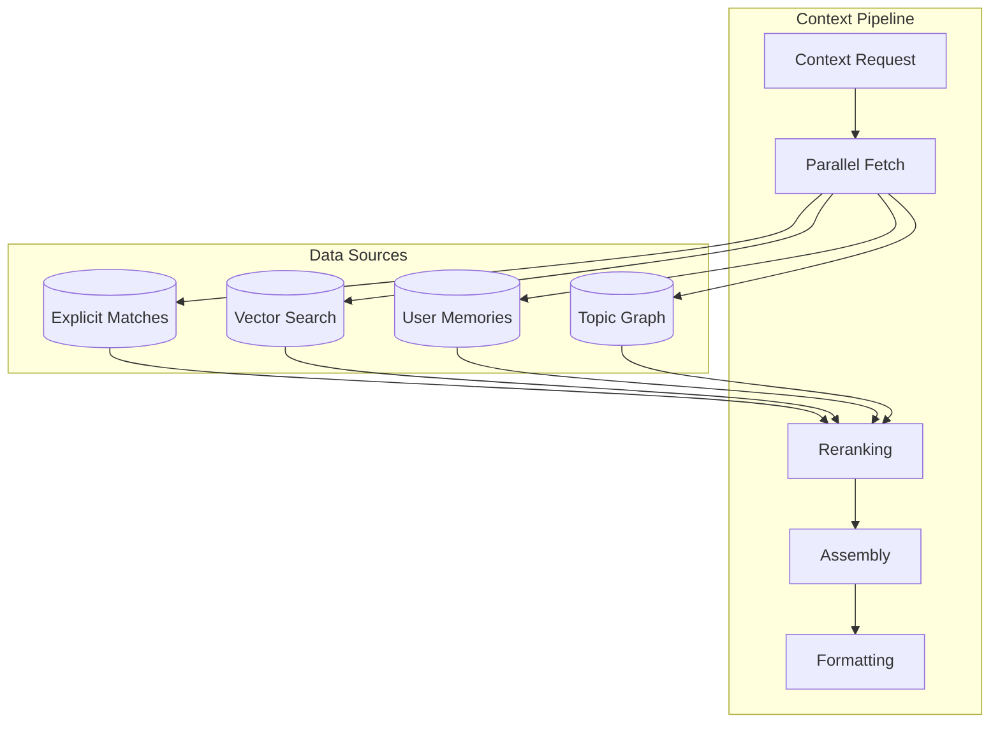
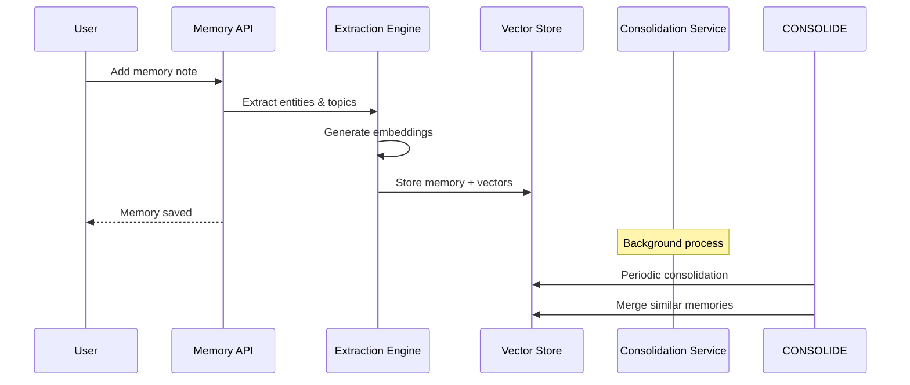
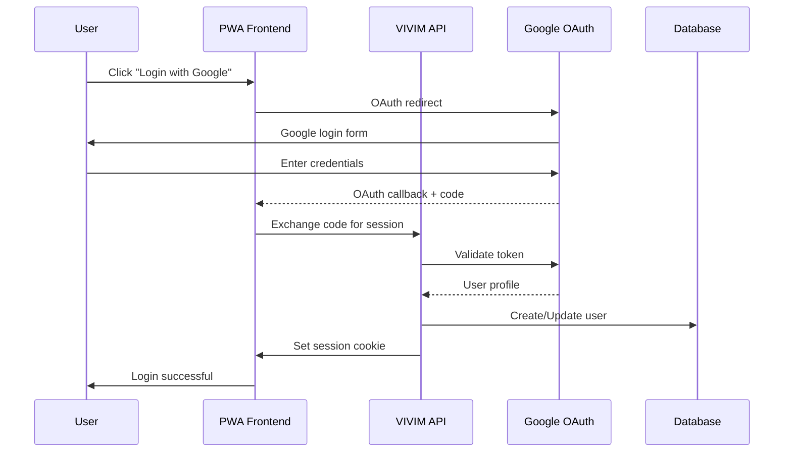

# Server Architecture

The VIVIM API Server (`/server`) is a comprehensive Express.js application that handles authentication, conversation capture, context management, and real-time communication.

## Technology Stack

| Layer | Technology | Purpose |
|-------|------------|---------|
| Runtime | Bun | JavaScript runtime |
| Framework | Express.js 5.x | HTTP server |
| Database | PostgreSQL + Prisma | ORM and data persistence |
| Cache | Redis | Sessions, caching, pub/sub |
| Vector DB | Custom embeddings | Semantic search |
| Real-time | Socket.IO | WebSocket communication |
| AI SDK | Vercel AI SDK | Multi-provider LLM integration |
| Auth | Passport.js + JWT | Authentication |

## Server Entryermaid
flowchart LR
    subgraph " Point

```mserver.js"
        ENV[Environment Config]
        MID[Middleware Stack]
        ROUTES[Route Registration]
        WS[WebSocket Setup]
        ERR[Error Handling]
    end
    
    ENV --> MID
    MID --> ROUTES
    ROUTES --> WS
    WS --> ERR
```

The main server file (`src/server.js`) follows a modular structure:

```typescript
// Key middleware registration order
app.use(helmet())           // Security headers
app.use(cors())             // CORS
app.use(compression())      // Gzip
app.use(rateLimit)          // Rate limiting
app.use(express.json())     // Body parsing
app.use(session)            // Sessions
app.use(passport.initialize()) // Auth
```

## API Routes Overview

```mermaid
graph TD
    subgraph "Authentication Routes"
        AUTH[/api/v1/auth]
        GOOGLE[Google OAuth]
        APIKEY[API Keys]
    end
    
    subgraph "Core Data Routes"
        CONV[/api/v1/conversations]
        CAPTURE[/api/v1/capture]
        ACU[/api/v1/acus]
        MEM[/api/v1/memory]
    end
    
    subgraph "Social Features"
        CIRCLE[/api/v2/circles]
        SHARE[/api/v2/sharing]
        FEED[/api/v2/feed]
    end
    
    subgraph "AI Integration"
        CONTEXT[/api/v1/context]
        AI[/api/v1/ai/*]
        CHAT[/api/v1/ai/chat]
    end
    
    subgraph "Admin Routes"
        ADMIN_SYS[/api/admin/system]
        ADMIN_NET[/api/admin/network]
        ADMIN_DB[/api/admin/database]
    end
    
    AUTH --> GOOGLE
    AUTH --> APIKEY
    CONV --> CAPTURE
    CONV --> ACU
    CIRCLE --> SHARE
    CONTEXT --> AI
    AI --> CHAT
```

## Key Services

### 1. Capture Service

Handles extraction of conversations from AI provider websites.

```typescript
// From: server/src/routes/capture.js
interface CaptureRequest {
  sourceUrl: string;        // URL of AI chat
  provider: 'chatgpt' | 'claude' | 'gemini' | 'other';
  options?: {
    extractCode?: boolean;
    extractImages?: boolean;
    generateSummary?: boolean;
  };
}

interface CaptureResponse {
  success: boolean;
  conversation?: {
    id: string;
    title: string;
    messageCount: number;
    provider: string;
  };
  error?: {
    code: string;
    message: string;
  };
}
```

**Supported Providers:**
- ChatGPT (chat.openai.com)
- Claude (claude.ai)  
- Gemini (gemini.google.com)
- Generic/Other (fallback extraction)

### 2. Context Engine

The Dynamic Context System assembles relevant context for AI prompts:



**Key Components:**

| Component | File | Purpose |
|-----------|------|---------|
| `ParallelContextPipeline` | `context-pipeline.ts` | Parallel retrieval orchestration |
| `DynamicContextAssembler` | `context-assembler.ts` | Context aggregation & formatting |
| `HybridRetrievalService` | `hybrid-retrieval.ts` | Mixed explicit + semantic search |
| `ContextCache` | `context-cache.ts` | In-memory caching |
| `ContextEventBus` | `context-event-bus.ts` | Event-driven invalidation |

### 3. Social Service

Manages social features like circles, sharing, and feeds:

```typescript
// Key endpoints from: server/src/routes/social.ts
- GET    /api/v2/circles          // List user's circles
- POST   /api/v2/circles          // Create circle
- GET    /api/v2/circles/:id      // Get circle details
- PUT    /api/v2/circles/:id      // Update circle
- DELETE /api/v2/circles/:id      // Delete circle
- POST   /api/v2/circles/:id/members  // Add member
- DELETE /api/v2/circles/:id/members/:did  // Remove member
```

### 4. Memory Service

User's "second brain" for persistent knowledge:



## WebSocket Events

Real-time communication via Socket.IO:

```typescript
// From: server/src/services/socket.ts

// Server events (emit to client)
'sync:status'      // Sync progress updates
'context:update'   // Context bundle changed
'notification'      // User notifications
'presence'         // Online status changes

// Client events (listen from client)
'sync:request'     // Request full sync
'context:subscribe' // Subscribe to context updates
'ping'             // Heartbeat
```

## Authentication Flow



## Error Handling

The server uses a centralized error handling middleware:

```typescript
// From: server/src/middleware/errorHandler.js
app.use((err, req, res, next) => {
  const error = {
    code: err.code || 'INTERNAL_ERROR',
    message: err.message,
    requestId: req.id,
    ...(process.env.NODE_ENV === 'development' && { stack: err.stack })
  };
  
  const statusCode = err.statusCode || 500;
  res.status(statusCode).json({ error });
});
```

## Rate Limiting

Production-grade rate limiting configuration:

```typescript
const rateLimitConfig = {
  windowMs: 15 * 60 * 1000,  // 15 minutes
  max: 100,                   // requests per window
  standardHeaders: true,
  message: {
    error: 'Too many requests',
    retryAfter: '15m'
  }
};
```

---

## Next Steps

- [Context Engine Deep Dive](/docs/architecture/context) - Full context system documentation
- [API Reference](/docs/api/overview) - Complete endpoint documentation
- [Database Schema](/docs/database/schema) - Data models
