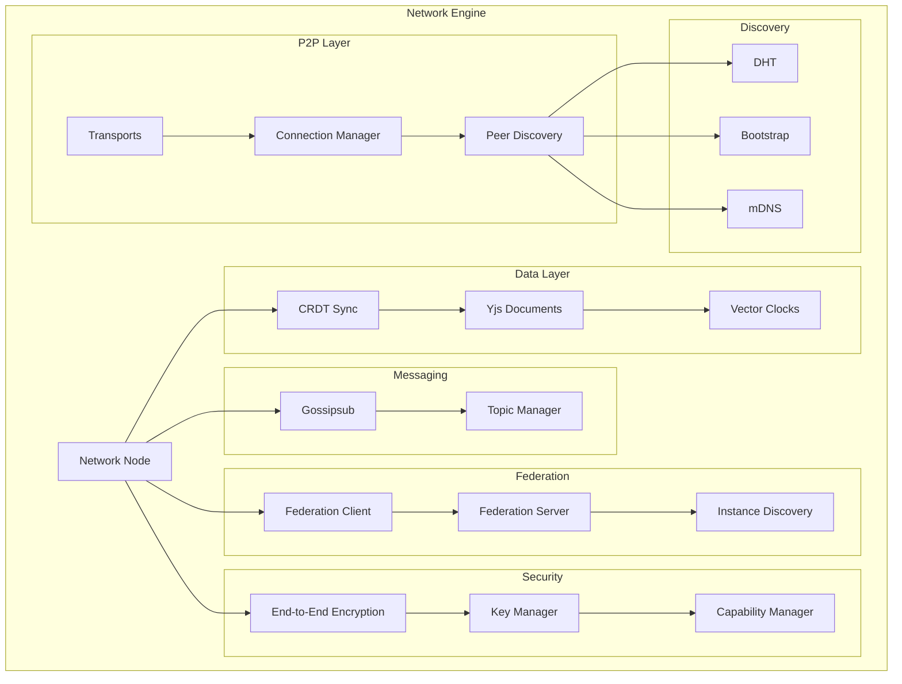
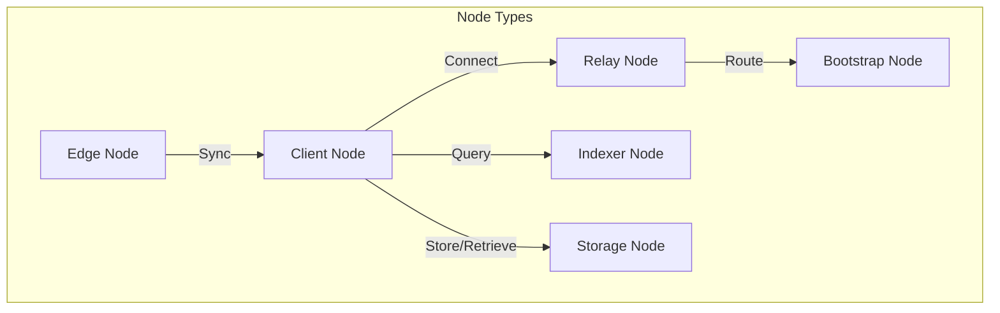
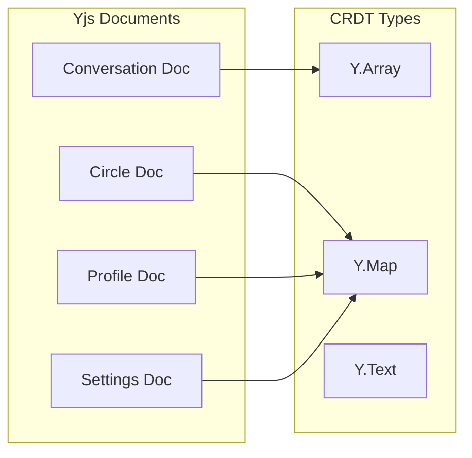
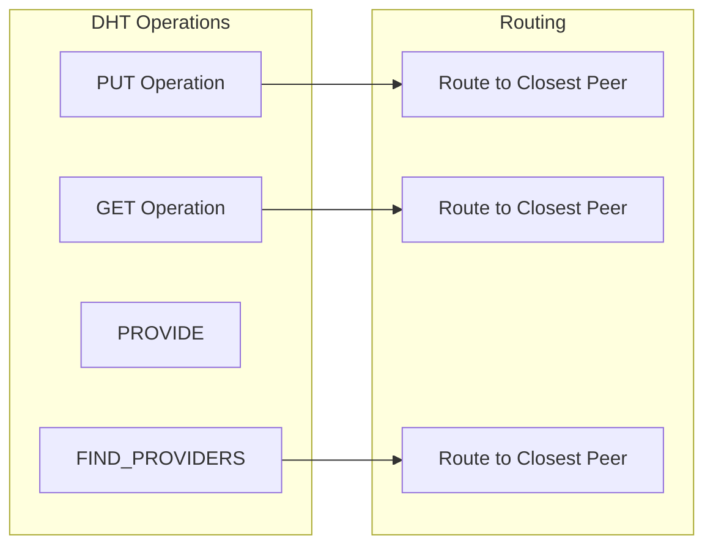
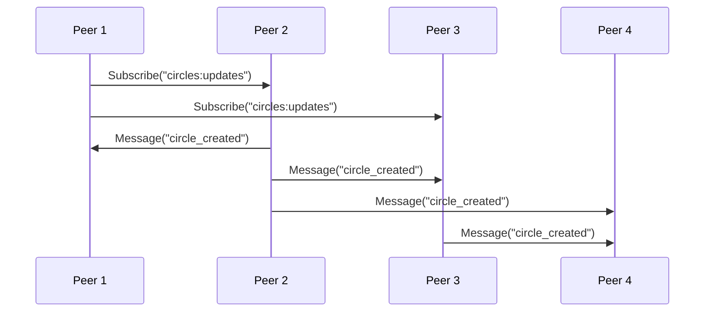
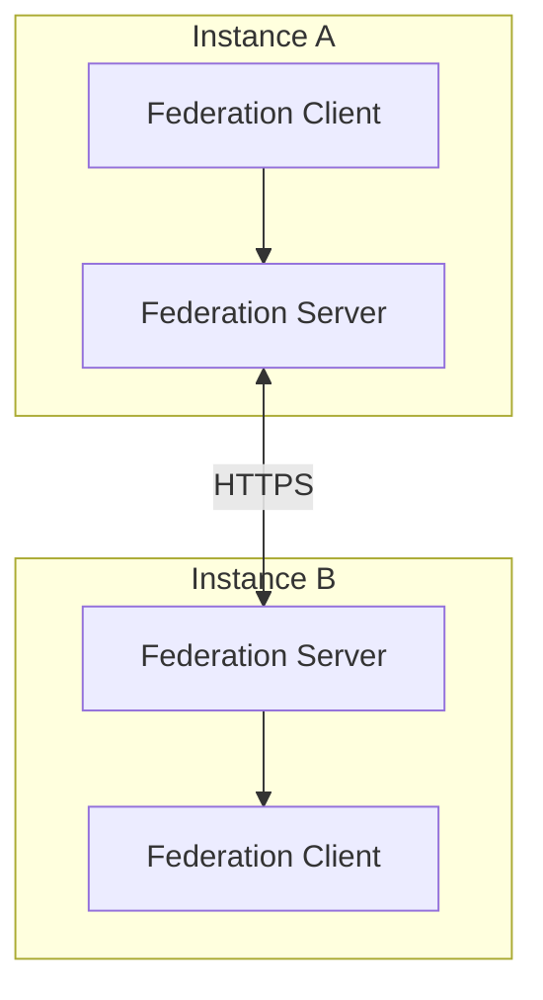

# Network Layer Architecture

The Network Layer (`/network`) provides decentralized P2P communication, data synchronization, and federation capabilities for VIVIM.

## Technology Stack

| Component | Technology | Purpose |
|-----------|------------|---------|
| P2P Core | libp2p v1 | Peer-to-peer networking |
| Protocol | WebRTC, WebSockets, TCP | Transport layers |
| CRDT | Yjs | Conflict-free data types |
| DHT | kad-dht | Distributed hash table |
| PubSub | Gossipsub | Topic-based messaging |
| Security | @libp2p/noise, @libp2p/tls | Encryption |

## Architecture Overview



## P2P Networking

### Network Node

The core P2P node based on libp2p:

```typescript
// From: network/src/p2p/NetworkNode.ts
import { createLibp2p } from 'libp2p';

const node = await createLibp2p({
  // Transports - multiple transport support
  transports: [
    webRTC(),      // Browser-to-browser
    webSockets(),  // WebSocket connections
    tcp()          // Direct TCP
  ],
  
  // Connection security
  connectionEncryption: [
    noise(),      // Noise protocol
    tls()         // TLS 1.3
  ],
  
  // Stream multiplexing
  streamMuxers: [
    yamux(),      // YAMUX
    mplex()       // MPLEX
  ],
  
  // Peer discovery
  peerDiscovery: [
    bootstrap({   // Bootstrap peers
      list: ['/ip4/.../tcp/.../p2p/...']
    }),
    mdns()        // Local discovery
  ],
  
  // DHT for content routing
  dht: kadDHT({
    clientMode: true
  }),
  
  // PubSub
  pubsub: gossipsub({
    allowPublishToZeroPeers: false
  })
});
```

### Node Types



| Node Type | Role | Responsibilities |
|-----------|------|------------------|
| Client | End-user devices | Read/write data, sync with relays |
| Edge | Lightweight nodes | Cached content delivery |
| Relay | Network bridge | Route traffic, enable connectivity |
| Indexer | Search service | Content indexing, discovery |
| Storage | Data persistence | Long-term data storage |
| Bootstrap | Entry points | Initial peer discovery |

## CRDT Synchronization

### Conflict-Free Replicated Data Types

VIVIM uses Yjs for CRDT-based synchronization:

```typescript
// From: network/src/crdt/CRDTSyncService.ts
import * as Y from 'yjs';
import { WebrtcProvider } from 'y-webrtc';

class CRDTSyncService {
  async createDocument(config: CRDTSyncConfig): Promise<Y.Doc> {
    const doc = new Y.Doc();
    
    // Choose provider based on config
    if (config.p2pEnabled) {
      // WebRTC for direct P2P
      const provider = new WebrtcProvider(config.docId, doc, {
        signaling: config.signalingServers
      });
    } else {
      // WebSocket for relay-based
      const provider = new WebsocketProvider(
        config.websocketUrl,
        config.docId,
        doc
      );
    }
    
    return doc;
  }
}
```

### Document Types



| Document Type | CRDT Structure | Sync Strategy |
|---------------|----------------|---------------|
| Conversation | Y.Array of messages | Last-write-wins |
| Circle | Y.Map of members | LWW + vector clock |
| Profile | Y.Map of attributes | LWW |
| Settings | Y.Map of preferences | LWW |

### Vector Clocks

Tracking causality for conflict resolution:

```typescript
// From: network/src/crdt/VectorClock.ts
interface VectorClock {
  [peerId: string]: number;
}

// Compare vector clocks
function compare(a: VectorClock, b: VectorClock): 'after' | 'before' | 'concurrent' {
  let aGreater = false;
  let bGreater = false;
  
  const allPeers = new Set([...Object.keys(a), ...Object.keys(b)]);
  
  for (const peer of allPeers) {
    const aVal = a[peer] || 0;
    const bVal = b[peer] || 0;
    
    if (aVal > bVal) aGreater = true;
    if (bVal > aVal) bGreater = true;
  }
  
  if (aGreater && !bGreater) return 'after';
  if (bGreater && !aGreater) return 'before';
  return 'concurrent';
}
```

## Distributed Hash Table (DHT)

### Content Routing



### Content Registry

```typescript
// From: network/src/dht/ContentRegistry.ts
interface ContentRecord {
  key: string;
  value: Uint8Array;
  providers: PeerId[];
  timestamp: number;
  signature: Uint8Array;
}

// Store content reference
await dht.put(key, value);

// Find providers of content
const providers = await dht.findProviders(key);
```

## PubSub Messaging

### Gossipsub Protocol



### Topic Manager

```typescript
// From: network/src/pubsub/TopicManager.ts
const topicManager = {
  // Subscribe to topics
  async subscribe(topic: string, handler: MessageHandler) {
    await pubsub.subscribe(topic);
    pubsub.on('message', (msg) => {
      if (msg.topic === topic) {
        handler(msg.data);
      }
    });
  },
  
  // Publish to topics
  async publish(topic: string, data: any) {
    await pubsub.publish(topic, encode(data));
  }
};

// Usage
topicManager.subscribe('user:updates:did_123', handleUpdate);
topicManager.publish('circle:messages:circle_456', message);
```

## Federation

### Cross-Instance Communication



### Instance Discovery

```typescript
// From: network/src/federation/InstanceDiscovery.ts
interface FederationInstance {
  did: string;
  endpoint: string;
  version: string;
  capabilities: string[];
}

// Discover instances
const instances = await discovery.discover({
  domain: 'vivim.social',
  limit: 10
});

// Connect to instance
const client = new FederationClient({
  instance: instances[0],
  auth: await getAuth()
});
```

## Security

### End-to-End Encryption

```typescript
// From: network/src/security/E2EEncryption.ts
import { generateKeyPair, encrypt, decrypt } from '@noble/ed25519';

// Generate key pair
const { publicKey, privateKey } = await generateKeyPair();

// Encrypt message for recipient
const encrypted = await encrypt(
  message,
  privateKey,
  recipientPublicKey
);

// Decrypt message
const decrypted = await decrypt(
  encrypted,
  recipientPrivateKey,
  senderPublicKey
);
```

### Capability-Based Access

```typescript
// From: network/src/security/CapabilityManager.ts
interface Capability {
  resource: string;
  actions: ('read' | 'write' | 'delete')[];
  expiresAt: Date;
  issuer: string;
  signature: Uint8Array;
}

// Grant capability
const capability = await capabilityManager.grant({
  resource: 'circle:123:members',
  actions: ['read', 'write'],
  expiresAt: addDays(new Date(), 7),
  to: peerId
});

// Verify capability
const valid = await capabilityManager.verify(capability);
```

## Sync States

```mermaid
stateDiagram-v2
    [*] --> Offline
    Offline --> Connecting: Network available
    Connecting --> Syncing: Connected
    Syncing --> Synced: All data synced
    Syncing --> Conflict: Conflict detected
    Conflict --> Resolved: Auto-merge
    Resolved --> Synced
    Synced --> Syncing: New changes
    Synced --> Offline: Network lost
    Offline --> [*]
---

## Next Steps

- [Security Overview](/docs/network/security) - Network security details

---

## Next Steps

- [Security Overview](/docs/network/security) - Network security details

- [Security Overview](/docs/network/security) - Network security details

- [P2P Protocols](/docs/network/protocols) - Detailed protocol documentation
- [CRDT Implementation](/docs/network/crdt) - Conflict resolution strategies
- [Federation Protocol](/docs/network/federation) - Cross-instance communication
