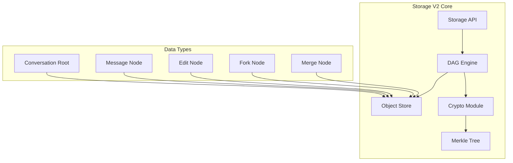
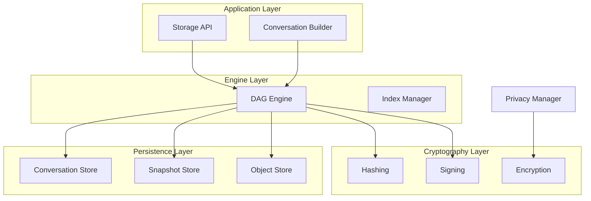
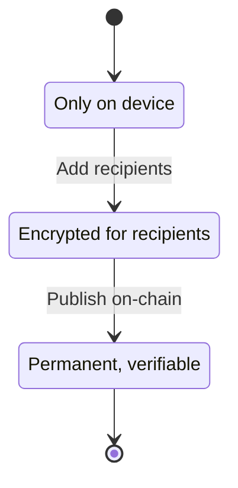

# Storage V2 Architecture

OpenScroll Storage V2 is a next-generation storage system for conversations, featuring **content-addressed DAG storage**, **cryptographic signatures**, and **P2P-native** architecture.

## Core Concepts



## Architecture Overview

### Design Principles

1. **Content-Addressing**: Every piece of content is identified by its cryptographic hash
2. **DAG Structure**: Non-linear conversation history with forks and merges
3. **Cryptographic Verification**: Every node is signed by its author
4. **Merkle Proofs**: Efficient verification of conversation integrity
5. **Offline-First**: Works without network connectivity
6. **Mobile Optimized**: IndexedDB-based with efficient batching

### Storage Layers



## Node Types

### Conversation Root

```typescript
interface ConversationRoot extends BaseNode {
  type: 'root';
  title: string;
  conversationId: Hash;  // Stable ID
  metadata: ConversationMetadata;
  firstMessage?: Hash;
  privacy?: PrivacyState;
}
```

### Message Node

```typescript
interface MessageNode extends BaseNode {
  type: 'message';
  role: 'user' | 'assistant' | 'system';
  content: ContentBlock[];
  parents: Hash[];      // Previous messages
  depth: number;        // Distance from root
  contentHash: Hash;
  metadata?: MessageMetadata;
}
```

### Edit Node

```typescript
interface EditNode extends BaseNode {
  type: 'edit';
  edits: Hash;          // Original message
  content: ContentBlock[];
  parents: Hash[];
  depth: number;
  contentHash: Hash;
  editReason?: string;
}
```

### Fork & Merge Nodes

```typescript
interface ForkNode extends BaseNode {
  type: 'fork';
  forkPoint: Hash;
  branchName: string;
  forkReason?: string;
}

interface MergeNode extends BaseNode {
  type: 'merge';
  sources: Hash[];
  parents: Hash[];
  depth: number;
  mergeStrategy?: 'recursive' | 'ours' | 'theirs' | 'manual';
}
```

## DAG Engine

### Conversation Builder

```typescript
import { ConversationBuilder } from './storage-v2';

const builder = new ConversationBuilder(storage);

// Create a new conversation
const root = await builder.create('My Chat');

// Add messages
const msg1 = await builder.addMessage(root.conversationId, {
  role: 'user',
  content: [{ type: 'text', content: 'Hello!' }]
});

// Edit a message
const edited = await builder.editMessage(msg1.id, {
  content: [{ type: 'text', content: 'Hello, world!' }],
  reason: 'Fixed typo'
});

// Fork the conversation
const fork = await builder.fork(root.conversationId, 'alternative-branch');

// Merge branches
const merged = await builder.merge('main', ['branch1', 'branch2']);
```

### Traversal Operations

```typescript
// Get conversation history
const history = await dag.getHistory(conversationId);

// Get message ancestors
const ancestors = await dag.getAncestors(messageHash);

// Get branch heads
const heads = await dag.getHeads(conversationId);

// Topological sort
const sorted = await dag.topologicalSort(conversationId);
```

## Cryptographic Operations

### Hashing

```typescript
import { sha256, contentHash } from './storage-v2';

// SHA-256 hash
const hash = sha256('Hello, World!');

// Content hash (canonical form)
const ch = contentHash({
  type: 'text',
  content: 'Hello'
});
```

### Signing & Verification

```typescript
import { sign, verify, signNode } from './storage-v2';

// Sign a message
const signature = await sign(
  messageContent,
  privateKey
);

// Verify a signature
const isValid = await verify(
  messageContent,
  signature,
  publicKey
);

// Sign a node
const signedNode = await signNode(messageNode, privateKey);
```

### DID Management

```typescript
import { publicKeyToDID, didToPublicKey, generateIdentity } from './storage-v2';

// Generate new identity
const identity = generateIdentity();
console.log('DID:', identity.did);

// Convert between formats
const did = publicKeyToDID(publicKey);
const pk = didToPublicKey(did);
```

## Merkle Tree

### Building the Tree

```typescript
import { buildMerkleTree, generateProof, verifyProof } from './storage-v2';

const messages = [msg1, msg2, msg3, msg4];
const tree = buildMerkleTree(messages);

// Generate proof for a message
const proof = generateProof(tree, msg2.hash);

// Verify proof
const isValid = verifyProof(tree.root, proof);
```

### State Commitments

```typescript
import { createStateCommitment, verifyStateCommitment } from './storage-v2';

// Create state commitment
const commitment = await createStateCommitment(
  conversationRoot,
  messageHashes,
  privateKey
);

// Verify commitment
const isValid = await verifyStateCommitment(commitment);
```

## Privacy Levels



### Privacy States

```typescript
// Local only
const localPrivacy: PrivacyState = {
  level: 'local',
  updatedAt: new Date().toISOString()
};

// Shared with specific users
const sharedPrivacy: PrivacyState = {
  level: 'shared',
  updatedAt: new Date().toISOString(),
  recipients: ['did:key:abc123', 'did:key:def456'],
  encryptionKey: 'encrypted-key...' // Per recipient
};

// Public on-chain
const publicPrivacy: PrivacyState = {
  level: 'public',
  updatedAt: new Date().toISOString(),
  onChainAnchors: [{
    chainId: 'optimism',
    blockNumber: 12345678,
    transactionHash: '0x...',
    timestamp: Date.now(),
    merkleRoot: '0x...'
  }]
};
```

## Content Blocks

### Supported Types

| Type | Description | Example |
|------|-------------|---------|
| `text` | Plain text or markdown | `"Hello world"` |
| `code` | Syntax-highlighted code | Python, JavaScript |
| `image` | Images (data URI, IPFS, URL) | Charts, diagrams |
| `mermaid` | Mermaid diagrams | Flowcharts |
| `table` | Data tables | Tabular data |
| `math` | LaTeX math | Equations |
| `tool_call` | AI function calls | API calls |
| `tool_result` | Function results | Response data |

### Example Content

```typescript
const content: ContentBlock[] = [
  {
    type: 'text',
    content: 'Here is a solution:'
  },
  {
    type: 'code',
    content: 'function fib(n) {\n  return n <= 1 ? n : fib(n-1) + fib(n-2);\n}',
    language: 'javascript'
  },
  {
    type: 'mermaid',
    content: 'graph TD;\n  A-->B;\n  B-->C;'
  },
  {
    type: 'math',
    content: 'E = mc^2',
    display: true
  }
];
```

## Storage Operations

### Basic CRUD

```typescript
const storage = new Storage();

// Create conversation
const root = await storage.createConversation('My Chat', {
  provider: 'openai',
  model: 'gpt-4'
});

// Get conversation
const conversation = await storage.getConversation(root.conversationId);

// List conversations
const conversations = await storage.listConversations({
  limit: 10,
  offset: 0
});

// Delete conversation
await storage.deleteConversation(conversationId);
```

### Message Operations

```typescript
// Add message
const message = await storage.addMessage(conversationId, {
  role: 'user',
  content: [{ type: 'text', content: 'Hello!' }]
});

// Edit message
const edited = await storage.editMessage(message.id, {
  content: [{ type: 'text', content: 'Updated!' }]
});

// Get history
const history = await storage.getHistory(conversationId);
```

## Sync Protocol

### P2P Sync Messages

```typescript
// Have message - advertise what we have
const have: HaveMessage = {
  conversations: [rootHash1, rootHash2],
  snapshots: [snap1, snap2]
};

// Want message - request what we need
const want: WantMessage = {
  hashes: [msgHash1, msgHash2]
};

// Get objects - request specific objects
const getObjects: GetObjectsMessage = {
  hashes: [objHash1, objHash2]
};

// Objects message - response with objects
const objects: ObjectsMessage = {
  objects: [node1, node2]
};
```

## (0,0) Fallback

The **(0,0) Fallback** is the ultimate last-resort verification system:

> "If the platform dies, the company closes, the servers go down: The fallback HTML file still works. Just open it in a browser. Verification runs automatically. From (0,0), forever."

### Guarantees

```typescript
/**
 * (0,0) GUARANTEE:
 * 
 * This fallback code:
 * - Has MODE=0 (private) or MODE=1 (open)
 * - Contains embedded SHA-256 math (150 lines)
 * - Contains Ed25519 verify math
 * - Requires NO external dependencies
 * - Works in ANY browser, FOREVER
 */
```

### Usage

```typescript
import { generateFallback00, downloadFallback } from './storage-v2';

// Generate standalone verification file
const html = await generateFallback00(conversationData);

// Download for offline use
await downloadFallback(conversationId);
```

## Performance

### IndexedDB Optimization

- **Batch Operations**: Group multiple writes
- **Cursor-based Pagination**: Efficient large dataset handling
- **Index Management**: Maintain lookup indexes
- **Auto-compaction**: Periodic garbage collection

### Benchmarks

| Operation | Time (1K messages) |
|-----------|-------------------|
| Create conversation | ~5ms |
| Add message | ~2ms |
| List conversations | ~50ms |
| Full history load | ~200ms |
| Merkle proof generation | ~10ms |

## Related Documentation

- [Security Overview](/docs/security/overview) - E2E encryption
- [PWA Architecture](/docs/pwa/overview) - Frontend storage
- [Sync Architecture](/docs/architecture/sync) - Offline-first sync
