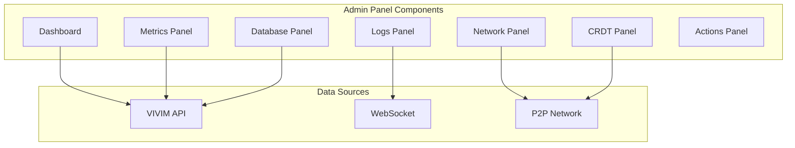

# Admin Panel

The VIVIM Admin Panel (`/admin-panel`) provides real-time monitoring, debugging, and management capabilities for system operators.

## Overview



## Features

### Real-Time Logs

```typescript
// Log panel configuration
const logConfig = {
  sources: ['server', 'network', 'pwa'],
  levels: ['debug', 'info', 'warn', 'error'],
  filters: {
    userId: string,
    sessionId: string,
    timeframe: '1h' | '24h' | '7d'
  },
  refreshInterval: 1000
};
```

### System Metrics

| Metric | Description | Visualization |
|--------|-------------|----------------|
| CPU Usage | Server CPU utilization | Line chart |
| Memory | RAM usage | Gauge |
| Requests/sec | API throughput | Counter |
| Latency | Response times | Histogram |
| Error Rate | Errors per minute | Rate |

### Database Monitoring

```typescript
// Database queries panel
const dbMetrics = {
  connectionPool: {
    active: number,
    idle: number,
    waiting: number
  },
  queries: {
    slow: Query[],
    frequent: Query[]
  },
  tables: {
    rowCounts: Record<string, number>,
    sizeBytes: Record<string, number>
  }
};
```

### Network Status

```mermaid
graph TD
    subgraph "Network Visualization"
        PEERS[Peer Graph]
        TOPICS[Topic Mesh]
        STREAMS[Stream Map]
    end
    
    subgraph "Peer Info"
        CONN[Connections]
        LATENCY[Latency]
        BANDWIDTH[Bandwidth]
    end
    
    PEERS --> CONN
    TOPICS --> STREAMS
end
```

### CRDT Management

```typescript
// CRDT sync status
const crdtStatus = {
  documents: {
    conversations: SyncStatus,
    circles: SyncStatus,
    settings: SyncStatus
  },
  conflicts: Conflict[],
  pending: Operation[]
};
```

---

## Panel Components

### System Overview

Real-time system health:

```tsx
<SystemOverviewPanel>
  <MetricCard title="Active Users" value={1234} trend="up" />
  <MetricCard title="API Requests" value="45K/min" trend="stable" />
  <MetricCard title="Error Rate" value="0.1%" trend="down" />
  <MetricCard title="P2P Peers" value={567} />
</SystemOverviewPanel>
```

### Real-Time Logs

```tsx
<RealTimeLogsPanel 
  source="server"
  filter={{ level: ['error', 'warn'] }}
  maxLines={1000}
/>
```

### Network Visualization

```tsx
<NetworkPanel>
  <PeerGraph peers={peerList} />
  <ConnectionTable connections={connections} />
  <TopicMesh topics={topics} />
</NetworkPanel>
```

### Actions Panel

| Action | Description | Permission |
|--------|-------------|------------|
| Flush Cache | Clear all caches | Admin |
| Restart Worker | Restart background worker | Admin |
| Ban User | Ban user by ID | Moderator |
| Force Sync | Force P2P sync | Admin |
| Export Logs | Download log archive | Admin |

---

## Access Control

### Roles

| Role | Permissions |
|------|-------------|
| Viewer | View dashboards |
| Moderator | View + moderate |
| Admin | Full access |
| Owner | Super admin |

### Authentication

```typescript
// Admin panel auth
const adminAuth = {
  provider: 'google',
  domain: 'vivim.app',
  groups: ['admins', 'ops-team']
};
```
