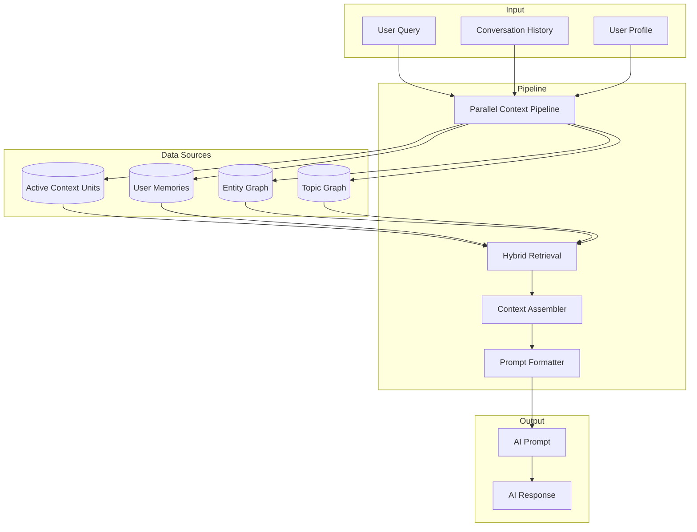
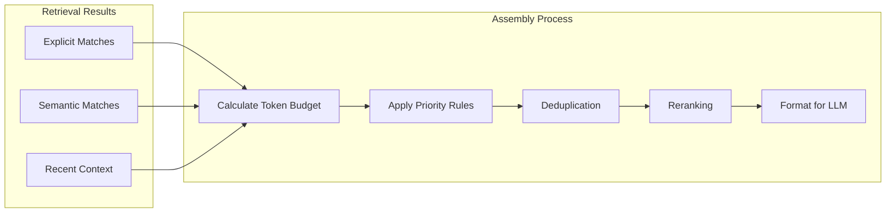
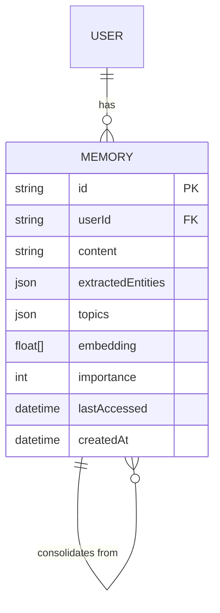
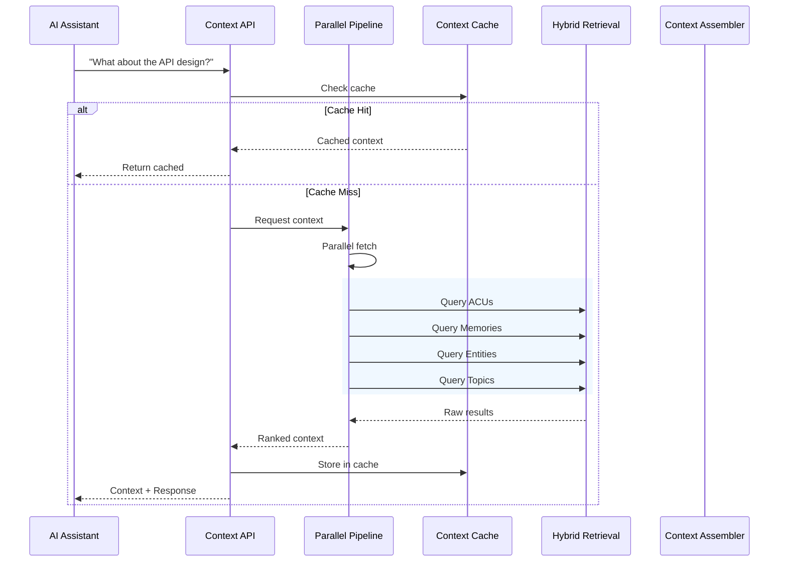

# Dynamic Context Engine

The Context Engine is the heart of VIVIM - it intelligently retrieves and assembles relevant user data to inject into AI prompts, enabling personalized AI responses.

## Overview



## Core Components

### 1. Parallel Context Pipeline

Executes multiple retrieval tasks concurrently:

```typescript
// From: server/src/context/context-pipeline.ts
import { ParallelContextPipeline } from './context-pipeline';

const pipeline = new ParallelContextPipeline({
  maxConcurrency: 5,
  timeout: 30000,
  enableStreaming: true
});

// Execute parallel retrieval
const results = await pipeline.execute({
  userId: 'user_123',
  query: 'What was that project we discussed?',
  options: {
    includeMemories: true,
    includeEntities: true,
    includeTopics: true,
Budget    token: 8000
  }
});
```

**Key Features:**
- Configurable concurrency limits
- Timeout handling per task
- Streaming support for real-time results
- Automatic task prioritization

### 2. Hybrid Retrieval Service

Combines multiple retrieval strategies:

```typescript
// Retrieval strategy combination
{
  explicit: {
    // Direct mentions in conversation
    mentions: ['@project-alpha', '#meeting-notes'],
    // Explicit links via ACU graph
    links: ['acu_id_1', 'acu_id_2']
  },
  semantic: {
    // Vector similarity search
    embeddingSearch: {
      query: 'project discussion about architecture',
      topK: 10,
      threshold: 0.75
    }
  }
}
```

### 3. Context Assembler

Aggregates and formats retrieved content:



### 4. Token Budget Algorithm

Intelligent token allocation:

```typescript
// From: server/src/context/budget-algorithm.ts
interface TokenBudget {
  total: number;
  allocation: {
    system: 500;        // System prompt
    memories: 2000;    // User memories
    entities: 1500;    // Entity context
    topics: 1000;      // Topic context
    history: 2000;     // Recent messages
    padding: 1000;     // Response buffer
  };
}

// Dynamic adjustment based on query type
const budget = budgetAlgorithm.calculate({
  queryType: 'factual',  // vs 'creative', 'debugging'
  urgency: 'normal',     // vs 'high', 'low'
  userPreferences: user.preferences
});
```

## Context Types

### Active Context Units (ACUs)

The fundamental unit of context - atomic, self-contained pieces of knowledge:

```typescript
interface AtomicChatUnit {
  id: string;
  authorDid: string;
  content: string;
  type: 'fact' | 'preference' | 'project' | 'person' | 'code' | 'idea';
  category: string;
  embedding?: number[];
  
  // Quality metrics
  qualityOverall?: number;
  contentRichness?: number;
  uniqueness?: number;
  
  // Sharing settings
  sharingPolicy: 'self' | 'circle' | 'public';
  sharingCircles: string[];
  
  // Metadata
  tags: string[];
  linksFrom: AcuLink[];
  linksTo: AcuLink[];
  createdAt: Date;
  parentId?: string;
}
```

### User Memories

Long-term knowledge storage:



### Entity Graph

Knowledge about people, projects, and concepts:

```typescript
interface Entity {
  id: string;
  type: 'person' | 'project' | 'company' | 'technology' | 'concept';
  name: string;
  description?: string;
  
  // Relationships
  relatedEntities: EntityRelation[];
  mentions: number;
  
  // Source tracking
  acuIds: string[];
  lastMentioned: Date;
}
```

## Context Assembly Flow



## Caching & Invalidation

### Multi-Layer Cache

```typescript
// Cache layers (fastest to slowest)
const cacheLayers = [
  { name: 'L1', implementation: 'In-Memory', ttl: '30s' },
  { name: 'L2', implementation: 'Redis', ttl: '5m' },
  { name: 'L3', implementation: 'Database', ttl: '1h' }
];
```

### Event-Driven Invalidation

```typescript
// From: server/src/context/context-event-bus.ts
const eventBus = new ContextEventBus();

// Subscribe to events
eventBus.subscribe('ACU_UPDATED', (event) => {
  // Invalidate related cache entries
  cache.invalidatePattern(`context:*:${event.userId}:*`);
});

eventBus.subscribe('MEMORY_CREATED', (event) => {
  // Trigger context refresh
  pipeline.triggerRefresh(event.userId);
});
```

## Telemetry & Quality

The engine tracks quality metrics:

```typescript
interface ContextTelemetry {
  // Retrieval metrics
  retrievalLatency: number;
  cacheHitRate: number;
  resultsCount: number;
  
  // Assembly metrics
  tokenUsage: number;
  budgetUtilization: number;
  
  // Quality metrics
  relevanceScore: number;
  diversityScore: number;
  freshnessScore: number;
  
  // Anomalies
  anomalies: AnomalyAlert[];
}
---

## Next Steps

- [Context Pipeline Details](/docs/architecture/pipeline) - Deep dive into parallel processing
- [Database Schema](/docs/database/schema) - ACU and memory models

---

## Next Steps

- [Context Pipeline Details](/docs/architecture/pipeline) - Deep dive into parallel processing
- [Database Schema](/docs/database/schema) - ACU and memory models

- [Context Pipeline Details](/docs/architecture/pipeline) - Deep dive into parallel processing
- [Memory System](/docs/architecture/memory) - User memory management
- [Database Schema](/docs/database/schema) - ACU and memory models
