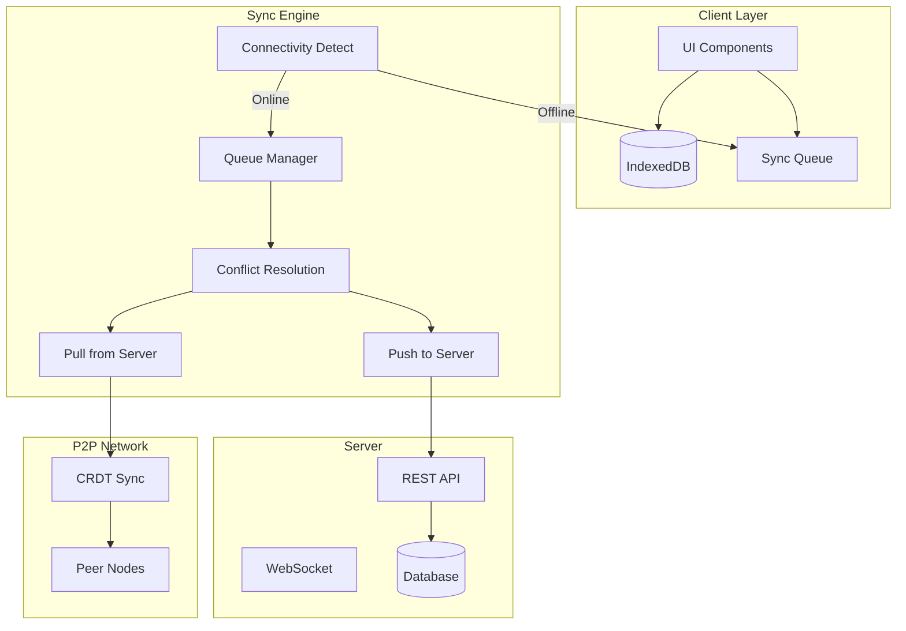
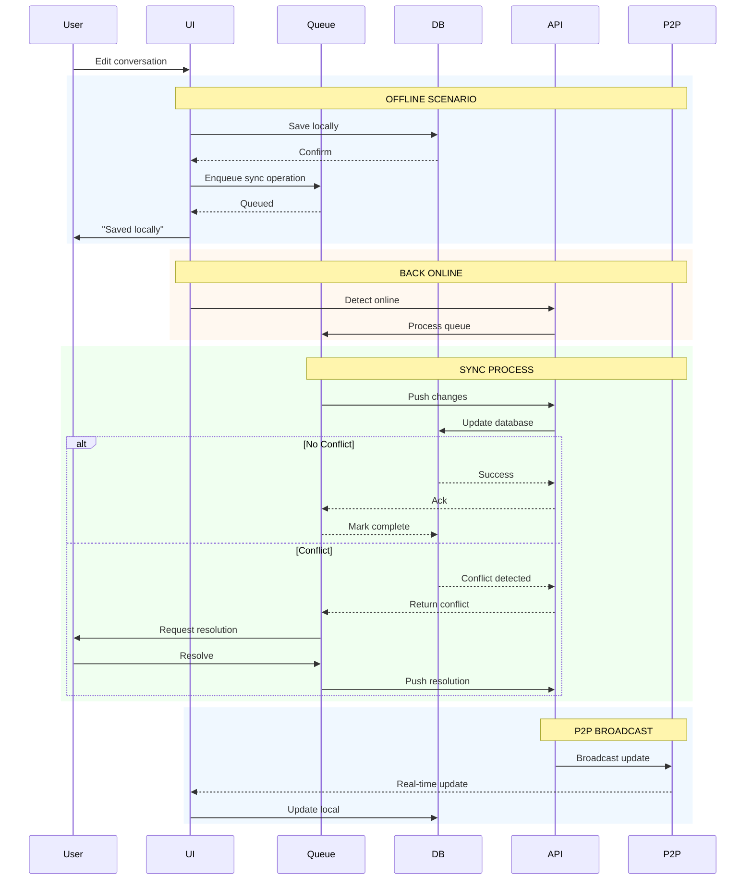

# Data Sync & Offline-First Architecture

VIVIM implements a sophisticated offline-first architecture enabling full functionality without network connectivity.

## Architecture Overview



## Offline Detection

```typescript
// Automatic offline detection
class ConnectivityManager {
  private online: boolean = true;
  
  constructor() {
    // Browser online/offline events
    window.addEventListener('online', () => this.handleOnline());
    window.addEventListener('offline', () => this.handleOffline());
    
    // Periodic connectivity check
    setInterval(() => this.checkConnectivity(), 30000);
  }
  
  isOnline(): boolean {
    return this.online && navigator.onLine;
  }
  
  private async checkConnectivity(): Promise<void> {
    try {
      const response = await fetch('/api/v1/health', { 
        method: 'HEAD',
        cache: 'no-store'
      });
      this.online = response.ok;
    } catch {
      this.online = false;
    }
  }
  
  private handleOnline(): void {
    console.log('Connection restored');
    this.online = true;
    syncService.processQueue();
  }
  
  private handleOffline(): void {
    console.log('Connection lost');
    this.online = false;
  }
}
```

## Sync Queue Management

### Queue Operations

```typescript
// From: pwa/src/lib/sync-queue.ts

interface SyncOperation {
  id: string;
  type: 'create' | 'update' | 'delete';
  entityType: 'conversation' | 'message' | 'acu' | 'memory';
  entityId: string;
  payload: any;
  timestamp: number;
  retries: number;
  status: 'pending' | 'processing' | 'failed';
}

class SyncQueue {
  private queue: SyncOperation[] = [];
  private processing: boolean = false;
  
  // Add operation to queue
  async enqueue(operation: Omit<SyncOperation, 'id' | 'timestamp' | 'retries' | 'status'>): Promise<void> {
    const op: SyncOperation = {
      ...operation,
      id: this.generateId(),
      timestamp: Date.now(),
      retries: 0,
      status: 'pending'
    };
    
    // Persist to IndexedDB
    await db.syncQueue.add(op);
    this.queue.push(op);
    
    // Try to process immediately if online
    if (connectivityManager.isOnline()) {
      this.processQueue();
    }
  }
  
  // Process queue
  async processQueue(): Promise<void> {
    if (this.processing || !connectivityManager.isOnline()) {
      return;
    }
    
    this.processing = true;
    
    try {
      const pending = await db.syncQueue
        .where('status')
        .equals('pending')
        .toArray();
      
      for (const op of pending) {
        await this.processOperation(op);
      }
    } finally {
      this.processing = false;
    }
  }
  
  private async processOperation(op: SyncOperation): Promise<void> {
    try {
      op.status = 'processing';
      await db.syncQueue.put(op);
      
      // Execute based on type
      switch (op.entityType) {
        case 'conversation':
          await this.syncConversation(op);
          break;
        case 'message':
          await this.syncMessage(op);
          break;
        case 'acu':
          await this.syncACU(op);
          break;
      }
      
      // Success - remove from queue
      await db.syncQueue.delete(op.id);
      
    } catch (error) {
      op.retries++;
      op.status = op.retries >= 3 ? 'failed' : 'pending';
      await db.syncQueue.put(op);
      
      if (op.status === 'failed') {
        errorReporter.trackSyncIssue({
          issueType: 'missing_data',
          source: 'pwa',
          target: 'server',
          entityType: op.entityType,
          entityId: op.entityId,
          details: { error: error.message }
        });
      }
    }
  }
}
```

## Conflict Resolution

### Version-Based Merging

```typescript
// Conflict detection and resolution

interface VersionInfo {
  local: {
    version: number;
    updatedAt: Date;
    data: any;
  };
  remote: {
    version: number;
    updatedAt: Date;
    data: any;
  };
}

class ConflictResolver {
  
  // Auto-resolve conflicts
  async resolve(conflict: VersionInfo): Promise<ConflictResolution> {
    const { local, remote } = conflict;
    
    // Last-write-wins for simple fields
    if (local.updatedAt > remote.updatedAt) {
      return {
        strategy: 'local_wins',
        resolvedData: local.data,
        resolvedAt: new Date()
      };
    }
    
    // Check for field-level conflicts
    const conflictingFields = this.findConflictingFields(local.data, remote.data);
    
    if (conflictingFields.length === 0) {
      // No actual conflict, merge
      return {
        strategy: 'merge',
        resolvedData: this.mergeData(local.data, remote.data),
        resolvedAt: new Date()
      };
    }
    
    // Deep conflict - requires manual resolution
    return {
      strategy: 'manual',
      conflictingFields,
      requiresUserInput: true
    };
  }
  
  private findConflictingFields(local: any, remote: any): string[] {
    const conflicts: string[] = [];
    
    for (const key of Object.keys(local)) {
      if (local[key] !== remote[key]) {
        conflicts.push(key);
      }
    }
    
    return conflicts;
  }
  
  private mergeData(local: any, remote: any): any {
    return {
      ...remote,
      ...local,
      // Merge nested objects
      ...this.deepMerge(local, remote)
    };
  }
}
```

## Real-Time Sync

### WebSocket Events

```typescript
// Real-time sync via WebSocket

class RealtimeSync {
  private socket: Socket.IOClient.Socket;
  private handlers: Map<string, Function[]> = new Map();
  
  constructor() {
    this.connect();
    this.setupEventHandlers();
  }
  
  private connect(): void {
    this.socket = io(API_URL, {
      auth: { token: getAuthToken() },
      transports: ['websocket', 'polling']
    });
    
    this.socket.on('connect', () => {
      console.log('Real-time sync connected');
      this.syncPendingChanges();
    });
    
    this.socket.on('disconnect', () => {
      console.log('Real-time sync disconnected');
    });
  }
  
  private setupEventHandlers(): void {
    // Listen for remote changes
    this.socket.on('conversation:updated', (data) => {
      this.handleRemoteUpdate('conversation', data);
    });
    
    this.socket.on('message:created', (data) => {
      this.handleRemoteUpdate('message', data);
    });
    
    this.socket.on('acu:shared', (data) => {
      this.handleRemoteUpdate('acu', data);
    });
    
    // Sync status updates
    this.socket.on('sync:status', (status) => {
      this.updateSyncStatus(status);
    });
  }
  
  // Subscribe to entity changes
  subscribe(entityType: string, entityId: string): void {
    this.socket.emit('subscribe', { entityType, entityId });
  }
  
  // Push local changes
  async pushChange(operation: SyncOperation): Promise<void> {
    this.socket.emit('sync:push', operation);
  }
}
```

## P2P Synchronization

### CRDT-Based Sync

```typescript
// From: network/src/crdt/CRDTSyncService.ts

class P2PSync {
  private crdtService: CRDTSyncService;
  private yDocs: Map<string, Y.Doc> = new Map();
  
  // Initialize CRDT document for entity
  async initializeDocument(entityType: string, entityId: string): Promise<void> {
    const docId = `${entityType}_${entityId}`;
    
    if (!this.yDocs.has(docId)) {
      const doc = await this.crdtService.createDocument({
        docId,
        docType: entityType as any,
        p2pEnabled: true,
        signalingServers: ['wss://signaling.vivim.net']
      });
      
      this.yDocs.set(docId, doc);
      this.setupChangeHandler(docId, doc);
    }
  }
  
  // Handle local changes
  private setupChangeHandler(docId: string, doc: Y.Doc): void {
    doc.on('update', (update: Uint8Array, origin: any) => {
      // Only handle local changes
      if (origin === 'local') {
        this.broadcastUpdate(docId, update);
      }
    });
  }
  
  // Broadcast to peers
  private async broadcastUpdate(docId: string, update: Uint8Array): Promise<void> {
    const peers = await this.crdtService.getConnectedPeers(docId);
    
    for (const peer of peers) {
      try {
        await this.sendToPeer(peer, { docId, update });
      } catch (error) {
        console.error(`Failed to send update to ${peer}:`, error);
      }
    }
  }
  
  // Merge incoming updates
  async handleIncomingUpdate(docId: string, update: Uint8Array): Promise<void> {
    const doc = this.yDocs.get(docId);
    if (!doc) return;
    
    // Apply update from remote peer
    Y.applyUpdate(doc, update);
    
    // Update local storage
    await this.persistToLocal(docId, doc);
  }
}
```

## Sync Status UI

### Visual Indicators

```tsx
// Sync status component

function SyncIndicator() {
  const [status, setStatus] = useState<SyncState>('synced');
  const [pending, setPending] = useState(0);
  const [conflicts, setConflicts] = useState(0);
  
  useEffect(() => {
    const unsubscribe = syncService.onStatusChange((newStatus) => {
      setStatus(newStatus.status);
      setPending(newStatus.pending);
      setConflicts(newStatus.conflicts);
    });
    
    return unsubscribe;
  }, []);
  
  return (
    <div className="sync-indicator">
      {status === 'synced' && pending === 0 && (
        <Badge variant="success">Synced</Badge>
      )}
      
      {status === 'syncing' && (
        <Badge variant="warning">
          <Spinner size="sm" /> Syncing...
        </Badge>
      )}
      
      {status === 'offline' && (
        <Badge variant="neutral">
          <CloudOff size="sm" /> Offline
        </Badge>
      )}
      
      {pending > 0 && (
        <Badge variant="info">
          {pending} pending
        </Badge>
      )}
      
      {conflicts > 0 && (
        <Badge variant="error" onClick={() => navigate('/conflicts')}>
          {conflicts} conflicts
        </Badge>
      )}
    </div>
  );
}
```

## Complete Sync Flow



## Best Practices

1. **Always write locally first** - No network dependency for user actions
2. **Queue everything** - Store all mutations in IndexedDB queue
3. **Idempotent operations** - Design APIs to handle duplicate operations
4. **Version everything** - Use version numbers for conflict detection
5. **Show sync status** - Always indicate current sync state to users
6. **Handle conflicts gracefully** - Provide clear UI for resolution
7. **Test offline** - Always test in airplane mode
