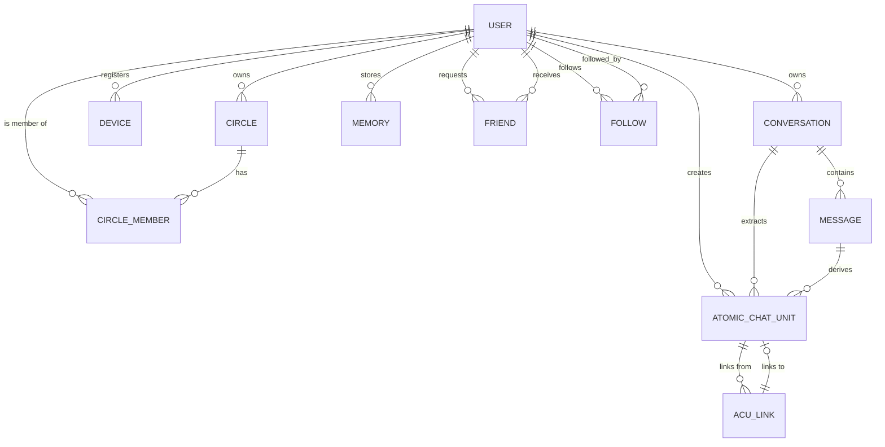

# Database Schema

VIVIM uses PostgreSQL as its primary database with Prisma ORM. The schema is extensive, supporting conversations, ACUs, social features, and more.

## Core Models

### Conversation

The main entity representing captured AI conversations:

```prisma
model Conversation {
  id              String   @id @default(uuid())
  provider        String   // 'chatgpt', 'claude', 'gemini'
  sourceUrl       String   @unique // Original URL
  contentHash     String?  // Content integrity check
  version         Int      @default(1)
  title           String
  model           String?  // AI model used
  
  // Timestamps
  createdAt       DateTime @default(now())
  updatedAt       DateTime @updatedAt
  capturedAt      DateTime @default(now())
  
  // Statistics
  messageCount    Int      @default(0)
  userMessageCount Int     @default(0)
  aiMessageCount  Int      @default(0)
  totalWords      Int      @default(0)
  totalCharacters Int      @default(0)
  totalTokens     Int?
  totalCodeBlocks Int      @default(0)
  totalImages     Int      @default(0)
  totalTables     Int      @default(0)
  totalLatexBlocks Int     @default(0)
  totalMermaidDiagrams Int @default(0)
  totalToolCalls  Int      @default(0)
  
  // Relations
  owner           User?    @relation(fields: [ownerId], references: [id])
  ownerId         String?
  messages        Message[]
  atomicChatUnits AtomicChatUnit[]
  
  @@index([provider])
  @@index([capturedAt(sort: Desc)])
  @@index([ownerId])
}
```

### Message

Individual messages within a conversation:

```prisma
model Message {
  id             String   @id @default(uuid())
  conversationId String
  role           String   // 'user', 'assistant', 'system', 'tool'
  author         String?
  parts          Json     // ContentPart[] array
  contentHash    String?
  version        Int      @default(1)
  createdAt      DateTime @default(now())
  messageIndex   Int      // Position in conversation
  status         String   @default("completed")
  finishReason   String?
  tokenCount     Int?
  metadata       Json     @default("{}")
  
  conversation   Conversation @relation(fields: [conversationId], references: [id], onDelete: Cascade)
  
  @@index([conversationId, messageIndex])
  @@index([conversationId, createdAt])
}
```

## User & Identity Models

### User

The central identity model:

```prisma
model User {
  id                String   @id @default(uuid())
  did               String   @unique // Decentralized Identifier
  handle            String?  @unique
  displayName       String?
  email             String?  @unique
  emailVerified     Boolean  @default(false)
  
  // Cryptographic identity
  publicKey         String
  keyType           String   @default("Ed25519")
  
  // Verification
  verificationLevel Int      @default(0)
  trustScore       Float    @default(50)
  
  // Account status
  status            AccountStatus @default(ACTIVE)
  
  // Security
  mfaEnabled       Boolean  @default(false)
  mfaSecret        String?
  
  // Timestamps
  createdAt        DateTime @default(now())
  updatedAt        DateTime @updatedAt
  lastSeenAt       DateTime @default(now())
  
  // Relations
  conversations    Conversation[]
  devices          Device[]
  circlesOwned     Circle[]        @relation("CircleOwner")
  circleMemberships CircleMember[]
  
  // Social
  friendsRequested Friend[]        @relation("FriendRequester")
  friendsReceived  Friend[]        @relation("FriendAddressee")
  followers        Follow[]        @relation("Follower")
  following       Follow[]         @relation("Following")
}

enum AccountStatus {
  ACTIVE
  SUSPENDED
  BANNED
  DELETING
  DELETED
}
```

### Device

User's registered devices:

```prisma
model Device {
  id          String   @id @default(uuid())
  userId      String
  deviceId    String   @unique
  deviceName  String
  deviceType  String
  platform    String   // 'ios', 'android', 'web'
  fingerprint String?
  publicKey   String
  
  isActive    Boolean  @default(true)
  isTrusted   Boolean  @default(false)
  
  createdAt   DateTime @default(now())
  updatedAt   DateTime @updatedAt
  lastSeenAt  DateTime @default(now())
  
  user        User     @relation(fields: [userId], references: [id], onDelete: Cascade)
  
  @@index([userId])
  @@index([deviceId])
}
```

## ACU (Active Context Unit)

### AtomicChatUnit

The fundamental unit of contextual knowledge:

```prisma
model AtomicChatUnit {
  id              String   @id
  authorDid       String
  signature       Bytes    // Cryptographic signature
  
  content         String
  contentHash     String?
  version         Int      @default(1)
  language       String?
  type            String   // 'fact', 'preference', 'project', etc.
  category        String
  
  // Embeddings
  embedding       Float[]
  embeddingModel  String?
  
  // Lineage
  conversationId  String?
  messageId       String?
  messageIndex    Int?
  parentId        String?
  
  // AI metadata
  provider        String?
  model           String?
  extractorVersion String?
  parserVersion   String?
  
  // Quality metrics
  qualityOverall  Float?
  contentRichness Float?
  uniqueness      Float?
  
  // Sharing
  sharingPolicy   String   @default("self") // 'self', 'circle', 'public'
  sharingCircles  String[]
  
  // Access control
  canView         Boolean  @default(true)
  canAnnotate     Boolean  @default(false)
  canRemix        Boolean  @default(false)
  canReshare      Boolean  @default(false)
  
  // Expiration
  expiresAt      DateTime?
  
  createdAt       DateTime @default(now())
  indexedAt       DateTime @default(now())
  
  // Metadata
  metadata        Json     @default("{}")
  tags            String[]
  
  // Relations
  author          User     @relation(fields: [authorDid], references: [did])
  conversation    Conversation? @relation(fields: [conversationId], references: [id], onDelete: Cascade)
  message         Message? @relation(fields: [messageId], references: [id], onDelete: Cascade)
  parent          AtomicChatUnit? @relation("AcuDerivations", fields: [parentId], references: [id])
  derivations     AtomicChatUnit[] @relation("AcuDerivations")
  
  @@index([authorDid])
  @@index([type])
  @@index([category])
  @@index([qualityOverall(sort: Desc)])
  @@index([createdAt(sort: Desc)])
}
```

### AcuLink

Relationships between ACUs:

```prisma
model AcuLink {
  id           String   @id @default(uuid())
  sourceId     String
  targetId    String
  relation    String   // 'references', 'related', 'derived_from'
  weight      Float    @default(1.0)
  createdByDid String?
  createdAt    DateTime @default(now())
  metadata     Json     @default("{}")
  
  source       AtomicChatUnit @relation("SourceAcu", fields: [sourceId], references: [id], onDelete: Cascade)
  target       AtomicChatUnit @relation("TargetAcu", fields: [targetId], references: [id], onDelete: Cascade)
  
  @@unique([sourceId, targetId, relation])
}
```

## Social Models

### Circle

Group of users for sharing:

```prisma
model Circle {
  id          String   @id @default(uuid())
  ownerId     String
  name        String
  description String?
  isPublic    Boolean  @default(false)
  icon        String?
  color       String?
  
  createdAt   DateTime @default(now())
  updatedAt   DateTime @updatedAt
  
  owner       User     @relation("CircleOwner", fields: [ownerId], references: [id])
  members     CircleMember[]
  
  @@index([ownerId])
}
```

### CircleMember

Membership in circles:

```prisma
model CircleMember {
  id          String    @id @default(uuid())
  circleId    String
  userId      String
  role        String    @default("member") // 'owner', 'admin', 'member'
  
  joinedAt    DateTime  @default(now())
  
  circle      Circle    @relation(fields: [circleId], references: [id], onDelete: Cascade)
  user        User      @relation(fields: [userId], references: [id], onDelete: Cascade)
  
  @@unique([circleId, userId])
  @@index([circleId])
  @@index([userId])
}
```

### Friend

Friend relationships:

```prisma
model Friend {
  id              String   @id @default(uuid())
  requesterId     String   // User who sent request
  addresseeId     String   // User who received request
  status          String   @default("pending") // 'pending', 'accepted', 'rejected'
  
  createdAt       DateTime @default(now())
  updatedAt       DateTime @updatedAt
  
  requester       User     @relation("FriendRequester", fields: [requesterId], references: [id], onDelete: Cascade)
  addressee       User     @relation("FriendAddressee", fields: [addresseeId], references: [id], onDelete: Cascade)
  
  @@unique([requesterId, addresseeId])
}
```

## Memory Models

### Memory

User's long-term knowledge:

```prisma
model Memory {
  id              String   @id @default(uuid())
  userId          String
  content         String
  
  // Extracted metadata
  extractedEntities Json   @default("{}")
  topics          Json     @default("[]")
  
  // Embeddings
  embedding       Float[]
  embeddingModel  String?
  
  // Importance scoring
  importance      Int      @default(5)
  accessCount     Int      @default(0)
  lastAccessedAt  DateTime?
  
  createdAt       DateTime @default(now())
  updatedAt       DateTime @updatedAt
  
  user            User     @relation(fields: [userId], references: [id], onDelete: Cascade)
  
  @@index([userId])
  @@index([importance(sort: Desc)])
  @@index([createdAt(sort: Desc)])
}
```

## Schema Diagram



## Key Indexes

| Table | Index | Purpose |
|-------|-------|---------|
| conversations | `[provider, capturedAt DESC]` | Provider-based queries |
| messages | `[conversationId, messageIndex]` | Ordered message retrieval |
| atomic_chat_units | `[authorDid, createdAt DESC]` | User's ACU timeline |
| atomic_chat_units | `[qualityOverall DESC]` | Quality-based search |
| memory | `[userId, importance DESC]` | User's important memories |

---

## Next Steps

- [API Routes](/docs/api/overview) - How to interact with the database
- [Context Engine](/docs/architecture/context) - Using ACUs in context
- [Social Features](/docs/social/overview) - Circles and sharing
