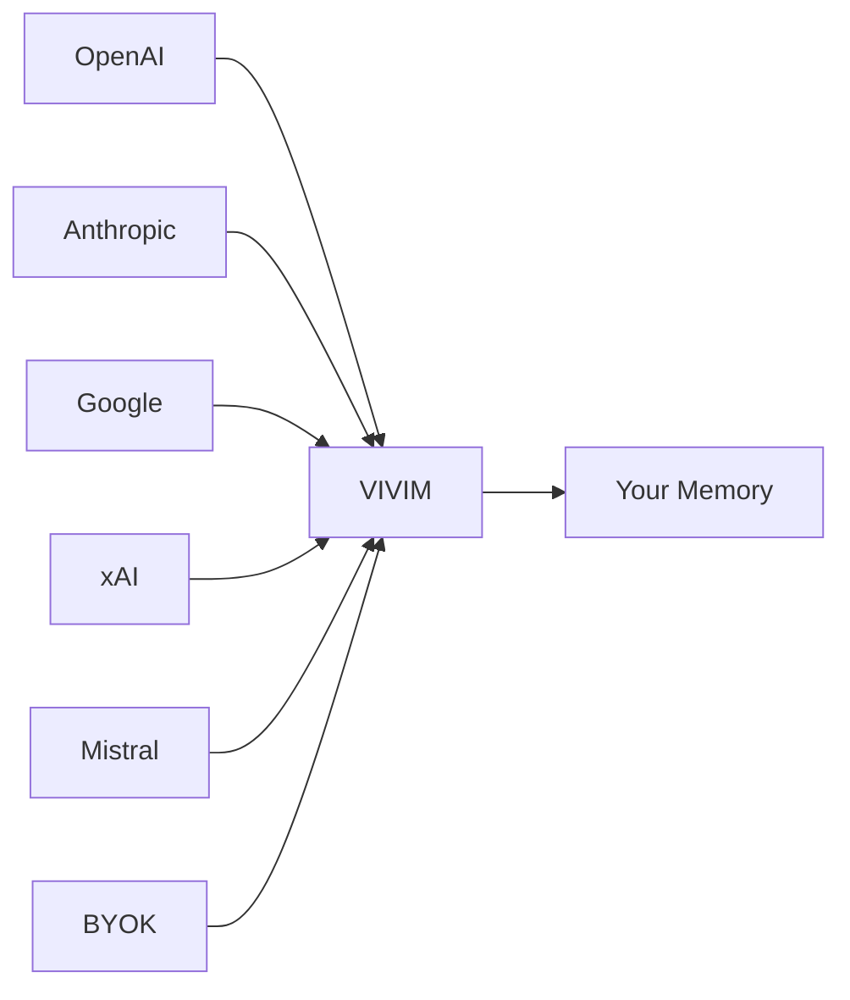
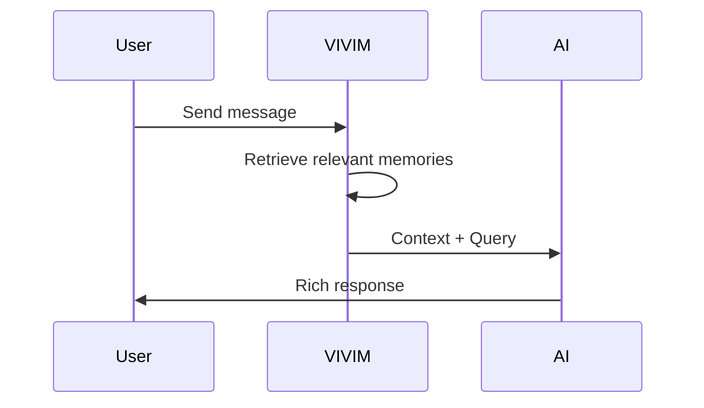
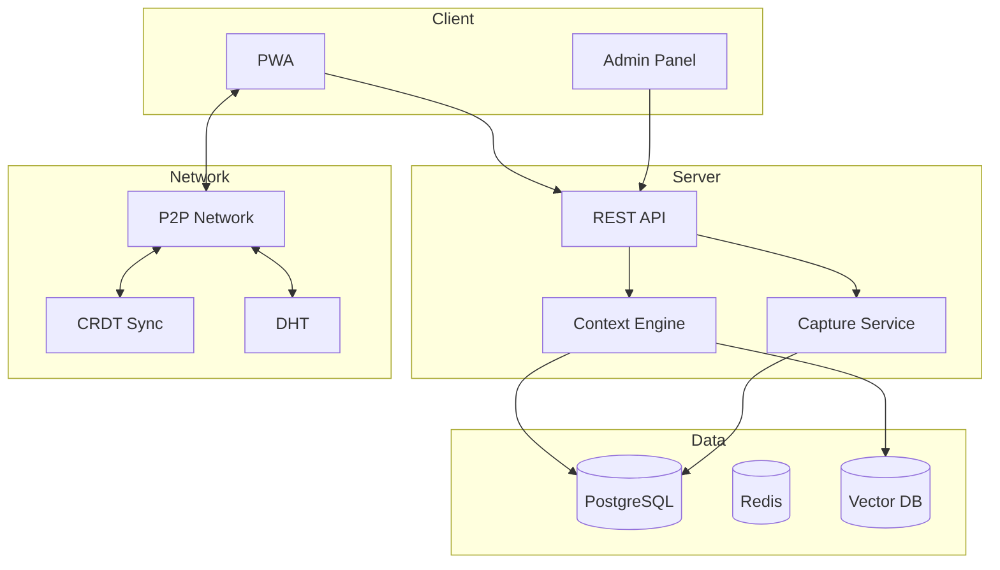

# VIVIM

## Your Personal AI Memory Platform

**Capture. Remember. Connect.**

VIVIM is a decentralized platform that captures your AI conversations, indexes them, and retrieves the exact context you need—when you need it.

---

## The Problem

| Problem | Description |
|---------|-------------|
| 🔒 **Locked Away** | AI providers store your conversations. You can't access them, search them, or use them to teach future AI about you. |
| 🌊 **Ephemeral** | Chat histories disappear. Context windows are limited. Your knowledge evaporates when the conversation ends. |
| 🌍 **Siloed** | Your AI interactions exist in isolated silos—one for ChatGPT, another for Claude, another for Gemini. No connection between them. |

---

## The VIVIM Solution

### 🦾 Universal Capture
Capture conversations from **any AI provider**—ChatGPT, Claude, Gemini, Grok, Mistral, or your own API keys.

### 🧠 Dynamic Context
Every conversation is indexed, tagged, and ranked. When you chat with AI, VIVIM retrieves the **exact context you need**.

---

## Core Features

| Feature | Description |
|---------|-------------|
| 🔐 **End-to-End Encrypted** | Your memories are encrypted. Only you can decrypt them. Zero-knowledge architecture. |
| 🌐 **P2P Decentralized** | No central server stores your data. Sync directly between devices using libp2p. |
| 📱 **Offline-First** | Works without internet. Sync when you're back online. |
| 🏛️ **Federated Social** | Share memories with Circles. Follow others. Build your network. |
| 💾 **Storage V2** | Content-addressed DAG storage with cryptographic verification. |
| 🔑 **BYOK** | Bring Your Own Key. Use your own API keys for maximum privacy and cost control. |
| 📊 **Context Pipeline** | Hyper-optimized streaming context pipelines with budget algorithms. |
| 🛡️ **Capability-Based Access** | Fine-grained permissions for sharing and collaboration. |

---

## Architecture Overview

---

## Tech Stack

| Layer | Technology |
|-------|------------|
| **Frontend** | React, TypeScript, Vite, PWA |
| **Backend** | Express.js, TypeScript |
| **Database** | PostgreSQL, Prisma |
| **Cache** | Redis |
| **Vector** | Embedding-based retrieval |
| **Network** | libp2p, Yjs CRDT |
| **Security** | E2E Encryption, Capability-based ACL |

---

## Quick Links

- **[Context Pipeline](/docs/architecture/pipeline)** - Hyper-optimized streaming context
- **[Storage V2](/docs/pwa/storage-v2)** - Content-addressed DAG storage
- **[BYOK](/docs/pwa/byok)** - Bring Your Own Key
- **[Security](/docs/network/security)** - E2E encryption & capabilities
- **[Development Guide](/docs/development/guide)** - Local setup
- **[Deployment](/docs/deployment/guide)** - Production deployment
