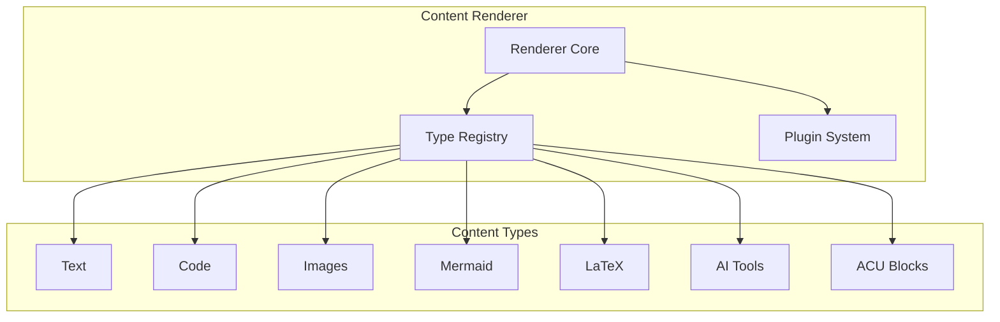
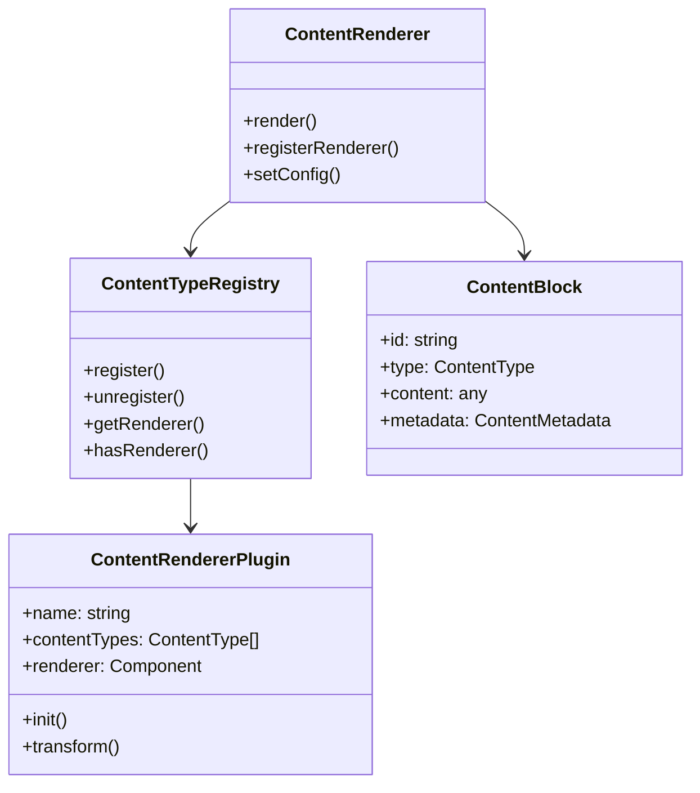
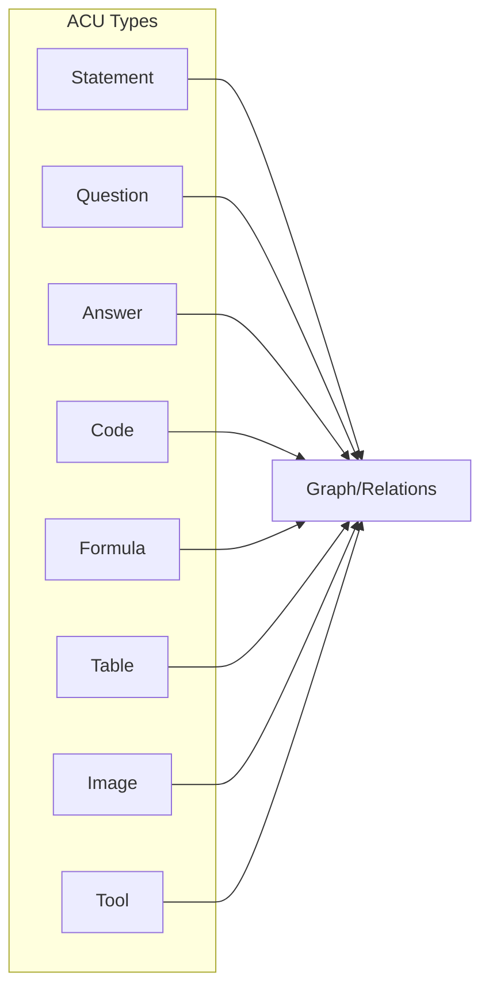

# Content Renderer System

The VIVIM Content Renderer is a comprehensive, extensible system for rendering diverse content types in a unified way. It handles everything from simple text to complex AI-specific content blocks.

## Overview



## Supported Content Types

### Basic Content

| Type | Description |
|------|-------------|
| `text` | Plain text or Markdown |
| `code` | Syntax-highlighted code blocks |
| `image` | Static images |
| `link` | URLs and hyperlinks |

### Rich Media

| Type | Description |
|------|-------------|
| `audio` | Audio files |
| `video` | Video content |
| `gif` | Animated GIFs |

### Data & Structured

| Type | Description |
|------|-------------|
| `table` | Data tables |
| `json` | JSON data display |
| `yaml` | YAML display |
| `xml` | XML display |

### Visual & Diagrams

| Type | Description |
|------|-------------|
| `mermaid` | Mermaid diagrams |
| `latex` | LaTeX math equations |
| `svg` | SVG graphics |
| `chart` | Charts and graphs |

### AI-Specific Types

| Type | Description |
|------|-------------|
| `tool_call` | AI function/tool calls |
| `tool_result` | AI tool results |
| `thought` | Chain of thought |
| `reasoning` | Reasoning steps |
| `acu_statement` | ACU statement blocks |
| `acu_question` | ACU question blocks |
| `acu_answer` | ACU answer blocks |
| `acu_code` | ACU code blocks |
| `acu_formula` | ACU formula blocks |
| `acu_table` | ACU table blocks |
| `acu_image` | ACU image blocks |
| `acu_tool` | ACU tool blocks |

## Architecture

### Core Components



### Type Definitions

```typescript
interface ContentBlock {
  // Identification
  id: string;
  type: ContentType;
  
  // Content data
  content: string | object | ContentBlock[];
  
  // Metadata
  metadata?: ContentMetadata;
  
  // Display options
  display?: 'inline' | 'block' | 'full-width';
  size?: 'sm' | 'md' | 'lg' | 'xl';
  align?: 'left' | 'center' | 'right';
  
  // Interaction options
  interactive?: boolean;
  copyable?: boolean;
  downloadable?: boolean;
  expandable?: boolean;
  collapsible?: boolean;
}

interface ContentMetadata {
  source?: string;
  provider?: string;
  author?: string;
  timestamp?: string;
  title?: string;
  description?: string;
  language?: string;
  filename?: string;
  mimetype?: string;
  size?: number;
  duration?: number;
  alt?: string;
  caption?: string;
  thumbnail?: string;
  acuType?: ACUType;
  acuId?: string;
  acuParentId?: string;
  confidence?: number;
}
```

## Usage

### Basic Rendering

```tsx
import { ContentRenderer } from './content-renderer';

const block: ContentBlock = {
  id: '1',
  type: 'text',
  content: 'Hello, **world**!',
  metadata: { language: 'en' }
};

<ContentRenderer 
  content={block}
  enableCopy={true}
  enableSyntaxHighlighting={true}
/>
```

### Multiple Blocks

```tsx
const blocks: ContentBlock[] = [
  {
    id: '1',
    type: 'text',
    content: 'Here is some code:'
  },
  {
    id: '2',
    type: 'code',
    content: 'function hello() {\n  console.log("Hello!");\n}',
    language: 'javascript',
    metadata: { filename: 'hello.js' }
  }
];

<ContentRenderer 
  content={blocks}
  enableCopy={true}
/>
```

### With Configuration

```tsx
const config: ContentRendererConfig = {
  defaultMaxImageWidth: 800,
  defaultTheme: 'dark',
  enableMermaid: true,
  enableKaTeX: true,
  enableSyntaxHighlighting: true,
  enableLazyLoading: true,
  customRenderers: {
    custom: MyCustomRenderer
  }
};

<ContentRenderer 
  content={content}
  {...config}
/>
```

## Renderer-Specific Props

### Code Renderer

```tsx
interface CodeRendererProps {
  block: ContentBlock;
  language?: string;
  filename?: string;
  showLineNumbers?: boolean;
  showLanguage?: boolean;
  showCopyButton?: boolean;
  showDownloadButton?: boolean;
  wordWrap?: boolean;
  maxHeight?: number;
}

<ContentRenderer
  content={{
    type: 'code',
    content: 'const x = 1;',
    language: 'javascript',
    metadata: { filename: 'main.js' }
  }}
  // Props
  showLineNumbers={true}
  wordWrap={true}
/>
```

### Mermaid Renderer

```tsx
<ContentRenderer
  content={{
    type: 'mermaid',
    content: `
graph TD
  A[Start] --> B{Decision}
  B -->|Yes| C[Process 1]
  B -->|No| D[Process 2]
`
  }}
  // Props
  enableZoom={true}
  enableDownload={true}
/>
```

### LaTeX Renderer

```tsx
// Inline math
<ContentRenderer
  content={{
    type: 'latex',
    content: 'E = mc^2',
    display: 'inline'
  }}
/>

// Block math
<ContentRenderer
  content={{
    type: 'latex',
    content: '\\int_{-\\infty}^{\\infty} e^{-x^2} dx = \\sqrt{\\pi}',
    display: 'block'
  }}
/>
```

### Tool Call Renderer

```tsx
<ContentRenderer
  content={{
    type: 'tool_call',
    content: {
      name: 'get_weather',
      args: { location: 'San Francisco', units: 'celsius' }
    },
    metadata: {
      status: 'running'
    }
  }}
/>
```

## ACU (Atomic Content Unit) Blocks

ACU blocks represent the fundamental units of AI-generated content:



### ACU Types

```typescript
type ACUType = 
  | 'statement'   // Factual statements
  | 'question'     // Questions
  | 'answer'       // Answers to questions
  | 'code'         // Code snippets
  | 'formula'      // Mathematical formulas
  | 'table'        // Tabular data
  | 'image'        // Images
  | 'tool';        // Tool outputs
```

### ACU Rendering

```tsx
<ContentRenderer
  content={{
    type: 'acu_statement',
    content: 'The capital of France is Paris.',
    metadata: {
      acuType: 'statement',
      acuId: 'acu-123',
      confidence: 0.95
    }
  }}
  enableGraph={true}
  enableEdit={true}
/>
```

## Plugin System

### Creating a Custom Plugin

```typescript
import type { ContentRendererPlugin } from './ContentRenderer.types';

const MyCustomPlugin: ContentRendererPlugin = {
  name: 'my-custom-plugin',
  version: '1.0.0',
  contentTypes: ['custom-type'],
  
  renderer: ({ block, config }) => {
    return (
      <div className="custom-block">
        {block.content}
      </div>
    );
  },
  
  init(config) {
    // Initialize plugin
  },
  
  transform(block) {
    // Transform content before rendering
    return block;
  },
  
  validate(block) {
    // Validate content
    return true;
  }
};
```

### Registering Plugins

```tsx
import { contentRenderer } from './content-renderer';

// Register plugin
contentRenderer.registerPlugin(MyCustomPlugin);

// Use in renderer
<ContentRenderer
  content={content}
  customRenderers={{
    'custom-type': MyCustomRenderer
  }}
/>
```

## Registry API

```typescript
const registry = contentRenderer.getRegistry();

// Register new type
registry.register('my-type', MyRenderer, 10);

// Unregister
registry.unregister('my-type');

// Check if registered
if (registry.hasRenderer('code')) {
  // ...
}

// Get all types
const types = registry.getRegisteredTypes();

// Set fallback
registry.setFallbackRenderer(FallbackRenderer);
```

## Error Handling

```tsx
<ContentRenderer
  content={content}
  onError={(error, block) => {
    console.error('Render error:', error);
    // Handle error UI
  }}
  errorComponent={({ error, block }) => (
    <div className="error">
      Failed to render: {error.message}
    </div>
  )}
/>
```

## Performance

### Lazy Loading

```tsx
<ContentRenderer
  content={content}
  lazyLoad={true}
  virtualScroll={true}
/>
```

### Optimization Tips

1. **Enable lazy loading** for long content lists
2. **Use virtualization** for 100+ blocks
3. **Cache rendered content** when possible
4. **Limit syntax highlighting** to visible blocks

## Related Documentation

- [Context Engine](/docs/architecture/context) - How content is processed
- [PWA Architecture](/docs/pwa/overview) - Frontend rendering
- [Storage V2](/docs/pwa/storage-v2) - Content storage
