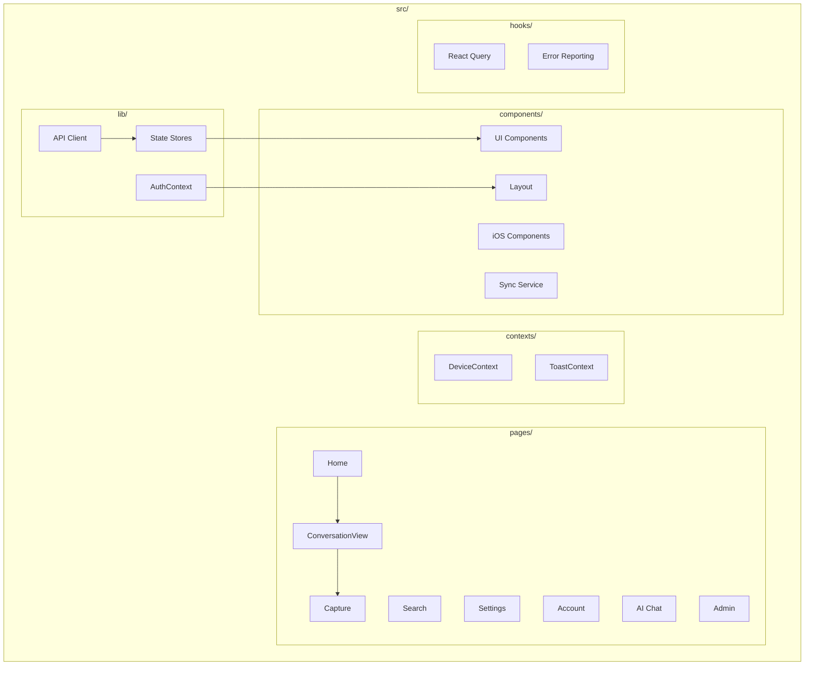
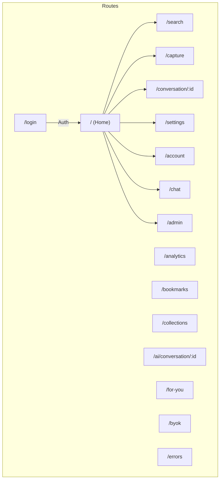
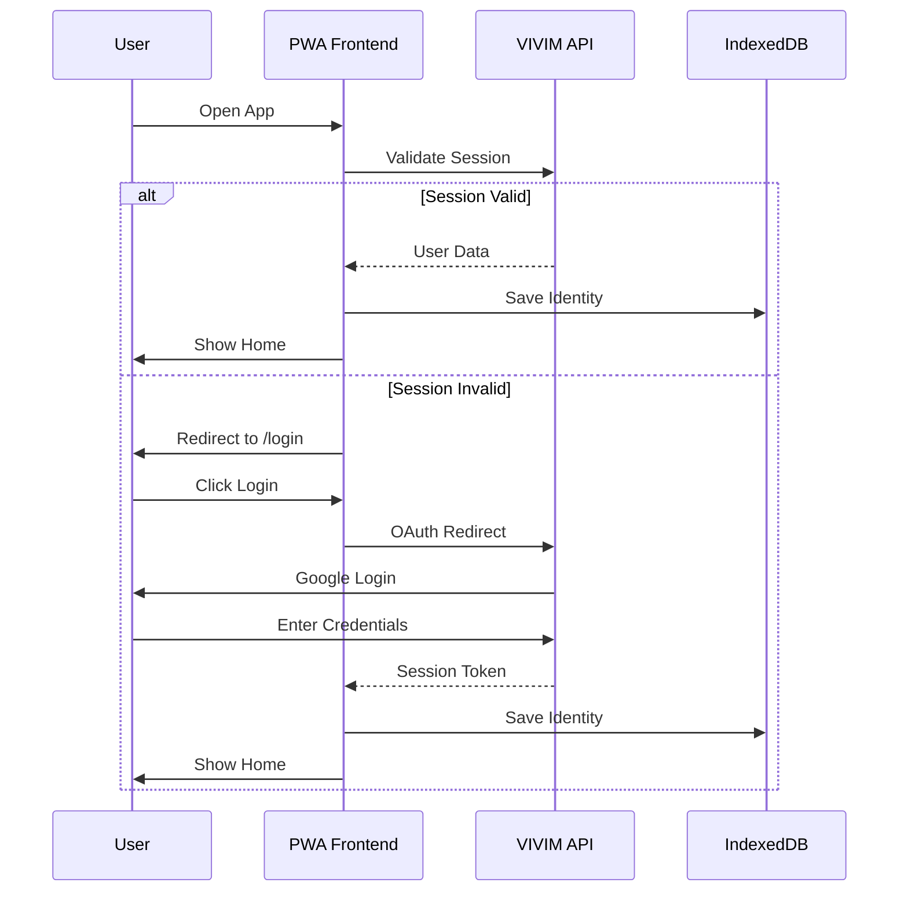

# PWA Frontend Architecture

The VIVIM PWA (`/pwa`) is a Progressive Web Application built with React, TypeScript, and Vite, providing a rich, offline-capable user experience.

## Technology Stack

| Layer | Technology | Purpose |
|-------|------------|---------|
| Framework | React 19 | UI library |
| Build | Vite 7 | Development & bundling |
| Routing | React Router 7 | Client-side routing |
| State | Zustand | Lightweight state management |
| Query | TanStack Query | Server state management |
| Storage | IndexedDB (Dexie) | Local persistence |
| Styling | Tailwind CSS 4 | Utility-first styling |
| Icons | Lucide React | Icon library |
| PWA | vite-plugin-pwa | Service worker & manifest |

## Application Structure



## Page Routes



## Key Pages

### Home Page (`/`)
The main dashboard showing captured conversations:

```tsx
// From: pwa/src/pages/Home.tsx
export default function Home() {
  const { data: conversations, isLoading } = useQuery({
    queryKey: ['conversations'],
    queryFn: api.getConversations
  });

  return (
    <div className="home-page">
      <Header />
      <ConversationList 
        conversations={conversations}
        isLoading={isLoading}
      />
      <BottomNav />
    </div>
  );
}
```

### Conversation View (`/conversation/:id`)
Detailed view of a captured conversation:

```tsx
// From: pwa/src/pages/ConversationView.tsx
export default function ConversationView() {
  const { id } = useParams();
  
  const { data: conversation, messages } = useConversation(id);
  
  return (
    <div className="conversation-view">
      <TopBar title={conversation.title} />
      <MessageList messages={messages} />
      <InputBar />
    </div>
  );
}
```

### Capture Page (`/capture`)
URL-based conversation capture:

```tsx
// From: pwa/src/pages/Capture.tsx
export default function Capture() {
  const [url, setUrl] = useState('');
  const captureMutation = useCapture();

  const handleCapture = async () => {
    const result = await captureMutation.mutateAsync({ url });
    if (result.success) {
      navigate(`/conversation/${result.conversation.id}`);
    }
  };

  return (
    <div className="capture-page">
      <URLInput 
        value={url}
        onChange={setUrl}
        onSubmit={handleCapture}
      />
      <CaptureOptions />
    </div>
  );
}
```

## State Management

### Zustand Stores

```typescript
// From: pwa/src/lib/stores/index.ts
import { create } from 'zustand';

// Identity store
interface IdentityState {
  did: string | null;
  isUnlocked: boolean;
  setIdentity: (did: string, publicKey: string, ...);
  unlock: () => void;
  lock: () => void;
}

export const useIdentityStore = create<IdentityState>((set) => ({
  did: null,
  isUnlocked: false,
  setIdentity: (did, publicKey, verification, userId) => 
    set({ did, publicKey, verificationLevel: verification, userId }),
  unlock: () => set({ isUnlocked: true }),
  lock: () => set({ isUnlocked: false, did: null })
}));
```

### React Query Integration

```typescript
// From: pwa/src/lib/query-client.ts
import { QueryClient } from '@tanstack/react-query';

const queryClient = new QueryClient({
  defaultOptions: {
    queries: {
      staleTime: 1000 * 60 * 5,  // 5 minutes
      cacheTime: 1000 * 60 * 30, // 30 minutes
      retry: 3,
      refetchOnWindowFocus: false
    }
  }
});
```

## Local Storage (Dexie/IndexedDB)

### Database Schema

```typescript
// From: pwa/src/lib/db.ts
import Dexie, { Table } from 'dexie';

interface LocalConversation {
  id: string;
  title: string;
  provider: string;
  messages: Message[];
  synced: boolean;
}

interface LocalMessage {
  id: string;
  conversationId: string;
  role: 'user' | 'assistant';
  parts: ContentPart[];
  createdAt: Date;
}

class VIVIMDatabase extends Dexie {
  conversations!: Table<LocalConversation>;
  messages!: Table<LocalMessage>;
  settings!: Table<Setting>;
  syncQueue!: Table<SyncItem>;

  constructor() {
    super('vivim');
    this.version(1).stores({
      conversations: 'id, provider, createdAt, synced',
      messages: 'id, conversationId, createdAt',
      settings: 'key',
      syncQueue: 'id, type, status, createdAt'
    });
  }
}

export const db = new VIVIMDatabase();
```

## Authentication Flow



## Sync Service

### Offline-First Architecture

```mermaid
flowchart LR
    subgraph "Local"
        UI[UI Action]
        STORE[(IndexedDB)]
        QUEUE[Sync Queue]
    end
    
    subgraph "Sync Engine"
        CHECK[Check Online]
        PROCESS[Process Queue]
        RESOLVE[Resolve Conflicts]
    end
    
    subgraph "Remote"
        API[VIVIM API]
        SERVER[(Server DB)]
    end
    
    UI --> STORE
    UI --> QUEUE
    QUEUE --> CHECK
    
    alt Online
        CHECK --> PROCESS
        PROCESS --> API
        API --> SERVER
        SERVER -->|Sync Back| STORE
    else Offline
        CHECK --> STORE
    end
```

### Sync Implementation

```typescript
// From: pwa/src/lib/data-sync-service.ts
class DataSyncService {
  async syncFullDatabase(onProgress: ProgressCallback) {
    // 1. Check connectivity
    if (!navigator.onLine) {
      return { success: false, error: 'offline' };
    }

    // 2. Get server state
    onProgress({ phase: 'fetch', message: 'Fetching server state...' });
    const serverState = await this.getServerState();

    // 3. Get local state
    onProgress({ phase: 'local', message: 'Reading local data...' });
    const localState = await this.getLocalState();

    // 4. Merge and resolve conflicts
    onProgress({ phase: 'merge', message: 'Merging changes...' });
    const merged = this.mergeState(localState, serverState);

    // 5. Push changes to server
    onProgress({ phase: 'push', message: 'Pushing changes...' });
    await this.pushChanges(merged.localChanges);

    // 6. Update local storage
    onProgress({ phase: 'update', message: 'Updating local storage...' });
    await this.updateLocalStorage(merged.serverChanges);

    return { success: true, synced: merged.totalChanges };
  }
}
```

## Content Rendering

### Rich Content Types

```tsx
// From: pwa/src/lib/content-renderer/ContentRenderer.tsx
import { TextRenderer } from './renderers/TextRenderer';
import { CodeRenderer } from './renderers/CodeRenderer';
import { ImageRenderer } from './renderers/ImageRenderer';

export function ContentRenderer({ parts }: { parts: ContentPart[] }) {
  return (
    <div className="content-renderer">
      {parts.map((part, index) => {
        switch (part.type) {
          case 'text':
            return <TextRenderer key={index} content={part} />;
          case 'code':
            return <CodeRenderer key={index} content={part} />;
          case 'image':
            return <ImageRenderer key={index} content={part} />;
          case 'table':
            return <TableRenderer key={index} content={part} />;
          case 'mermaid':
            return <MermaidRenderer key={index} content={part} />;
          default:
            return <UnknownRenderer key={index} content={part} />;
        }
      })}
    </div>
  );
}
```

### Supported Content Types

| Type | Description | Rendering |
|------|-------------|-----------|
| text | Markdown or plain text | react-markdown |
| code | Syntax highlighted code | Prism.js |
| image | Images with lazy loading | img tag |
| table | Tabular data | HTML table |
| mermaid | Diagrams | mermaid.js |
| latex | Mathematical expressions | KaTeX |
| tool_call | AI tool invocations | Custom UI |
| tool_result | Tool execution results | Custom UI |

## PWA Features

### Service Worker

```typescript
// From: pwa/vite.config.ts
import { VitePWA } from 'vite-plugin-pwa';

export default defineConfig({
  plugins: [
    VitePWA({
      registerType: 'autoUpdate',
      includeAssets: ['favicon.ico', 'robots.txt'],
      manifest: {
        name: 'VIVIM',
        short_name: 'VIVIM',
        description: 'Own Your AI',
        theme_color: '#ffffff',
        icons: [
          {
            src: 'pwa-192x192.png',
            sizes: '192x192',
            type: 'image/png'
          },
          {
            src: 'pwa-512x512.png',
            sizes: '512x512',
            type: 'image/png'
          }
        ]
      },
      workbox: {
        globPatterns: ['**/*.{js,css,html,ico,png,svg}'],
        runtimeCaching: [
          {
            urlPattern: /^https:\/\/api\.vivim\.app\//,
            handler: 'NetworkFirst',
            options: {
              cacheName: 'api-cache',
              expiration: {
                maxEntries: 100,
                maxAgeSeconds: 60 * 60 * 24
              }
            }
          }
        ]
      }
    })
  ]
});
```
---

## Next Steps

- [Content Renderer](/docs/pwa/content-renderer) - Rich content display
- [Storage V2](/docs/pwa/storage-v2) - Local storage system
- [BYOK](/docs/pwa/byok) - Bring Your Own Key
---

## Next Steps

- [Content Renderer](/docs/pwa/content-renderer) - Rich content display
- [Storage V2](/docs/pwa/storage-v2) - Local storage system
- [BYOK](/docs/pwa/byok) - Bring Your Own Key

- [Content Renderer](/docs/pwa/content-renderer) - Rich content display
- [Storage V2](/docs/pwa/storage-v2) - Local storage system
- [BYOK](/docs/pwa/byok) - Bring Your Own Key

- [Component Library](/docs/pwa/components) - UI components documentation
- [State Management](/docs/pwa/state) - Detailed state patterns
- [API Integration](/docs/pwa/api) - Client-side API patterns
