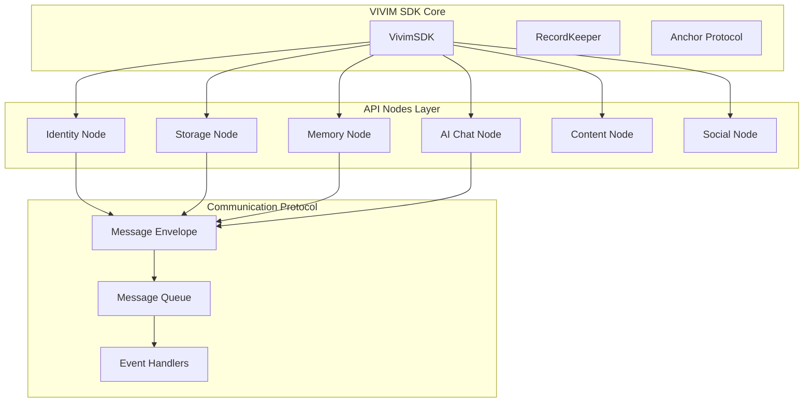
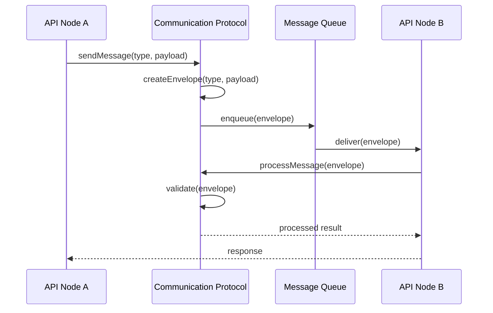
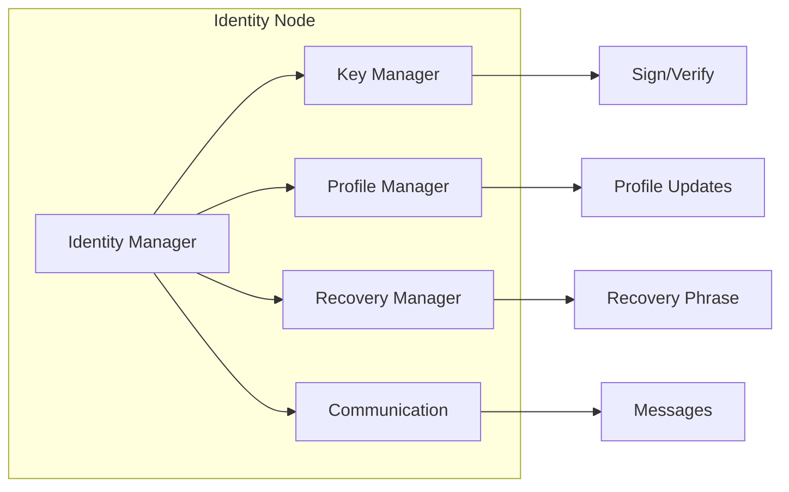
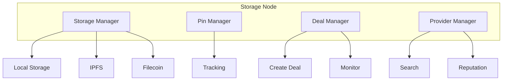
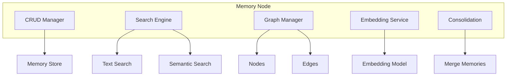
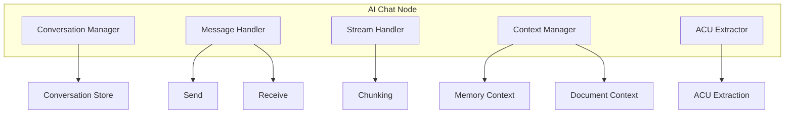

# API Nodes

API Nodes are the core functionality modules of the VIVIM SDK. Each node provides specific capabilities and implements the Communication Protocol for inter-node messaging.

## Architecture Overview



## Available API Nodes

| Node | Package | Description |
|------|---------|-------------|
| **Identity** | `@vivim/sdk/nodes` | DID management, profiles, signatures |
| **Storage** | `@vivim/sdk/nodes` | Distributed storage with IPFS/Filecoin |
| **Memory** | `@vivim/sdk/nodes` | Knowledge management with semantic search |
| **AI Chat** | `@vivim/sdk/nodes` | AI conversations with context |
| **Content** | `@vivim/sdk/nodes` | Content management and feeds |
| **Social** | `@vivim/sdk/nodes` | Social graph and circles |

## Communication Protocol

All API Nodes implement the Communication Protocol for standardized messaging:



## Identity Node

Manages decentralized identities (DID) using cryptographic keypairs.

### Architecture



### API Reference

```typescript
import { IdentityNode } from '@vivim/sdk/nodes';

const identityNode = await sdk.loadNode<IdentityNode>('identity');
```

#### Core Methods

| Method | Description | Returns |
|--------|-------------|---------|
| `getIdentity()` | Get current identity | `Promise<Identity>` |
| `createIdentity(options)` | Create new identity | `Promise<Identity>` |
| `importIdentity(seed)` | Import from seed | `Promise<Identity>` |
| `getPublicKey()` | Get public key | `Promise<string>` |
| `sign(data)` | Sign data | `Promise<string>` |
| `verify(data, sig, pubKey)` | Verify signature | `Promise<boolean>` |

#### Profile Management

```typescript
// Get profile
const profile = await identityNode.getProfile();

// Update profile
await identityNode.updateProfile({
  displayName: 'My Name',
  bio: 'Developer',
  website: 'https://example.com',
});
```

#### Recovery

```typescript
// Generate recovery phrase
const phrase = await identityNode.generateRecoveryPhrase();

// Verify recovery phrase
const valid = await identityNode.verifyRecoveryPhrase(phrase);
```

#### Communication Protocol

```typescript
// Get node metrics
const metrics = await identityNode.getMetrics();

// Listen for communication events
const unsubscribe = identityNode.onCommunicationEvent((event) => {
  console.log('Event:', event.type, event.messageId);
});

// Send message to another node
const envelope = await identityNode.sendMessage('identity_query', {
  targetDid: 'did:vivim:...',
});
```

### Example

```typescript
import { VivimSDK } from '@vivim/sdk';

const sdk = new VivimSDK({
  identity: { autoCreate: true },
});

await sdk.initialize();

const identityNode = await sdk.loadNode('identity');

// Get identity
const identity = await identityNode.getIdentity();
console.log('DID:', identity.did);

// Sign data
const data = new TextEncoder().encode('Hello, World!');
const signature = await identityNode.sign(data);

// Verify signature
const valid = await identityNode.verify(data, signature, identity.publicKey);
console.log('Signature valid:', valid);

// Update profile
await identityNode.updateProfile({
  displayName: 'Alice',
  bio: 'Developer & Researcher',
});
```

## Storage Node

Provides distributed storage with optional encryption and IPFS/Filecoin integration.

### Architecture



### API Reference

```typescript
import { StorageNode } from '@vivim/sdk/nodes';

const storageNode = await sdk.loadNode<StorageNode>('storage');
```

#### Storage Operations

| Method | Description | Returns |
|--------|-------------|---------|
| `store(data, options)` | Store data | `Promise<StorageResult>` |
| `retrieve(cid)` | Retrieve by CID | `Promise<Uint8Array>` |
| `exists(cid)` | Check if exists | `Promise<boolean>` |
| `pin(cid)` | Pin content | `Promise<void>` |
| `unpin(cid)` | Unpin content | `Promise<void>` |

#### Storage Options

```typescript
interface StoreOptions {
  encryption?: boolean;
  pin?: boolean;
  visibility?: 'public' | 'private';
}
```

#### Deal Management

```typescript
// Create storage deal
const deal = await storageNode.createDeal(cid, {
  duration: 180, // days
  maxPrice: BigInt(1000),
  replication: 3,
});

// List all deals
const deals = await storageNode.listDeals();

// Get deal status
const dealInfo = await storageNode.getDeal(dealId);
```

#### Provider Management

```typescript
// Find providers
const providers = await storageNode.findProviders({
  minReplication: 3,
  region: 'us-east',
});

// Get provider reputation
const rep = await storageNode.getProviderReputation(providerId);
```

### Example

```typescript
const storageNode = await sdk.loadNode('storage');

// Store encrypted data
const result = await storageNode.store(
  { message: 'Hello, World!' },
  {
    encryption: true,
    pin: true,
    visibility: 'private',
  }
);

console.log('Stored with CID:', result.cid);

// Retrieve data
const data = await storageNode.retrieve(result.cid);
console.log('Retrieved:', new TextDecoder().decode(data));

// Create Filecoin deal
const deal = await storageNode.createDeal(result.cid, {
  duration: 365,
  replication: 3,
});

console.log('Deal created:', deal.dealId);
```

## Memory Node

Manages knowledge and memories with semantic search and graph capabilities.

### Architecture



### Memory Types

```typescript
type MemoryType =
  | 'episodic'      // Events, conversations
  | 'semantic'      // Facts, knowledge
  | 'procedural'    // How-to
  | 'factual'       // User facts
  | 'preference'    // Preferences
  | 'identity'      // Bio, role
  | 'relationship'  // People info
  | 'goal'          // Plans
  | 'project';      // Project knowledge
```

### API Reference

```typescript
import { MemoryNode } from '@vivim/sdk/nodes';

const memoryNode = await sdk.loadNode<MemoryNode>('memory');
```

#### CRUD Operations

| Method | Description | Returns |
|--------|-------------|---------|
| `create(data)` | Create memory | `Promise<Memory>` |
| `get(id)` | Get memory | `Promise<Memory>` |
| `update(id, updates)` | Update memory | `Promise<Memory>` |
| `delete(id)` | Delete memory | `Promise<void>` |

#### Search

| Method | Description | Returns |
|--------|-------------|---------|
| `search(query)` | Search memories | `Promise<Memory[]>` |
| `findSimilar(id, limit)` | Find similar | `Promise<Memory[]>` |
| `semanticSearch(query, limit)` | Semantic search | `Promise<Memory[]>` |

#### Memory Graph

```typescript
// Get knowledge graph
const graph = await memoryNode.getKnowledgeGraph({
  depth: 3,
  types: ['episodic', 'semantic'],
  minStrength: 0.5,
});

// Get related memories
const related = await memoryNode.getRelatedMemoryGraph(memoryId, {
  depth: 2,
});
```

### Example

```typescript
const memoryNode = await sdk.loadNode('memory');

// Create episodic memory
const memory = await memoryNode.create({
  content: 'User asked about VIVIM SDK architecture',
  memoryType: 'episodic',
  category: 'conversations',
  tags: ['sdk', 'architecture', 'question'],
  provenanceId: 'conv-123',
});

// Create semantic memory
const fact = await memoryNode.create({
  content: 'VIVIM SDK uses RecordKeeper for on-chain operations',
  memoryType: 'semantic',
  category: 'knowledge',
  tags: ['sdk', 'recordkeeper', 'blockchain'],
  derivedFromIds: [memory.id],
});

// Search memories
const results = await memoryNode.search({
  text: 'SDK architecture',
  types: ['episodic', 'semantic'],
  limit: 10,
});

// Semantic search
const semantic = await memoryNode.semanticSearch(
  'How does VIVIM record operations?',
  5
);

// Get knowledge graph
const graph = await memoryNode.getKnowledgeGraph({
  depth: 3,
  minStrength: 0.3,
});
```

## AI Chat Node

Provides AI chat capabilities with context from the memory node.

### Architecture



### API Reference

```typescript
import { AIChatNode } from '@vivim/sdk/nodes';

const chatNode = await sdk.loadNode<AIChatNode>('ai-chat');
```

#### Conversations

| Method | Description | Returns |
|--------|-------------|---------|
| `createConversation(options)` | Create conversation | `Promise<Conversation>` |
| `getConversation(id)` | Get conversation | `Promise<Conversation>` |
| `listConversations()` | List all | `Promise<Conversation[]>` |
| `deleteConversation(id)` | Delete | `Promise<void>` |

#### Messages

| Method | Description | Returns |
|--------|-------------|---------|
| `sendChatMessage(convId, content, options)` | Send message | `Promise<Message>` |
| `getMessages(convId, options)` | Get messages | `Promise<Message[]>` |
| `streamMessage(convId, content, options)` | Stream response | `AsyncIterable<MessageChunk>` |

### Example

```typescript
const chatNode = await sdk.loadNode('ai-chat');

// Create conversation
const conv = await chatNode.createConversation({
  title: 'SDK Discussion',
  provider: 'openai',
  model: 'gpt-4',
  systemPrompt: 'You are a helpful assistant about VIVIM SDK.',
});

// Send message
const response = await chatNode.sendChatMessage(conv.id, 'What is VIVIM?', {
  context: [
    {
      type: 'memory',
      content: 'User is a developer interested in SDK architecture',
    },
  ],
});

console.log('Response:', response.content);

// Stream response
const stream = await chatNode.streamMessage(conv.id, 'Explain the RecordKeeper');
for await (const chunk of stream) {
  if (chunk.type === 'text') {
    process.stdout.write(chunk.text);
  }
}

// Extract ACUs from conversation
const acus = await chatNode.extractACUs(conv.id);
console.log('Extracted ACUs:', acus);
```

## Content Node

Manages content creation, editing, and versioning.

### API Reference

```typescript
import { ContentNode } from '@vivim/sdk/nodes';

const contentNode = await sdk.loadNode<ContentNode>('content');
```

### Content Types

```typescript
type ContentType =
  | 'article'
  | 'note'
  | 'bookmark'
  | 'image'
  | 'video'
  | 'audio'
  | 'code'
  | 'custom';
```

### Example

```typescript
const contentNode = await sdk.loadNode('content');

// Create content
const content = await contentNode.create({
  type: 'article',
  title: 'My Article',
  body: 'Content body...',
  tags: ['vivim', 'sdk'],
  visibility: {
    public: true,
    circles: [],
  },
});

// Update content
await contentNode.update(content.id, {
  title: 'Updated Title',
});

// Get content feed
const feed = await contentNode.getFeed({
  types: ['article', 'note'],
  limit: 20,
});
```

## Social Node

Manages social graph connections and interactions.

### API Reference

```typescript
import { SocialNode } from '@vivim/sdk/nodes';

const socialNode = await sdk.loadNode<SocialNode>('social');
```

### Social Operations

```typescript
// Follow a user
await socialNode.follow('did:vivim:...');

// Get followers
const followers = await socialNode.getFollowers();

// Create circle
const circle = await socialNode.createCircle({
  name: 'Close Friends',
  members: ['did:vivim:...', 'did:vivim:...'],
});

// Share to circle
await socialNode.shareToCircle(circleId, contentId);
```

## Communication Protocol

All nodes implement the Communication Protocol for standardized messaging.

### Message Envelope

```typescript
interface MessageEnvelope<T = unknown> {
  messageId: string;
  type: string;
  payload: T;
  sender: string;
  recipient: string;
  timestamp: number;
  priority: MessagePriority;
  direction: 'inbound' | 'outbound';
  status: MessageStatus;
  metadata: Record<string, unknown>;
}
```

### Node Metrics

```typescript
interface NodeMetrics {
  nodeId: string;
  messagesSent: number;
  messagesReceived: number;
  messagesProcessed: number;
  messagesFailed: number;
  averageLatency: number;
  maxLatency: number;
  minLatency: number;
  lastMessageAt: number;
  uptime: number;
  errorsByType: Record<string, number>;
  requestsByPriority: {
    critical: number;
    high: number;
    normal: number;
    low: number;
    background: number;
  };
}
```

### Using Communication Protocol

```typescript
const node = await sdk.loadNode('identity');

// Get metrics
const metrics = await node.getMetrics();
console.log('Messages sent:', metrics.messagesSent);

// Listen for events
const unsubscribe = node.onCommunicationEvent((event) => {
  console.log('Event:', event.type, event.messageId);
});

// Send message
const envelope = await node.sendMessage('identity_query', {
  targetDid: 'did:vivim:...',
});

// Process received message
const result = await node.processMessage(envelope);
```

## Related

- [Core SDK](../core/overview) - Core SDK fundamentals
- [Network](../network/overview) - P2P networking
- [Examples](../examples/basic) - Code examples

## Links

- **GitHub Repository**: [github.com/vivim/vivim-sdk](https://github.com/vivim/vivim-sdk)
- **API Nodes Source**: [github.com/vivim/vivim-sdk/tree/main/src/nodes](https://github.com/vivim/vivim-sdk/tree/main/src/nodes)
