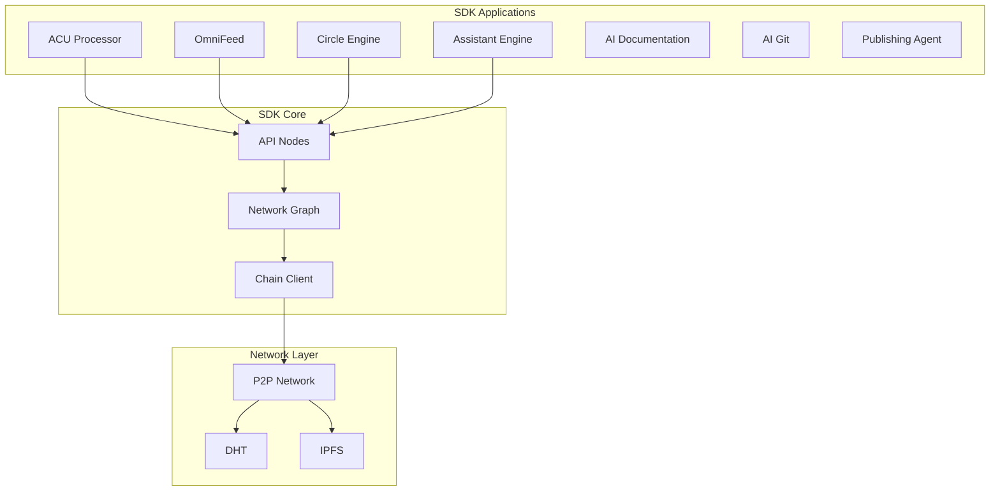
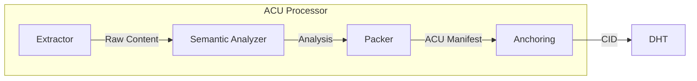
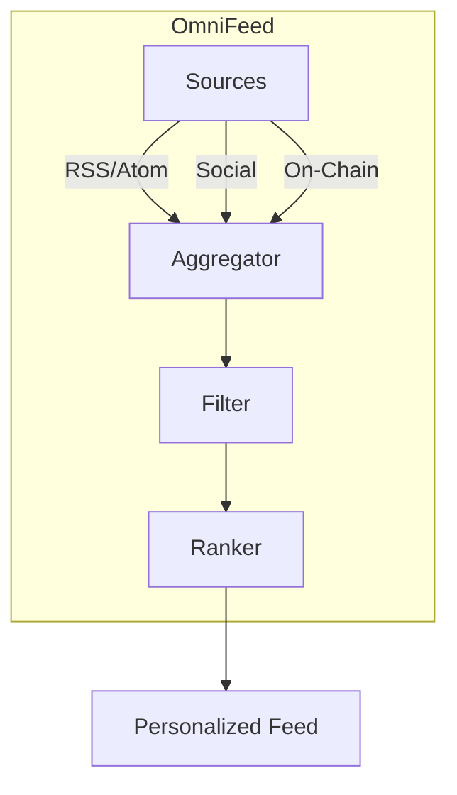
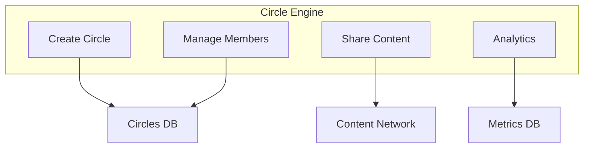
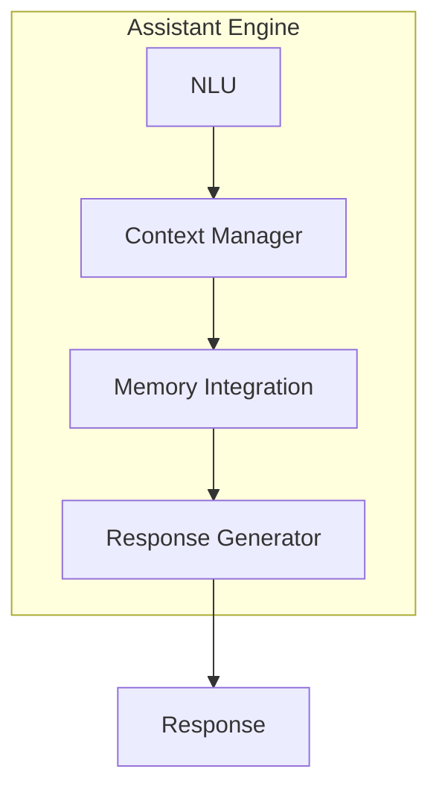
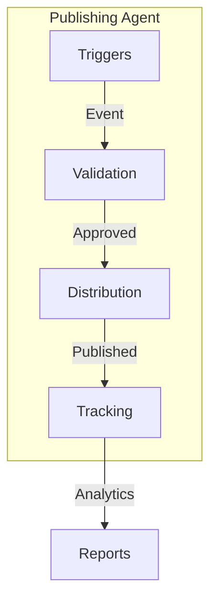

# SDK Applications

The VIVIM SDK includes a collection of decentralized applications built on top of the core SDK and API nodes.

## Architecture Overview



## ACU Processor

The Atomic Context Unit (ACU) Processor is a decentralized engine for content extraction and semantic analysis.

### Architecture



### Overview

The ACU Processor completely replaces traditional web scrapers and semantic memory generators with a decentralized, edge-based architecture:

1. **Listens** for `content:raw` events on the network
2. **Extracts** content from URLs or text
3. **Analyzes** semantically using LLM
4. **Packages** into Atomic Context Units
5. **Anchors** to distributed content network

### Usage

```typescript
import { AcuProcessorApp } from '@vivim/sdk/apps/acu-processor';
import { VivimChainClient, DistributedContentClient, NetworkNode } from '@vivim/network-engine';

// Initialize network clients
const chainClient = new VivimChainClient();
const contentClient = new DistributedContentClient();
const networkNode = new NetworkNode();

// Create ACU Processor
const acuProcessor = new AcuProcessorApp({
  chainClient,
  contentClient,
  networkNode,
  llmModel: 'gpt-4o-mini',
});

// Start processor
await acuProcessor.start();

console.log('ACU Processor online');
console.log('Listening for content:raw events');
```

### Processing Flow

```typescript
// The ACU Processor automatically:
// 1. Listens for content:raw events
acuProcessor.on('event:received', async (event) => {
  if (event.type === 'content:raw') {
    await processRawContent(event);
  }
});

// 2. Process raw content
async function processRawContent(event) {
  const payload = event.payload;
  
  // Extract content
  let extractedData;
  if (payload.url) {
    extractedData = await simulateWebScraper(payload.url);
  } else if (payload.text) {
    extractedData = payload.text;
  }
  
  // Semantic analysis
  const analysis = await simulateSemanticAnalyzer(
    extractedData,
    payload.parentContext
  );
  
  // Create ACU manifest
  const acuManifest = JSON.stringify({
    sourceType: payload.url ? 'url' : 'text',
    original: payload.url || payload.text?.substring(0, 100),
    markdown: extractedData,
    summary: analysis.summary,
    topics: analysis.topics,
    processingNode: acuProcessor.appDid,
    timestamp: Date.now(),
  });
  
  // Anchor to DHT
  const contentInfo = await contentClient.createContent({
    type: ContentType.ARTICLE,
    text: acuManifest,
    visibility: 'public',
    tags: ['acu', 'context', ...analysis.topics],
  });
  
  // Broadcast processed event
  await chainClient.broadcastEvent({
    type: 'content:processed',
    payload: {
      acuId: contentInfo.cid,
      originalEvent: event.id,
    },
  });
}
```

### ACU Manifest

```typescript
interface AcuManifest {
  sourceType: 'url' | 'text';
  original: string;
  markdown: string;
  summary: string;
  topics: string[];
  processingNode: string;  // DID of processing node
  timestamp: number;
}
```

## OmniFeed

The OmniFeed application aggregates and filters content from multiple sources.

### Architecture



### Usage

```typescript
import { OmniFeedApp } from '@vivim/sdk/apps/omni-feed';

const feed = new OmniFeedApp(sdk);

// Add content sources
await feed.addSource({
  type: 'rss',
  url: 'https://example.com/feed.xml',
  category: 'technology',
});

await feed.addSource({
  type: 'social',
  platform: 'twitter',
  handle: '@vivim',
});

// Get personalized feed
const items = await feed.getFeed({
  limit: 20,
  categories: ['technology', 'ai'],
  minScore: 0.5,
});

// Subscribe to updates
feed.on('new-items', (items) => {
  console.log('New items:', items.length);
});
```

## Circle Engine

The Circle Engine manages social circles and content sharing.

### Architecture



### Usage

```typescript
import { CircleEngineApp } from '@vivim/sdk/apps/circle-engine';

const circles = new CircleEngineApp(sdk);

// Create circle
const circle = await circles.createCircle({
  name: 'Close Friends',
  description: 'My closest friends',
  visibility: 'private',
});

// Add members
await circles.addMembers(circle.id, [
  'did:vivim:friend1',
  'did:vivim:friend2',
]);

// Share content to circle
await circles.shareToCircle(circle.id, {
  contentType: 'article',
  contentId: 'content-123',
  message: 'Check this out!',
});

// Get circle analytics
const analytics = await circles.getAnalytics(circle.id);
console.log('Engagement:', analytics.engagement);
```

## Assistant Engine

The Assistant Engine provides AI assistant capabilities with memory context.

### Architecture



### Usage

```typescript
import { AssistantEngineApp } from '@vivim/sdk/apps/assistant-engine';

const assistant = new AssistantEngineApp(sdk);

// Initialize with configuration
await assistant.initialize({
  model: 'gpt-4',
  memoryIntegration: true,
  contextWindow: 8000,
});

// Process query
const response = await assistant.processQuery({
  userId: 'user-123',
  query: 'What did I ask about yesterday?',
  options: {
    includeMemories: true,
    maxContextItems: 10,
  },
});

console.log('Response:', response.content);

// Stream response
const stream = await assistant.streamQuery({
  userId: 'user-123',
  query: 'Explain quantum computing',
});

for await (const chunk of stream) {
  process.stdout.write(chunk);
}
```

## AI Documentation

Auto-generates documentation from code and conversations.

### Usage

```typescript
import { AiDocumentationApp } from '@vivim/sdk/apps/ai-documentation';

const docGen = new AiDocumentationApp(sdk);

// Generate documentation
const docs = await docGen.generate({
  sourceType: 'conversation',
  sourceId: 'conv-123',
  format: 'markdown',
  includeExamples: true,
});

// Update existing docs
await docGen.update({
  docId: 'doc-456',
  changes: 'Updated API endpoints',
  sourceEvent: 'conv-789',
});
```

## Publishing Agent

Automated publishing agent for content distribution.

### Architecture



### Usage

```typescript
import { PublishingAgentApp } from '@vivim/sdk/apps/publishing-agent';

const agent = new PublishingAgentApp(sdk);

// Configure publishing rules
await agent.configure({
  autoPublish: true,
  platforms: ['ipfs', 'arweave'],
  visibility: 'public',
  tags: ['auto-generated'],
});

// Publish content
const result = await agent.publish({
  contentType: 'article',
  content: acuManifest,
  metadata: {
    title: 'Auto-published article',
    author: sdk.identity.did,
  },
});

console.log('Published to:', result.platforms);
```

## Complete Example

```typescript
import { VivimSDK } from '@vivim/sdk';
import { AcuProcessorApp } from '@vivim/sdk/apps/acu-processor';
import { OmniFeedApp } from '@vivim/sdk/apps/omni-feed';
import { CircleEngineApp } from '@vivim/sdk/apps/circle-engine';
import { AssistantEngineApp } from '@vivim/sdk/apps/assistant-engine';

async function appsExample() {
  // Initialize SDK
  const sdk = new VivimSDK({
    identity: { autoCreate: true },
    network: { enableP2P: true },
  });
  
  await sdk.initialize();
  
  // Start ACU Processor
  const acuProcessor = new AcuProcessorApp({
    chainClient: sdk.chainClient,
    contentClient: sdk.contentClient,
    networkNode: sdk.networkNode,
  });
  
  await acuProcessor.start();
  console.log('ACU Processor online');
  
  // Start OmniFeed
  const feed = new OmniFeedApp(sdk);
  
  await feed.addSource({
    type: 'rss',
    url: 'https://techcrunch.com/feed/',
    category: 'technology',
  });
  
  feed.on('new-items', (items) => {
    console.log('New feed items:', items.length);
  });
  
  // Start Circle Engine
  const circles = new CircleEngineApp(sdk);
  
  const circle = await circles.createCircle({
    name: 'AI Researchers',
    description: 'AI research community',
  });
  
  await circles.addMembers(circle.id, [
    'did:vivim:researcher1',
    'did:vivim:researcher2',
  ]);
  
  // Start Assistant Engine
  const assistant = new AssistantEngineApp(sdk);
  
  await assistant.initialize({
    model: 'gpt-4',
    memoryIntegration: true,
  });
  
  // Process query with memory context
  const response = await assistant.processQuery({
    userId: sdk.identity.did,
    query: 'What ACUs did I process today?',
    options: {
      includeMemories: true,
    },
  });
  
  console.log('Assistant response:', response.content);
  
  // Share feed item to circle
  const feedItems = await feed.getFeed({ limit: 5 });
  
  await circles.shareToCircle(circle.id, {
    contentType: 'feed-item',
    contentId: feedItems[0].id,
    message: 'Interesting article!',
  });
  
  console.log('Apps running successfully');
}

appsExample().catch(console.error);
```

## Available Applications

| Application | Description | Package |
|-------------|-------------|---------|
| **ACU Processor** | Content extraction & semantic analysis | `@vivim/sdk/apps/acu-processor` |
| **OmniFeed** | Content aggregation & filtering | `@vivim/sdk/apps/omni-feed` |
| **Circle Engine** | Social circles & sharing | `@vivim/sdk/apps/circle-engine` |
| **Assistant Engine** | AI assistant with memory | `@vivim/sdk/apps/assistant-engine` |
| **AI Documentation** | Auto-documentation generation | `@vivim/sdk/apps/ai-documentation` |
| **AI Git** | Git operations with AI | `@vivim/sdk/apps/ai-git` |
| **Publishing Agent** | Automated publishing | `@vivim/sdk/apps/publishing-agent` |
| **Crypto Engine** | Cryptocurrency operations | `@vivim/sdk/apps/crypto-engine` |
| **Tool Engine** | Tool integration layer | `@vivim/sdk/apps/tool-engine` |
| **Roadmap Engine** | Project roadmap management | `@vivim/sdk/apps/roadmap-engine` |
| **Public Dashboard** | Public analytics dashboard | `@vivim/sdk/apps/public-dashboard` |

## Related

- [API Nodes](../api-nodes/overview) - underlying node implementations
- [Network Protocols](./protocols) - P2P communication

## Links

- **GitHub Repository**: [github.com/vivim/vivim-sdk](https://github.com/vivim/vivim-sdk)
- **Apps Source**: [github.com/vivim/vivim-sdk/tree/main/src/apps](https://github.com/vivim/vivim-sdk/tree/main/src/apps)
