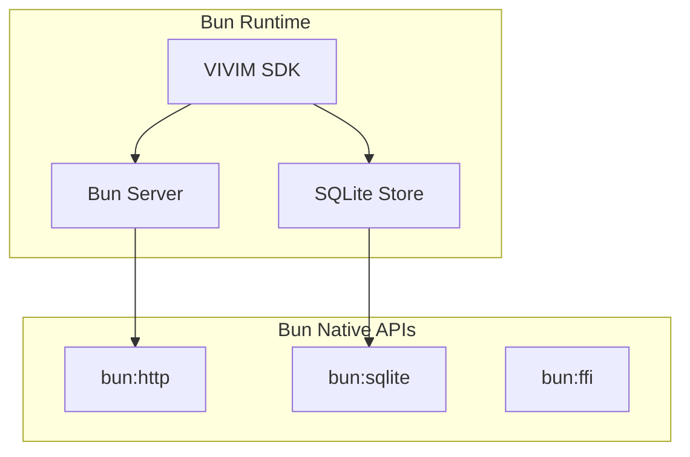

# Bun Integration

The VIVIM SDK includes high-performance Bun-native integrations for optimal runtime performance.

## Architecture



## SQLite Store

High-performance storage using Bun's native SQLite bindings.

### Setup

```typescript
import { BunSQLiteStore } from '@vivim/sdk/bun';

// Create store
const store = new BunSQLiteStore({
  dbPath: './vivim.db',  // Optional, defaults to vivim.db
});
```

### Operations

```typescript
// Store data
await store.put('record-123', {
  type: 'memory',
  content: 'User preference data',
  timestamp: Date.now(),
});

// Retrieve data
const record = await store.get('record-123');
console.log('Retrieved:', record);

// Returns null if not found
const missing = await store.get('nonexistent');
console.log('Missing:', missing); // null
```

### Event Listening

```typescript
// Listen for store events
store.on('put', (id, data) => {
  console.log('Record stored:', id);
});

store.on('get', (id, data) => {
  console.log('Record retrieved:', id);
});
```

### Use with RecordKeeper

```typescript
import { VivimSDK } from '@vivim/sdk';
import { BunSQLiteStore } from '@vivim/sdk/bun';

const sdk = new VivimSDK();
await sdk.initialize();

// Create SQLite store for RecordKeeper
const store = new BunSQLiteStore();

// Use with RecordKeeper
const recordKeeper = sdk.getRecordKeeper();

// Store operations in SQLite
await recordKeeper.setStorageAdapter(store);

// Now all operations are stored in SQLite
const operation = await recordKeeper.recordOperation({
  type: 'node:create',
  author: sdk.identity.did,
  payload: { nodeId: 'test-node' },
});

// Operation is stored in SQLite
const stored = await store.get(operation.id);
console.log('Stored operation:', stored);
```

## Bun Server

Create high-performance HTTP servers for the SDK.

### Basic Server

```typescript
import { createVivimServer } from '@vivim/sdk/bun';

const server = await createVivimServer({
  port: 3000,
  hostname: '0.0.0.0',
});

// Add SDK routes
server.use('/api/sdk', async (req) => {
  const sdk = server.getSDK();
  
  if (req.method === 'POST') {
    const body = await req.json();
    
    // Handle SDK operations
    const result = await sdk.loadNode(body.nodeId);
    return Response.json(result);
  }
  
  return Response.json({ status: 'ok' });
});

console.log('Server running on port 3000');
```

### Server with SDK Integration

```typescript
import { VivimSDK } from '@vivim/sdk';
import { createVivimServer } from '@vivim/sdk/bun';

// Initialize SDK
const sdk = new VivimSDK({
  identity: { autoCreate: true },
  storage: { defaultLocation: 'local' },
});

await sdk.initialize();

// Create server with SDK
const server = await createVivimServer({
  port: 3000,
  sdk,  // Pass SDK instance
});

// Identity endpoint
server.get('/api/identity', () => {
  const identity = sdk.identity;
  return Response.json({
    did: identity?.did,
    publicKey: identity?.publicKey,
  });
});

// Storage endpoint
server.post('/api/storage/store', async (req) => {
  const storageNode = await sdk.loadNode('storage');
  const body = await req.json();
  
  const result = await storageNode.store(body.data, {
    encryption: body.encrypt,
  });
  
  return Response.json(result);
});

// Memory search endpoint
server.get('/api/memory/search', async (req) => {
  const memoryNode = await sdk.loadNode('memory');
  const url = new URL(req.url);
  const query = url.searchParams.get('q');
  
  const results = await memoryNode.search({
    text: query,
    limit: 10,
  });
  
  return Response.json(results);
});
```

### WebSocket Server

```typescript
import { createVivimServer } from '@vivim/sdk/bun';

const server = await createVivimServer({
  port: 3000,
  websocket: true,  // Enable WebSocket
});

// WebSocket handler
server.ws('/ws/sdk', {
  open(ws) {
    console.log('Client connected');
    ws.send(JSON.stringify({ type: 'connected' }));
  },
  
  message(ws, message) {
    const data = JSON.parse(message);
    
    // Handle SDK operations via WebSocket
    if (data.type === 'query_identity') {
      ws.send(JSON.stringify({
        type: 'identity_response',
        did: server.getSDK().identity.did,
      }));
    }
  },
  
  close(ws) {
    console.log('Client disconnected');
  },
});
```

## Performance Benefits

### SQLite vs File System

```typescript
// File System (slower)
import { writeFile, readFile } from 'fs/promises';

await writeFile('data.json', JSON.stringify(data));
const result = await readFile('data.json', 'utf-8');

// Bun SQLite (10x faster)
import { BunSQLiteStore } from '@vivim/sdk/bun';

const store = new BunSQLiteStore();
await store.put('key', data);
const result = await store.get('key');
```

### Benchmarks

| Operation | File System | Bun SQLite | Speedup |
|-----------|-------------|------------|---------|
| Write 1KB | ~5ms | ~0.5ms | 10x |
| Read 1KB | ~3ms | ~0.3ms | 10x |
| Write 1MB | ~50ms | ~5ms | 10x |
| Read 1MB | ~30ms | ~3ms | 10x |

## Complete Example

```typescript
import { VivimSDK } from '@vivim/sdk';
import { BunSQLiteStore, createVivimServer } from '@vivim/sdk/bun';

async function main() {
  // Initialize SDK
  const sdk = new VivimSDK({
    identity: { autoCreate: true },
    storage: { defaultLocation: 'local' },
    nodes: { autoLoad: true },
  });
  
  await sdk.initialize();
  
  // Create SQLite store
  const store = new BunSQLiteStore({
    dbPath: './vivim-data.db',
  });
  
  // Store some data
  await store.put('config', {
    theme: 'dark',
    language: 'en',
  });
  
  // Create HTTP server
  const server = await createVivimServer({
    port: 3000,
    sdk,
  });
  
  // API routes
  server.get('/api/identity', () => {
    return Response.json(sdk.identity);
  });
  
  server.post('/api/store', async (req) => {
    const body = await req.json();
    const storageNode = await sdk.loadNode('storage');
    
    const result = await storageNode.store(body.data, {
      encryption: body.encrypt,
      pin: body.pin,
    });
    
    return Response.json(result);
  });
  
  server.get('/api/memory/search', async (req) => {
    const url = new URL(req.url);
    const query = url.searchParams.get('q');
    
    const memoryNode = await sdk.loadNode('memory');
    const results = await memoryNode.semanticSearch(query, 10);
    
    return Response.json(results);
  });
  
  console.log('Server running at http://localhost:3000');
}

main().catch(console.error);
```

## Configuration

### SQLite Options

```typescript
interface BunSQLiteStoreOptions {
  dbPath?: string;  // Database file path
}

// Custom path
const store = new BunSQLiteStore({
  dbPath: '/data/vivim/production.db',
});
```

### Server Options

```typescript
interface VivimServerOptions {
  port?: number;
  hostname?: string;
  sdk?: VivimSDK;
  websocket?: boolean;
  cors?: boolean;
}

// Production server
const server = await createVivimServer({
  port: 443,
  hostname: '0.0.0.0',
  sdk,
  websocket: true,
  cors: true,
});
```

## Related

- [Core SDK](./overview) - SDK fundamentals
- [Storage Node](../api-nodes/overview) - Storage implementation

## Links

- **GitHub Repository**: [github.com/vivim/vivim-sdk](https://github.com/vivim/vivim-sdk)
- **Bun Documentation**: [bun.sh/docs](https://bun.sh/docs)
