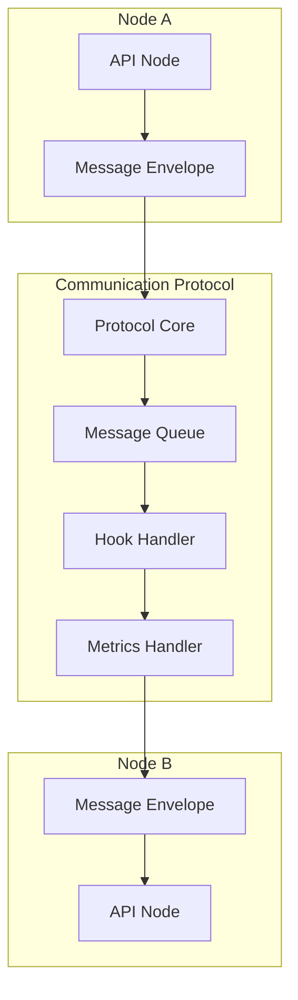

# Communication Protocol

The Communication Protocol provides standardized messaging for all VIVIM SDK nodes, enabling reliable inter-node communication with built-in quality of service.

## Architecture Overview



## Message Envelope

All messages use a standardized envelope format:

```typescript
interface MessageEnvelope<T = unknown> {
  header: MessageHeader;
  payload: T;
  signature?: string;
}

interface MessageHeader {
  id: string;                    // Unique message ID
  type: string;                  // Message type
  version: string;               // Protocol version
  timestamp: number;             // Unix timestamp
  priority: MessagePriority;     // Priority level
  direction: MessageDirection;   // inbound | outbound | internal
  sourceNode: string;            // Sender node ID
  targetNode?: string;           // Recipient node ID
  correlationId?: string;        // Correlation for request/response
  replyTo?: string;              // Reply-to message ID
  ttl?: number;                  // Time to live (ms)
  flags: MessageFlags;           // Message flags
}

interface MessageFlags {
  encrypted: boolean;
  signed: boolean;
  verified: boolean;
  compressed: boolean;
  idempotent: boolean;
  stream: boolean;
}
```

## Priority Levels

```typescript
type MessagePriority = 
  | 'critical'    // System-critical messages
  | 'high'        // High-priority operations
  | 'normal'      // Standard messages
  | 'low'         // Background tasks
  | 'background'; // Lowest priority
```

## Creating the Protocol

```typescript
import { createCommunicationProtocol } from '@vivim/sdk/core';

// Create protocol instance for a node
const communication = createCommunicationProtocol('identity-node');
```

## Sending Messages

```typescript
// Create message envelope
const envelope = communication.createEnvelope('identity_query', {
  targetDid: 'did:vivim:...',
}, {
  direction: 'outbound',
  priority: 'normal',
});

// Send message
const result = await communication.sendMessage(envelope);
```

## Receiving Messages

```typescript
// Process received message
const result = await communication.processMessage(envelope, async (msg) => {
  // Handle message based on type
  switch (msg.type) {
    case 'identity_query':
      return { did: identity.did, publicKey: identity.publicKey };
    case 'signature_request':
      const sig = await signData(msg.payload.data, privateKey);
      return { signature: sig };
    default:
      throw new Error(`Unknown message type: ${msg.type}`);
  }
});
```

## Event Handling

```typescript
// Listen for communication events
const unsubscribe = communication.onEvent('message_sent', (event) => {
  console.log('Message sent:', event.messageId);
});

// Listen for errors
const errorUnsub = communication.onEvent('message_error', (event) => {
  console.error('Message error:', event.error);
});

// Listen for all events
const allUnsub = communication.onEvent('*', (event) => {
  console.log('Event:', event.type, event.nodeId);
});
```

## Communication Hooks

Hooks allow you to intercept and modify messages:

```typescript
// Register before-send hook
const hookId = communication.registerHook({
  id: 'logging-hook',
  type: 'before_send',
  nodeId: 'identity-node',
  priority: 10,
  handler: (envelope) => {
    console.log('Sending message:', envelope.header.type);
    return envelope;
  },
});

// Register after-receive hook
communication.registerHook({
  id: 'validation-hook',
  type: 'after_receive',
  nodeId: 'identity-node',
  priority: 5,
  handler: (envelope) => {
    // Validate message
    if (!envelope.header.sourceNode) {
      throw new Error('Missing source node');
    }
    return envelope;
  },
});

// Unregister hook
communication.unregisterHook(hookId);
```

## Metrics

```typescript
// Get node metrics
const metrics = communication.getMetrics();

console.log('Messages sent:', metrics.messagesSent);
console.log('Messages received:', metrics.messagesReceived);
console.log('Average latency:', metrics.averageLatency);
console.log('Failed messages:', metrics.messagesFailed);
console.log('Errors by type:', metrics.errorsByType);
```

## Message Queue

```typescript
// Get queue state
const state = communication.getState();
console.log('Queue size:', state.messageQueueSize);
console.log('Processing:', state.processingQueue);
console.log('Connected:', state.isConnected);
```

## Complete Example

```typescript
import { VivimSDK } from '@vivim/sdk';
import { createCommunicationProtocol } from '@vivim/sdk/core';

const sdk = new VivimSDK();
await sdk.initialize();

const identityNode = await sdk.loadNode('identity');

// Create communication protocol
const communication = createCommunicationProtocol('identity-node');

// Register hooks
communication.registerHook({
  id: 'logger',
  type: 'before_send',
  nodeId: 'identity-node',
  priority: 10,
  handler: (envelope) => {
    console.log('Sending:', envelope.header.type);
    return envelope;
  },
});

// Listen for events
communication.onEvent('message_received', (event) => {
  console.log('Received message:', event.messageId);
});

// Send identity query
const envelope = communication.createEnvelope('identity_query', {
  targetDid: sdk.identity.did,
}, {
  direction: 'outbound',
  priority: 'normal',
});

const result = await communication.sendMessage(envelope);
console.log('Message sent:', result.header.id);

// Get metrics
const metrics = communication.getMetrics();
console.log('Uptime:', metrics.uptime);
```

## Error Handling

```typescript
try {
  const envelope = communication.createEnvelope('signature_request', {
    data: 'Hello',
  }, {
    direction: 'outbound',
    priority: 'high',
  });
  
  await communication.sendMessage(envelope);
} catch (error) {
  console.error('Communication error:', error);
  
  // Check error type
  if (error.code === 'TIMEOUT') {
    console.log('Message timed out');
  } else if (error.code === 'QUEUE_FULL') {
    console.log('Message queue is full');
  }
}
```

## Protocol Version

```typescript
import { PROTOCOL_VERSION } from '@vivim/sdk/core';

console.log('Protocol version:', PROTOCOL_VERSION); // "1.0.0"
```

## Related

- [API Nodes](../api-nodes/overview) - Nodes using communication protocol
- [Network](../network/overview) - P2P networking

## Links

- **GitHub Repository**: [github.com/vivim/vivim-sdk](https://github.com/vivim/vivim-sdk)
- **Source Code**: [github.com/vivim/vivim-sdk/tree/main/src/core/communication.ts](https://github.com/vivim/vivim-sdk/tree/main/src/core/communication.ts)
