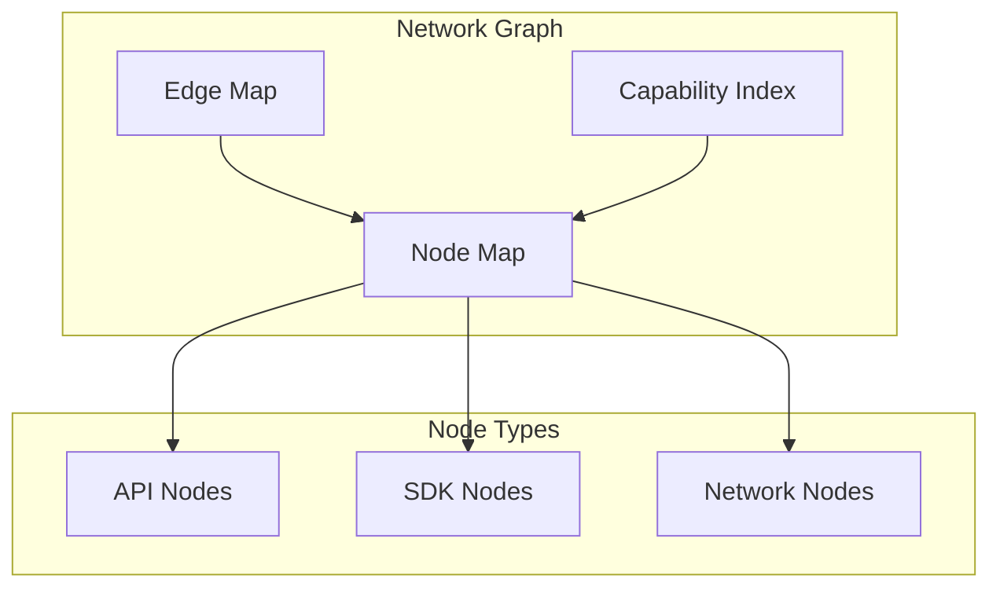
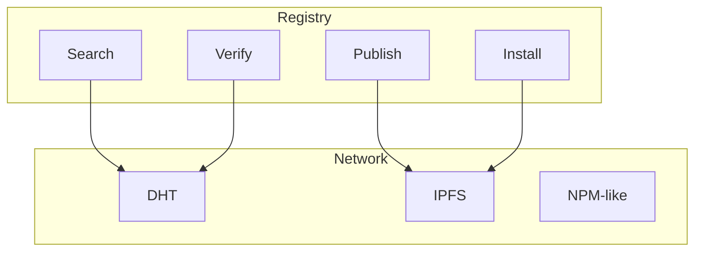

# Graph & Registry

The VIVIM SDK includes a network graph manager and node registry for discovering, loading, and managing nodes.

## Network Graph

The Network Graph manages connections between nodes and tracks capabilities.

### Architecture



### Graph Structure

```typescript
interface NetworkGraph {
  nodes: Map<string, NodeInstance>;
  edges: Map<string, EdgeInstance>;
  nodeDefinitions: Map<string, APINodeDefinition>;
  capabilityIndex: Map<string, Set<string>>;
}

interface NodeInstance {
  id: string;
  type: NodeType;  // 'api' | 'sdk' | 'network'
  definition: APINodeDefinition;
  instance?: unknown;
  loadedAt: number;
  status: 'loading' | 'ready' | 'running' | 'stopped' | 'error';
}

interface EdgeInstance {
  id: string;
  from: string;
  to: string;
  definition: EdgeDefinition;
  createdAt: number;
}
```

### Node Operations

```typescript
import { NetworkGraph } from '@vivim/sdk/graph';

const graph = new NetworkGraph();

// Add node to graph
await graph.addNode({
  id: 'storage-node-1',
  type: 'api',
  definition: storageNodeDefinition,
  loadedAt: Date.now(),
  status: 'ready',
});

// Get node
const node = graph.getNode('storage-node-1');
console.log('Node status:', node.status);

// Get all nodes
const allNodes = graph.getNodes();

// Get nodes by type
const apiNodes = graph.getNodesByType('api');

// Remove node
await graph.removeNode('storage-node-1');
```

### Edge Operations

```typescript
// Connect two nodes
await graph.addEdge('identity-node', 'storage-node', {
  id: 'edge-1',
  type: 'depends-on',
  metadata: {
    required: true,
  },
});

// Get edges for a node
const edges = graph.getEdges('identity-node');

// Remove edge
await graph.removeEdge('edge-1');
```

### Capability Discovery

```typescript
// Find nodes with specific capability
const nodesWithCapability = graph.getNodesByCapability('storage:store');

// Get all capabilities
const capabilities = graph.getCapabilities();

// Check if capability exists
const hasCapability = graph.hasCapability('storage:retrieve');
```

### Graph Events

```typescript
// Listen for node events
graph.on('node:added', ({ nodeId }) => {
  console.log('Node added:', nodeId);
});

graph.on('node:removed', ({ nodeId }) => {
  console.log('Node removed:', nodeId);
});

graph.on('node:status-changed', ({ nodeId, status }) => {
  console.log('Node status changed:', nodeId, status);
});

graph.on('edge:added', ({ edgeId, from, to }) => {
  console.log('Edge added:', edgeId, 'from', from, 'to', to);
});
```

### Graph Serialization

```typescript
// Export graph to JSON
const json = graph.toJSON();
console.log('Graph JSON:', json);

// Import graph from JSON
await graph.fromJSON(json);
```

## Node Registry

The Node Registry discovers and manages node packages from the network.

### Architecture



### Registry Interface

```typescript
import { NodeRegistry } from '@vivim/sdk/registry';

const registry = new NodeRegistry('https://registry.vivim.net');
```

### Local Discovery

```typescript
// List locally installed nodes
const localNodes = registry.listLocal();
console.log('Local nodes:', localNodes);

// Get node metadata
const metadata = registry.getMetadata('storage-node');
console.log('Metadata:', metadata);

// Check if node is installed
const isInstalled = registry.isInstalled('storage-node');
```

### Remote Discovery

```typescript
// Search for nodes
const results = await registry.search('storage', {
  type: 'api',
  limit: 10,
});

console.log('Search results:', results);

// Get node info from registry
const nodeInfo = await registry.getNodeInfo('storage-node');
console.log('Node info:', nodeInfo);

// Get available versions
const versions = await registry.getVersions('storage-node');
console.log('Available versions:', versions);

// Get trust score
const trustScore = await registry.getTrustScore('storage-node');
console.log('Trust score:', trustScore);
```

### Publishing Nodes

```typescript
// Publish a node
const result = await registry.publish({
  id: 'my-custom-node',
  name: 'My Custom Node',
  version: '1.0.0',
  type: 'api',
  definition: nodeDefinition,
  code: nodeCode,
  license: 'MIT',
  author: 'did:vivim:...',
});

console.log('Published:', result);
// { nodeId: 'my-custom-node', version: '1.0.0', cid: 'bafy...' }

// Publish new version
const newVersion = await registry.publishVersion({
  nodeId: 'my-custom-node',
  version: '1.1.0',
  changelog: 'Added new features',
  code: updatedCode,
});
```

### Installing Nodes

```typescript
// Install node from registry
const installResult = await registry.install('storage-node', {
  version: '1.0.0',  // Optional, defaults to latest
  verify: true,       // Verify signature
  trusted: true,      // Only from trusted publishers
});

console.log('Installed at:', installResult.path);

// Install from CID
const cidResult = await registry.installFromCID('bafy...');

// Uninstall node
await registry.uninstall('storage-node');
```

### Verification

```typescript
// Verify node package
const verification = await registry.verifyNode('storage-node');
console.log('Verified:', verification.verified);
console.log('Publisher:', verification.publisher);
console.log('Signature:', verification.signature);

// Report issue
await registry.reportIssue('storage-node', {
  type: 'bug',
  description: 'Memory leak in storage retrieval',
  severity: 'high',
});

// Get issues
const issues = await registry.getIssues('storage-node');
```

### Trusted Publishers

```typescript
// Add trusted publisher
registry.addTrustedPublisher('did:vivim:vivim-team');

// Remove trusted publisher
registry.removeTrustedPublisher('did:vivim:...');

// List trusted publishers
const trusted = registry.getTrustedPublishers();
```

### Node Packages

```typescript
interface NodePackageInfo {
  id: string;
  name: string;
  version: string;
  description: string;
  author: string;
  license: string;
  type: 'api' | 'sdk' | 'network';
  capabilities: Array<{ id: string; name: string }>;
  downloads: number;
  stars: number;
  publishedAt: number;
  updatedAt: number;
}

interface TrustScore {
  score: number;
  factors: {
    downloads: number;
    stars: number;
    verifiedPublisher: boolean;
    age: number;
    issues: number;
  };
}
```

## Complete Example

```typescript
import { VivimSDK } from '@vivim/sdk';
import { NetworkGraph } from '@vivim/sdk/graph';
import { NodeRegistry } from '@vivim/sdk/registry';

async function graphAndRegistryExample() {
  // Initialize SDK
  const sdk = new VivimSDK();
  await sdk.initialize();
  
  // Create network graph
  const graph = new NetworkGraph();
  
  // Create registry
  const registry = new NodeRegistry('https://registry.vivim.net');
  
  // Search for storage node
  const searchResults = await registry.search('storage', {
    type: 'api',
    limit: 5,
  });
  
  console.log('Found storage nodes:', searchResults);
  
  // Get node info
  const nodeInfo = await registry.getNodeInfo('storage-node');
  console.log('Node info:', nodeInfo);
  
  // Check trust score
  const trustScore = await registry.getTrustScore('storage-node');
  console.log('Trust score:', trustScore.score);
  
  // Install node
  const installResult = await registry.install('storage-node', {
    verify: true,
    trusted: true,
  });
  
  console.log('Installed at:', installResult.path);
  
  // Add to graph
  await graph.addNode({
    id: 'storage-node-1',
    type: 'api',
    definition: installResult.definition,
    loadedAt: Date.now(),
    status: 'ready',
  });
  
  // Load node instance
  const node = await sdk.loadNode('storage');
  
  // Update graph with instance
  const graphNode = graph.getNode('storage-node-1');
  graphNode.instance = node;
  graphNode.status = 'running';
  
  // Connect nodes
  const identityNode = await sdk.loadNode('identity');
  
  await graph.addNode({
    id: 'identity-node-1',
    type: 'api',
    definition: identityNodeDefinition,
    loadedAt: Date.now(),
    status: 'running',
  });
  
  // Create edge
  await graph.addEdge('identity-node-1', 'storage-node-1', {
    id: 'identity-storage-edge',
    type: 'depends-on',
    metadata: {
      required: true,
    },
  });
  
  // Get capabilities
  const capabilities = graph.getCapabilities();
  console.log('Available capabilities:', capabilities);
  
  // Find nodes with capability
  const storageNodes = graph.getNodesByCapability('storage:store');
  console.log('Nodes with storage:store:', storageNodes);
  
  // Listen for graph events
  graph.on('node:status-changed', ({ nodeId, status }) => {
    console.log('Node status changed:', nodeId, status);
  });
  
  // Export graph
  const graphJson = graph.toJSON();
  console.log('Graph JSON:', graphJson);
}

graphAndRegistryExample().catch(console.error);
```

## Related

- [Core SDK](../core/overview) - SDK fundamentals
- [API Nodes](../api-nodes/overview) - Available nodes

## Links

- **GitHub Repository**: [github.com/vivim/vivim-sdk](https://github.com/vivim/vivim-sdk)
- **Source Code**: [github.com/vivim/vivim-sdk/tree/main/src/graph](https://github.com/vivim/vivim-sdk/tree/main/src/graph)
- **Registry Source**: [github.com/vivim/vivim-sdk/tree/main/src/registry](https://github.com/vivim/vivim-sdk/tree/main/src/registry)
