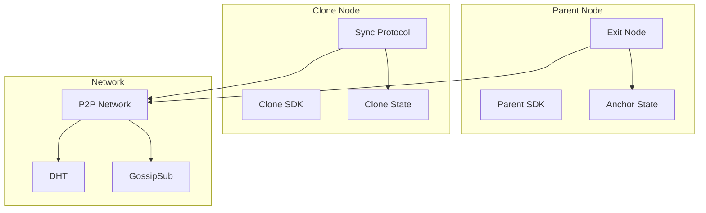
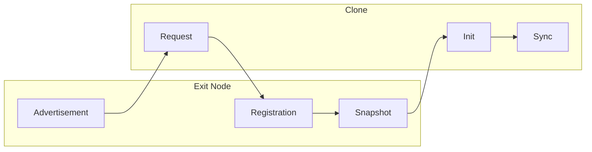
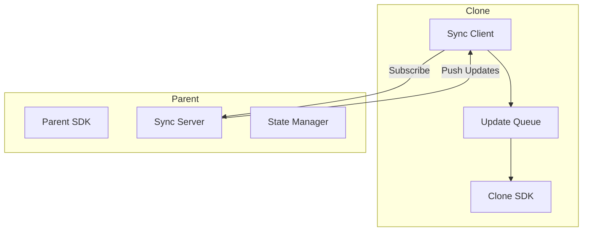

# Network Protocols

The VIVIM SDK implements advanced protocols for P2P synchronization, state management, and clone coordination.

## Architecture Overview



## Exit Node Protocol

The Exit Node Protocol (ENP) enables clone discovery, registration, and synchronization with canonical nodes.

### Architecture



### Exit Node Advertisement

```typescript
interface ExitNodeAdvertisement {
  // Node identity
  did: string;
  peerId: string;
  multiaddrs: string[];
  
  // Capabilities
  capabilities: string[];
  supportedCloneVersions: string[];
  
  // Trust
  trustLevel: TrustLevel;
  anchorState: AnchorState;
  
  // Endpoints
  endpoints: {
    clone: string;
    sync: string;
    relay: string;
  };
  
  // Policy
  policy: {
    maxClones: number;
    allowMigration: boolean;
    requireVerification: boolean;
  };
}
```

### Clone Registration

```typescript
import { VivimSDK } from '@vivim/sdk';

const sdk = new VivimSDK();
await sdk.initialize();

// Register with exit node
const exitNode = sdk.getExitNode();

// Advertise as exit node
await exitNode.advertise({
  capabilities: ['storage', 'memory', 'identity'],
  policy: {
    maxClones: 100,
    allowMigration: true,
    requireVerification: false,
  },
});

// Handle registration requests
exitNode.on('clone:register', async (request) => {
  // Verify identity
  const verified = await verifyCloneIdentity(request);
  
  if (verified) {
    // Create state snapshot
    const snapshot = await exitNode.createSnapshot();
    
    // Generate trust proof
    const trustProof = await exitNode.delegateTrust(request.did);
    
    // Return registration response
    return {
      approved: true,
      cloneId: generateCloneId(),
      endpoints: {
        api: 'https://api.vivim.live',
        p2p: '/ip4/192.168.1.1/tcp/4001',
      },
      trustProof,
      initialState: snapshot,
    };
  }
  
  return {
    approved: false,
    denialReason: 'Identity verification failed',
  };
});
```

### State Snapshot

```typescript
interface StateSnapshot {
  // Metadata
  snapshotId: string;
  createdAt: number;
  sourceDid: string;
  sourceCloneId: string;
  
  // Version info
  sdkVersion: string;
  schemaVersion: string;
  
  // Merkle root
  merkleRoot: string;
  
  // State categories
  state: {
    identity: {
      did: string;
      publicKey: string;
      profile?: unknown;
    };
    nodes: Record<string, unknown>;
    apps: Record<string, unknown>;
    contentManifest: unknown;
    socialGraph: unknown;
    memoryIndex: unknown;
  };
  
  // Verification
  signature: string;
}
```

## Sync Protocol

The Sync Protocol handles ongoing state synchronization between clones and parent nodes.

### Architecture



### Sync Configuration

```typescript
interface SyncConfig {
  autoSync: boolean;
  syncInterval: number;        // Default: 60000 (1 minute)
  maxBatchSize: number;        // Default: 100
  syncTimeout: number;         // Default: 30000
  compression: boolean;
}

const sync = sdk.getSyncProtocol();

// Configure sync
sync.setConfig({
  autoSync: true,
  syncInterval: 30000,  // Sync every 30 seconds
  maxBatchSize: 50,
  compression: true,
});
```

### State Updates

```typescript
interface StateUpdate {
  updateId: string;
  type: UpdateType;  // 'identity' | 'content' | 'social' | 'memory' | 'node' | 'app'
  timestamp: number;
  
  sourceDid: string;
  sourceCloneId: string;
  
  operation: 'create' | 'update' | 'delete';
  path: string;
  data: unknown;
  
  merkleProof: string;
  signature: string;
}
```

### Sync Events

```typescript
// Listen for sync events
sync.on('sync:started', ({ parentDid }) => {
  console.log('Sync started with parent:', parentDid);
});

sync.on('sync:completed', ({ parentDid, updatesApplied }) => {
  console.log('Sync completed:', updatesApplied, 'updates applied');
});

sync.on('update:received', ({ update }) => {
  console.log('Update received:', update.type, update.updateId);
});

sync.on('status:changed', ({ status }) => {
  console.log('Sync status:', status);
  console.log('Connected:', status.connected);
  console.log('Pending updates:', status.pendingUpdates);
});
```

### Manual Sync

```typescript
// Trigger manual sync
await sync.syncNow();

// Get sync status
const status = sync.getStatus();
console.log('Last sync:', status.lastSyncAt);
console.log('Pending updates:', status.pendingUpdates);

// Pause/resume sync
sync.pause();
sync.resume();
```

## Trust Levels

```typescript
enum TrustLevel {
  GENESIS = 'genesis',         // Root anchor node
  BOOTSTRAP = 'bootstrap',     // Bootstrap/relay nodes
  PRIMARY = 'primary',         // Primary SDK instances
  SECONDARY = 'secondary',     // Verified clones
  UNVERIFIED = 'unverified',   // New/untrusted nodes
  SUSPENDED = 'suspended'      // Revoked trust
}
```

## Trust Proofs

```typescript
interface TrustProof {
  type: 'attestation' | 'challenge' | 'migration';
  issuer: string;
  target: string;
  signature: string;
  timestamp: number;
  payload: {
    trustLevel?: TrustLevel;
    delegatedBy?: string;
    parentCloneId?: string;
    migrationType?: 'fork' | 'mirror' | 'relay';
  };
}
```

## Complete Example

```typescript
import { VivimSDK } from '@vivim/sdk';

async function networkProtocolsExample() {
  // Initialize parent SDK
  const parentSdk = new VivimSDK({
    identity: { autoCreate: true },
    network: { enableP2P: true },
  });
  
  await parentSdk.initialize();
  
  // Setup exit node
  const exitNode = parentSdk.getExitNode();
  
  // Advertise as exit node
  await exitNode.advertise({
    capabilities: ['storage', 'memory', 'identity', 'content'],
    policy: {
      maxClones: 50,
      allowMigration: true,
      requireVerification: true,
    },
  });
  
  // Handle clone registrations
  exitNode.on('clone:register', async (request) => {
    console.log('Clone registration request from:', request.did);
    
    // Verify identity
    const verified = await parentSdk.verifyIdentity(request.identityProof);
    
    if (verified) {
      // Create state snapshot
      const snapshot = await exitNode.createSnapshot();
      
      // Delegate trust
      const trustProof = await exitNode.delegateTrust(
        request.did,
        TrustLevel.SECONDARY
      );
      
      return {
        approved: true,
        cloneId: `clone-${Date.now()}`,
        endpoints: {
          api: 'https://api.vivim.live',
          p2p: '/ip4/0.0.0.0/tcp/4001',
        },
        trustProof,
        initialState: snapshot,
      };
    }
    
    return {
      approved: false,
      denialReason: 'Identity verification failed',
    };
  });
  
  // Initialize clone SDK
  const cloneSdk = new VivimSDK({
    identity: { autoCreate: true },
    network: {
      bootstrapNodes: ['https://bootstrap.vivim.live'],
    },
  });
  
  await cloneSdk.initialize();
  
  // Setup sync protocol
  const sync = cloneSdk.getSyncProtocol();
  
  // Configure sync
  sync.setConfig({
    autoSync: true,
    syncInterval: 30000,
    maxBatchSize: 50,
    compression: true,
  });
  
  // Listen for sync events
  sync.on('sync:completed', ({ updatesApplied }) => {
    console.log('Sync completed:', updatesApplied, 'updates');
  });
  
  sync.on('update:received', ({ update }) => {
    console.log('Update received:', update.type);
  });
  
  // Start sync
  await sync.start();
  
  console.log('Clone synchronized with parent');
}

networkProtocolsExample().catch(console.error);
```

## Related

- [Core SDK](../core/overview) - SDK fundamentals
- [Anchor Protocol](../core/overview#anchor-protocol) - State anchoring

## Links

- **GitHub Repository**: [github.com/vivim/vivim-sdk](https://github.com/vivim/vivim-sdk)
- **Source Code**: [github.com/vivim/vivim-sdk/tree/main/src/protocols](https://github.com/vivim/vivim-sdk/tree/main/src/protocols)
